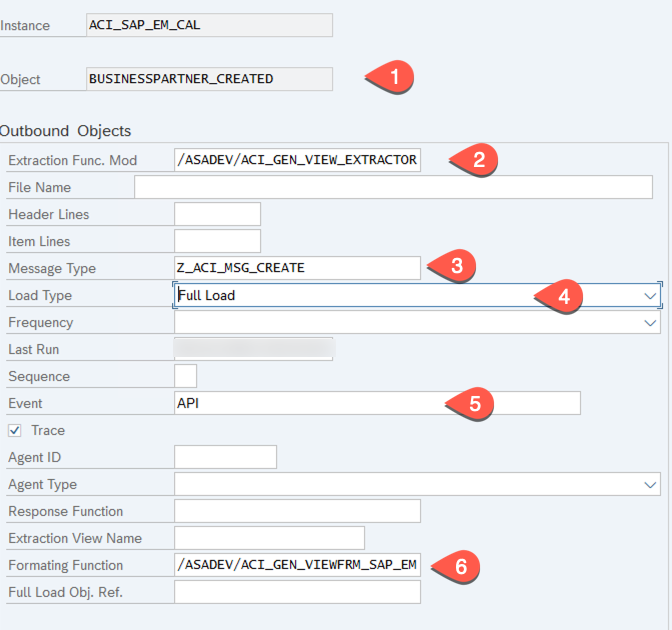
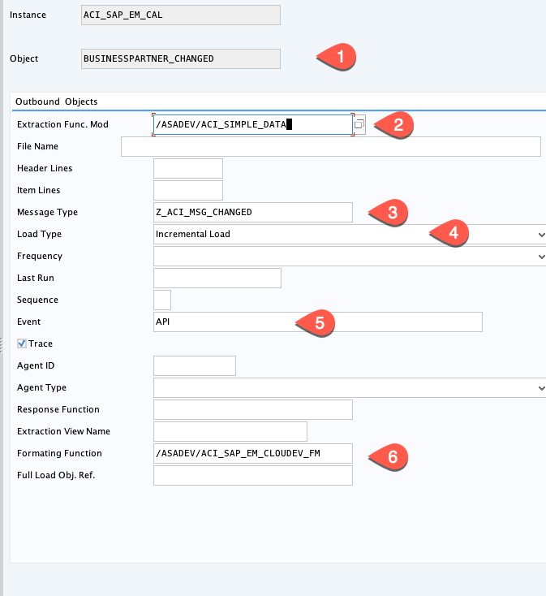
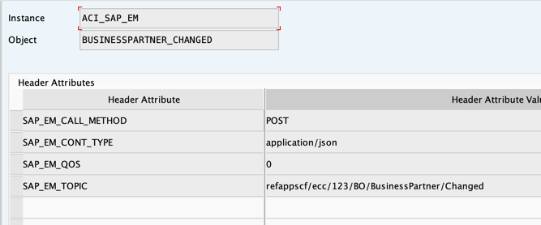

# Setup Connection and Replication Object for Event Enablement Header

You have already done the basic connection and configuration steps for the eventing process. In this section, you customize Event Enablement Add-On for events with payload using the database view created in the previous steps.  
 
**Audience:** Basis ABAP Administrator 

### Setup Connection and Replication Object		
1. Go back to transaction **/nSPRO**, expand **SAP Customization Implementation Guide** > **Integration with other SAP components** > **SAP NetWeaver AddOn for Event enablement** and choose the clock icon with tooltip **IMG:Activity** next to **Connection and Replication Object Customizing**.
   
   
   
2. Choose **New Entries**.

   
   
3. In the **New Entries: Details of added entries** screen, enter the following values: 
   - In the **Instance** field, enter **ACI_SAP_EM_CAL**.
   - In the **RFC Dest (Upload)** field, enter **ACI_SAP_EM**.
   - In the **ISO Code** field, select **UTF-8**.
   - In the **Cloud Type** field, select **SAP_EM**.
   - Choose **Save**. 
   - Select **Default Values**.
   
     
   
4. In **Default Values**, choose **New Entries**.

   
   

5. In the **New Entries: Overview of Added Entries** screen, enter the following values: 
   - In the **Default Attribute** column, enter **SAP_EM_CLIENT_ID**
   - In the **Default Attribute value** column, copy and paste the value of **clientid** from the Event Mesh Service Key which you copied in the previous steps.
   - In the **Default Attribute** column, enter **SAP_EM_TOKEN_DESTINATION**.
   - In the **Default Attribute value** column, enter  **ACI_SAP_EM_TOKEN**.
   - Choose **Save**.
   

     
   
6. In the **Dialog Structure**, choose **Error Type Mapping**. In the **Change View Error Type Mapping: Overview** screen, choose **New Entries**.
   
7. In the **Change View Error Type Mapping: Overview** screen, enter the following values: 
   - In the **Resp Code** column, enter **200**.
   - In the **Message Type** column, select **Success**.
   - In the **Resp Code** column, enter **201**.
   - In the **Message Type** column, select **Success**.
   - In the **Resp Code** column, enter **204**.
   - In the **Message Type** column, select **Success**.
   - Choose **Save**.

     

8. Choose **Outbound Objects** and then choose **New Entries**.

   
   
9. In the **Change View Outbound Objects: Details** screen, enter the following values:
   - In the **Object** field, enter **BUSINESSPARTNER_CREATED**.
   - In the **Extraction Func Mod** field, enter **/ASADEV/ACI_GEN_VIEW_EXTRACTOR**.
   - In the **Message Type** field, enter **Z_ACI_MSG_CREATED**.
   - In the **Load Type** field, select **Full Load**.
   - In the **Event** field, enter **API**.
   - Select the **Trace** checkbox.
   - In the **Formatting Function** field, enter **/ASADEV/ACI_GEN_VIEWFRM_SAP_EM**.
   - Choose **Save**.
   	
     

10. Select **Header Attributes**, choose **New Entries**.
    
    
	
11. In the opened screen, enter the following values:
    - In the **Header Attributes** column, enter **ACI_VIEW**.
    - In the **Header Attributes Value** column, enter **ZBUSINESSPARTNER**.
    - In the **Header Attributes** column, enter **SAP_EM_CALL_METHOD**.
    - In the **Header Attributes Value** column, enter **POST**.
    - In the **Header Attributes** column, enter **SAP_EM_CONT_TYPE**.
    - In the **Header Attributes Value** column, enter **application/json**.
    - In the **Header Attributes** column, enter **SAP_EM_QOS**.
    - In the **Header Attributes Value** column, enter **0**.
    - In the **Header Attributes** column, enter **SAP_EM_TOPIC**.
    - In the **Header Attributes Value** column, enter **refappscf/ecc/123/BO/BusinessPartner/Created** (enter the topic name created in Event Mesh Dashboard through the CAP Application)
    - Choose **Save**.
    
      

12. Choose **Event Linkage** and verifiy the predefined values from transaction SWE2:
       
      - In the **Object Category** column, you should have **BOR Object Type**.
      - In the **Object Type** column, you should have **BUS1006**.
      - In the **Event**  column, you should have **CREATED**.
      - In the **Receiver Function Module**  column, you should have **/ASADEV/ACI_EVENTS_TRIGGER**.
      - The **Global** checkbox should be selected.
      - The **Type linkage active** checkbox should be selected.
      
      
      

13. Double-click **Outbound Object** and choose **New Entries**.
14. In the **Change View Outbound Objects: Details** screen, enter the following values:
   - Enter Object as **BUSINESSPARTNER_CHANGED**
   - Enter Extraction Function Module Name as **/ASADEV/ACI_SIMPLE_DATA**
   - Enter Message Type as **Z_ACI_MSG_CHANGED**
   - Select Load Type as **Incremental Load**
   - Enter Event **API**
   - Check the **Trace** Checkbox	
   - Enter **Formatting Function**, value as **/ASADEV/ACI_SAP_EM_CLOUDEV_FM** 
   - Press **Save**
   	
     

15. Select **Header Attributes**, select **New Entries**.
16. In the opened screen, enter the following values:
    - In the column, **Header Attributes**, enter **SAP_EM_CALL_METHOD**
    - In the column, **Header Attributes Value**, enter **POST**
    - In the column, **Header Attributes**, enter **SAP_EM_CONT_TYPE**
    - In the column, **Header Attributes Value** enter **application/json**
    - In the column, **Header Attributes**, enter **SAP_EM_QOS**
    - In the column, **Header Attributes Value**, enter **0**
    - In the column, **Header Attributes**, enter **SAP_EM_TOPIC**
    - In the column, **Header Attributes Value**, enter **refappscf/ecc/123/BO/BusinessPartner/Changed** (enter the topic name created in Event Mesh Dashboard through CAP Application)
    - Press **Save**
    
      

17. Select **Event Linkage** and verifiy the values from transaction SWE2:
       
      - In the column, **Object Category** = **BOR Object Type**
      - In the column, **Object Type** = **BUS1006**
      - In the column, **Event** = **CHANGED**
      - In the column, **Receiver Function Module** = **/ASADEV/ACI_EVENTS_TRIGGER**
      - The field **Global** is checked
      - The field **Type linkage active** is checked
     
      

### Enter Cloud Connection Secret

1. Select the **Back** button to go to previous screen of **Display IMG**.
2. Expand the following path: **SAP Customization Implementation Guide** --> **Integration with Other SAP components** --> **SAP NetWeaver AddOn for Event Enablement** and select the clock icon with tooltip **IMG:Activity** next to **Set the Cloud Connection Password**.
3. In the screen, **Maintain the Cloud Shared Secret**:
   - Select Cloud Instance **ACI_SAP_EM_CAL**.
   - For the field **Cloud Shared Secret**, copy and paste the value of **clientsecret** from the Event Mesh Service Key which you copied in the beginning of this document.

     

   - Choose **Execute** ( You will see a success Message---> **Shared Secret for ACI_SAP_EM_CAL was created successfully!**)
   	
     
 

## Summary

You have estabilished a trust between our SAP ERP backend and the Event Mesh service and set up the eventing. Now you are ready to run the reference application and test your setup.

**Additional Resources:**

* [SAP Event Mesh for SAP ERP: HowTo-Guide (Part 1 – Connectivity)](https://blogs.sap.com/2020/10/02/sap-enterprise-messaging-for-sap-erp-howto-guide-part-1-connectivity/)

* [SAP Event Mesh for SAP ERP: HowTo-Guide (Part 2 – First use case)](https://blogs.sap.com/2020/10/08/sap-enterprise-messaging-for-sap-erp-howto-guide-part-2-first-use-case/)
* [Emit Data Events from SAP S/4HANA or SAP ECC through SAP NetWeaver Add-On for Event Enablement](https://blogs.sap.com/2021/08/13/emit-data-events-from-sap-s-4hana-or-sap-ecc-through-sap-netweaver-add-on-for-event-enablement/)
* [SAP Help - SAP NetWeaver Add-On for Event enablement](https://help.sap.com/viewer/e966e6c0e61443ebaa0270a4bae4b363/1.0/en-US/3eba827c531344eb879d8e35022d90ba.html)
