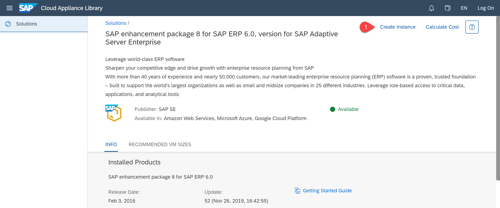

# Create a Test SAP ERP 6.0 System using SAP Cloud Appliance Library

If you don't own an ERP System you could use the 30 day trial version from SAP Cloud Appliance Library.
As a prerequisite you need either an Azure, AWS or Google account.
For the operation costs you will be charged by the account provider.

You can create an instance here:

*  [SAP enhancement package 8 for SAP ERP 6.0, version for SAP Adaptive Server Enterprise](https://cal.sap.com/catalog#/solutions/3857f8b3-9f49-48a9-bfb6-68f184299541)

First **logon** and then select on **Create Instance** on the top right.

  

For this mission we will use **client 000**.

Also in the section "Access Points" of your CAL image, kindly add the ports for HTTP and HTTPS, we have used for 'HTTP' - '50000' and for HTTPS - 44300 in this mission. Only after you allow these access points, the ports for HTTP and HTTPS will be opened. 

You find more information about this image in the [Getting Started Guide](https://caldocs.hana.ondemand.com/caldocs/help/Getting%20started%20guide%20ERP%20608%20on%20Sybase%20ASE.pdf),
and here more details about the [SAP Cloud Appliance Library](https://www.sap.com/products/cloud-appliance-library.html?btp=42c6e4e7-c8c3-4f02-a263-b319b00c9021)
