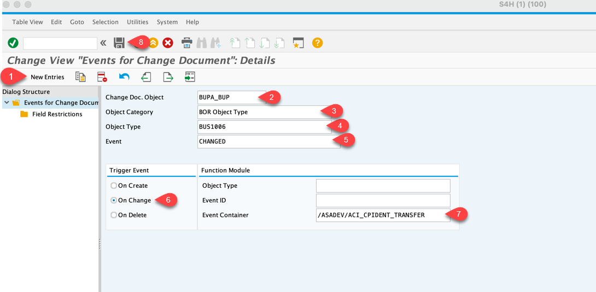

# Create Link between Business Partner Change Document and Change Event

In this section you will link the Change Document for Business Partner with the corresponding event. This allows to transfer only the data which was changed and keep the message payload reasonably small.

1. Log in to your SAP S/4HANA system using SAP GUI. Go to transaction **SWEC**.

2. Choose **New Entries** button and fill in the following fields:
   - In the **Change Doc.Object** field, select **BUPA\_BUP**.
   - In the **Object Category** field, select **BOR Object Type**.
   - In the **Object Type** field, select **BUS1006**.
   - In the **Event** field, select **CHANGED**.
   - In the **Event Container** field, select **/ASADEV/ACI\_CPIDENT\_TRANSFER**.
   - Select the **On Change** checkbox.
   - Choose **Save**.

   

