# Step by Step Creation and Registration of Attachment Odata Service

## Introduction

In this section we create a custom object of the Attachment service.

This service allows you to manage attachments and attachment URLs for business objects. You can perform operations such as create, read, rename, and deletion of attachments. It supports attachments of type Generic Object Services (GOS) and Document Management System (DMS).

**Persona:** ABAB Developer

## Step-by-step

1. Navigate to [SAP API Hub -  Attachments ](https://api.sap.com/api/API_CV_ATTACHMENT_SRV/overview) for downloading the EDMX file of Attachment service. We will use this as a template for creating a custom OData service.

   * Click **Download API Specifiation**

     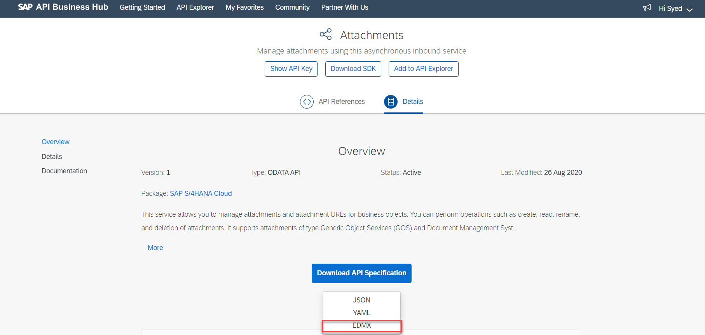

   * **Logon** to SAP API Hub using your SAP User

     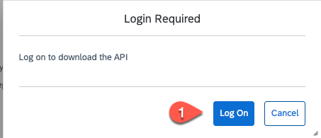  

   * Select **EDMX** and save the file.

     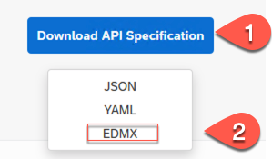


2. Logon to your ERP 6.0 system **client 000** with the ABAP Dev user. Call transaction **SEGW** to create a new Project. Please set the following data:
   * **Project:** *ZAPI_CV_ATTACHMENT*
   * **Description:** *Attachment Service*
   * **Package:** *$TMP*

   Keep the other settings. Then click on **Local Object** to create the project.

   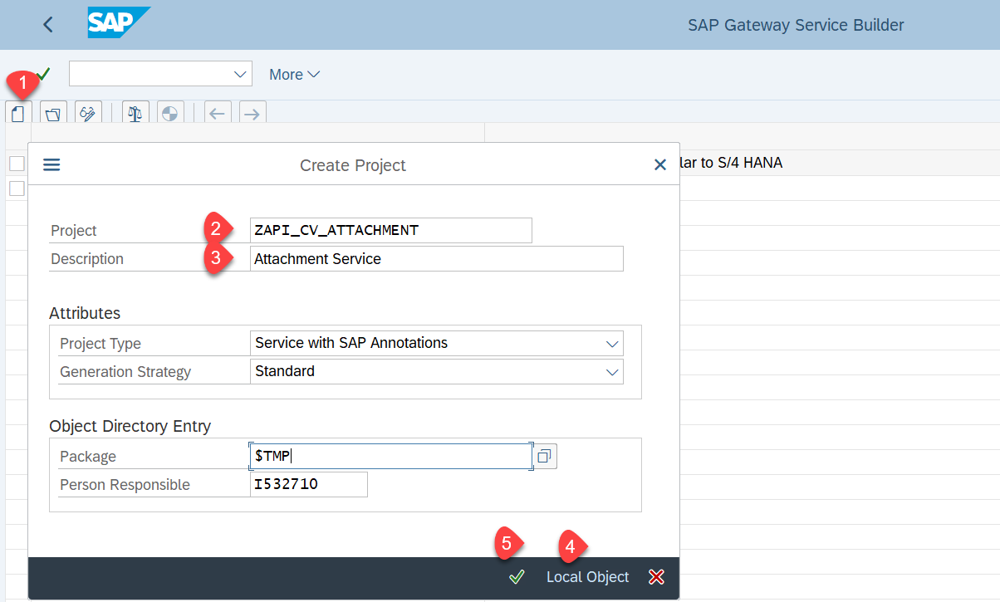

3. Navigate to **Data Model -> Import -> Data Model from File**.

   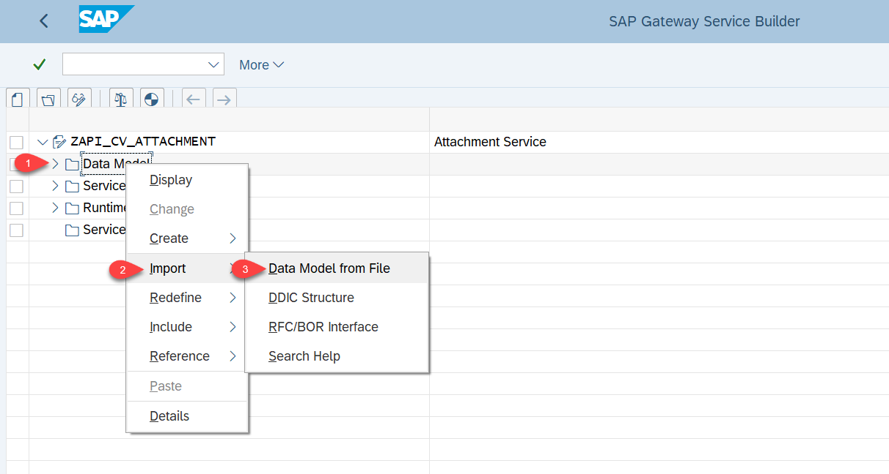

4. Import the previously downloaded EDMX file of the API_CV_ATTACHMENT_SRV using **Browse** and click on **Next**.

   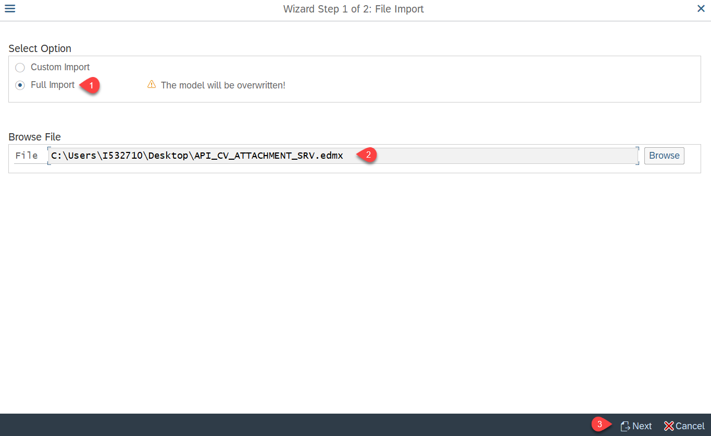

5. All entities got automatically imported through the EDMX file. Click on **Finish**.

   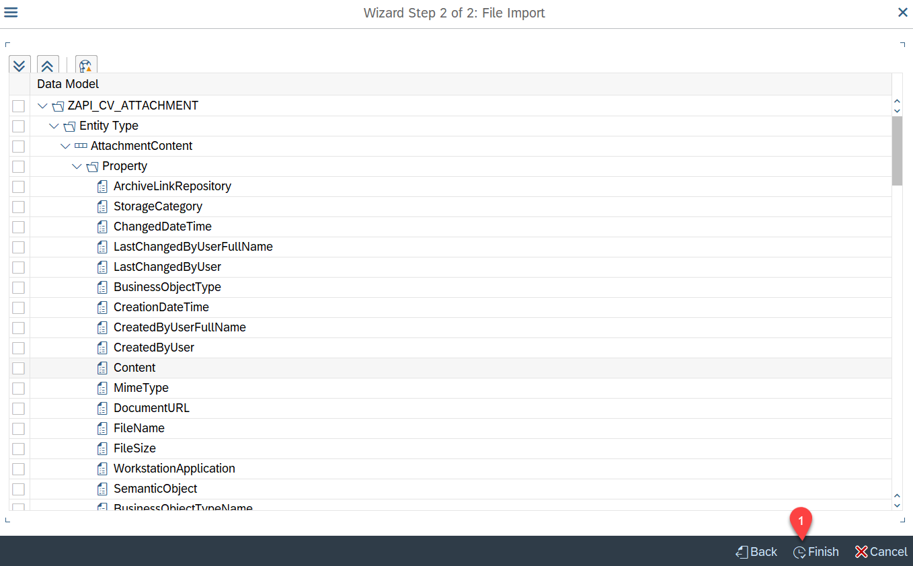

6. Click on **Generate** to enable **DPC**, **MPC**,**Model and Service** successfully. Save in **Local Package** or in **Transport**.

   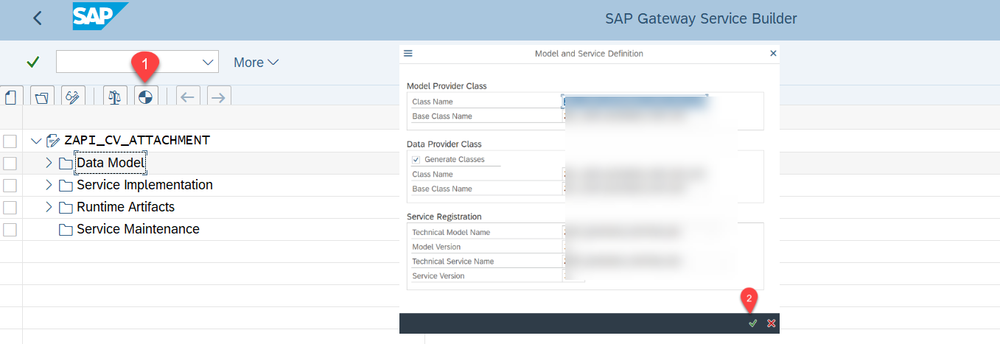

   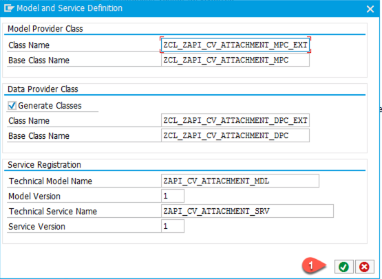

    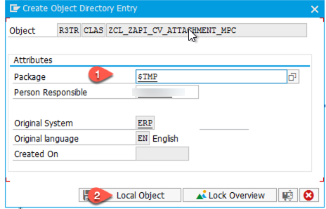

   The confirmation message will display all details of DPC, MPC, Model and Service.

   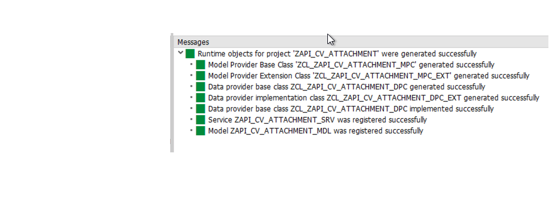

7. Double click on **Model Provider Class(ZCL_ZAPI_CV_ATTACHMENT_MPC_EXT)** by followig the below Navigation.

   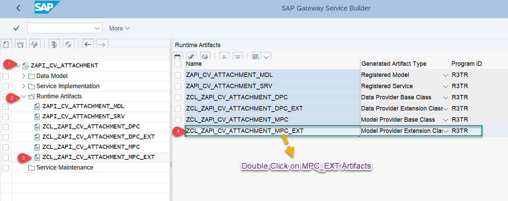

8. Expand **MPC_EXT Class -> Methods -> Inherited Methods -> DEFINE**. Follow the below Navigation.

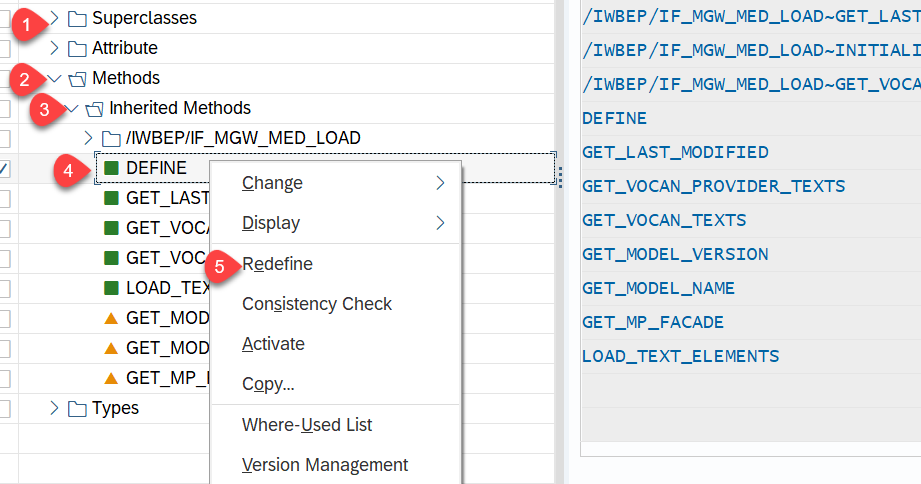

9. Once the method is redefined, it will also reflect on the **REDEFNITION** block. Double click on **DEFINE** method to implement. Copy and Paste the below Code to the **DEFINE** method.

### DEFINE

```
  METHOD define.
*&----------------------------------------------------------------------------------------------*
*  & Object         : ZCL_ZAPI_CV_ATTACHMENT_MPC_EXT=========DEFINE
*  &--------------------------------------------------------------------------------------------*
*  & Purpose        : The model provider extension class should redefine DEFINE method to handle
*                     this Media Type entity.

*  & Date written   : 19.09.2020
*  & Author         : Syed Ejazuddin(SAP)
*  &--------------------------------------------------------------------------------------------*
*  & Change Log : This Method has a scope for further extension and improvement
*  &--------------------------------------------------------------------------------------------*

*  &--------------------------------------------------------------------------------------------*
*  & Data Declaration
*  &--------------------------------------------------------------------------------------------*
    DATA: lo_entity           TYPE REF TO /iwbep/if_mgw_odata_entity_typ,
          lo_property         TYPE REF TO /iwbep/if_mgw_odata_property,
          lo_action           TYPE REF TO /iwbep/if_mgw_odata_action,
          lo_input_param      TYPE REF TO /iwbep/if_mgw_odata_property.

*Achieve the Inheritance for API_CV_ATTAHCHMENT_SRV
    super->define( ).

*Set the AttachmentConetent to Model
    lo_entity = model->get_entity_type( iv_entity_name = 'AttachmentContent' ).

*Set the Content Type for Mime Type Field to Handle Attachment/Media
    IF lo_entity IS BOUND.
      lo_property = lo_entity->get_property( iv_property_name = 'MimeType' ).
      lo_property->set_as_content_type( ).
    ENDIF.

*As many Entity field Are Key Field and Doesn't allow Null Value to Pass, To Avoid Any issue setting nullable to Key Field
*This Will Avoid Any Failing Issue in oData Provisioning
    TRY.
        CALL METHOD model->get_action
          EXPORTING
            iv_action_name = 'GetAllOriginals'
          RECEIVING
            ro_action      = lo_action.

        lo_input_param = lo_action->get_input_parameter( iv_name = 'SemanticObject' ).
        lo_input_param->set_nullable( ).

        CALL METHOD model->get_action
          EXPORTING
            iv_action_name = 'GetAttachmentCount'
          RECEIVING
            ro_action      = lo_action.

        lo_input_param = lo_action->get_input_parameter( iv_name = 'SemanticObject' ).
        lo_input_param->set_nullable( ).

        CALL METHOD model->get_action
          EXPORTING
            iv_action_name = 'RenameAttachment'
          RECEIVING
            ro_action      = lo_action.

        lo_input_param = lo_action->get_input_parameter( iv_name = 'SemanticObject' ).
        lo_input_param->set_nullable( ).

        lo_input_param = lo_action->get_input_parameter( iv_name = 'DocumentInfoRecordDocNumber' ).
        lo_input_param->set_nullable( ).

        lo_input_param = lo_action->get_input_parameter( iv_name = 'DocumentInfoRecordDocPart' ).
        lo_input_param->set_nullable( ).

        lo_input_param = lo_action->get_input_parameter( iv_name = 'DocumentInfoRecordDocType' ).
        lo_input_param->set_nullable( ).

        lo_input_param = lo_action->get_input_parameter( iv_name = 'DocumentInfoRecordDocVersion' ).
        lo_input_param->set_nullable( ).

      CATCH /iwbep/cx_mgw_med_exception .
    ENDTRY.
  ENDMETHOD.

```

10. Follow same procedure as Step 8 and now double click on **Data Provider Class(ZCL_ZAPI_CV_ATTACHMENT_DPC_EXT)**.

   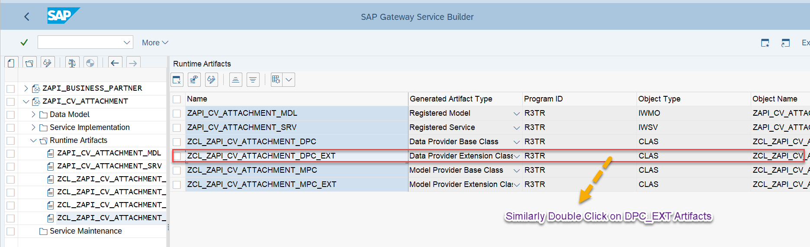

11. Expand **DPC_EXT Method -> Methods -> Inherited Methods -> /IWBEP/IF_MGW_APPL_SRV_RUNTIME**:  right-click on **CREATE_STREAM** and select **REDEFINE**.

   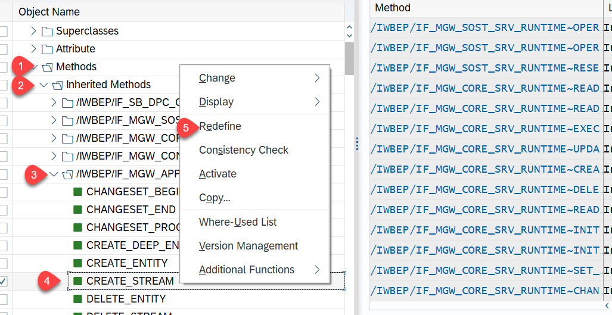

12. Remove the commented code and insert the below code to the method **/IWBEP/IF_MGW_APPL_SRV_RUNTIME~CREATE_STREAM**.

### Method /IWBEP/IF_MGW_APPL_SRV_RUNTIME~CREATE_STREAM

````
  METHOD /iwbep/if_mgw_appl_srv_runtime~create_stream.
*&---------------------------------------------------------------------------------------------------*
*  & ls_object         : ZCL_ZAPI_CV_ATTACHMENT_DPC_EXT====/IWBEP/IF_MGW_APPL_SRV_RUNTIME~CREATE_STREAM
*  &-------------------------------------------------------------------------------------------------*
*  & Purpose        : Thie Method Will Create Any Kind of Attachment in GOS of Business ls_object.

*  & Date written   : 19.09.2020
*  & Author         : Syed Ejazuddin(SAP)
*  &-------------------------------------------------------------------------------------------------*
*  & Change Log : This Method has a scope for further lv_extension and improvement
*  &-------------------------------------------------------------------------------------------------*

*  &-------------------------------------------------------------------------------------------------*
*  & Data Declaration
*  &-------------------------------------------------------------------------------------------------*
    TYPES: BEGIN OF ty_filemetadata,
             filename TYPE string,
             mimetype TYPE string,
           END OF ty_filemetadata.

    DATA: lt_content      TYPE STANDARD TABLE OF soli,
          lt_objhead      TYPE STANDARD TABLE OF soli,
          ls_filemetadata TYPE ty_filemetadata,
          ls_folmem_k     TYPE sofmk,
          ls_note         TYPE borident,
          ls_object       TYPE borident,
          ls_obj_id       TYPE soodk,
          ls_fol_id       TYPE soodk,
          ls_obj_data     TYPE sood1,
          lv_slug         TYPE string,
          lv_ep_note      TYPE swo_typeid,
          lv_partner      TYPE bu_partner,
          lv_extension    TYPE char4.

    CONSTANTS : lc_ext  TYPE char3 VALUE 'EXT',
                lc_atta TYPE char4  VALUE 'ATTA',
                lc_b    TYPE char1  VALUE 'B',
                lc_x    TYPE char1  VALUE 'X',
                lc_o    TYPE char1  VALUE 'O'.

* Clear the Entries in Internal Table
    CLEAR: lt_content[], lt_objhead[].

    TRY.

* Retrieve the Business object which will be sent as Header from Serverless Function
        DATA(lv_bus1006) = mr_request_details->technical_request-request_header[ name = 'businessobjecttypename' ]-value.

* Retrieve the Business Partner ID which will be sent as Header from Serverless Function
        lv_partner = mr_request_details->technical_request-request_header[ name = 'linkedsapobjectkey' ]-value.

* To avoid Leading zeroes issue, using conversion operator
        lv_partner = |{ lv_partner ALPHA = IN }|.

* Retrieve the Attachment File name which will be sent as Header from Serverless Function
        lv_slug = mr_request_details->technical_request-request_header[ name = 'slug' ]-value.
* As file name comes as ***.jpg, Split the File Name into Actual name and lv_extension
        SPLIT lv_slug AT '.' INTO lv_slug lv_extension.
* Change lv_extension to UpperCase
        TRANSLATE lv_extension TO UPPER CASE.

* Below Function Module Convert the Xstring Format of File coming from serverless to Binary
        CALL FUNCTION 'SCMS_XSTRING_TO_BINARY'
          EXPORTING
            buffer          = is_media_resource-value  "Xstring
            append_to_table = lc_x
          TABLES
            binary_tab      = lt_content[].             "Binary

* Convert to Binary file coming from prevous Function Module
        CALL FUNCTION 'SO_CONVERT_CONTENTS_BIN'
          EXPORTING
            it_contents_bin = lt_content[]
          IMPORTING
            et_contents_bin = lt_content[].

* Get an address of where your file contents will be stored in SAP
        CALL FUNCTION 'SO_FOLDER_ROOT_ID_GET'
          EXPORTING
            region                = lc_b
          IMPORTING
            folder_id             = ls_fol_id
          EXCEPTIONS
            communication_failure = 1
            owner_not_exist       = 2
            system_failure        = 3
            x_error               = 4
            OTHERS                = 5.

* Assigning Values to the Standard Structure Fields
        ls_object-objkey     =   lv_partner.   "Business Partner ID
        ls_object-objtype    =   lv_bus1006.   "Business ls_object of BP
        ls_obj_data-objsns   =   lc_o.         "Sensitivity of ls_object (O-Standard)
        ls_obj_data-objla    =   sy-langu.     "Language
        ls_obj_data-objdes   =   lv_slug.      "File Name
        ls_obj_data-file_ext =   lv_extension. "File lv_extension
        ls_obj_data-objlen   =   lines( lt_content ) * 255.

* Put the file into that "folder" by calling FM SO_OBJECT_INSERT.
* The lt_content of the file is passed to this function module in a table.
        CALL FUNCTION 'SO_OBJECT_INSERT'
          EXPORTING
            folder_id                  = ls_fol_id
            object_type                = lc_ext
            object_hd_change           = ls_obj_data
          IMPORTING
            object_id                  = ls_obj_id
          TABLES
            objhead                    = lt_objhead
            objcont                    = lt_content
          EXCEPTIONS
            active_user_not_exist      = 1
            communication_failure      = 2
            component_not_available    = 3
            dl_name_exist              = 4
            folder_not_exist           = 5
            folder_no_authorization    = 6
            object_type_not_exist      = 7
            operation_no_authorization = 8
            owner_not_exist            = 9
            parameter_error            = 10
            substitute_not_active      = 11
            substitute_not_defined     = 12
            system_failure             = 13
            x_error                    = 14
            OTHERS                     = 15.

* If Above FM Calls Success fully , Pass the Detail in Local Structure
        IF sy-subrc = 0 AND ls_object-objkey IS NOT INITIAL.
          ls_folmem_k-foltp = ls_fol_id-objtp.
          ls_folmem_k-folyr = ls_fol_id-objyr.
          ls_folmem_k-folno = ls_fol_id-objno.
          ls_folmem_k-doctp = ls_obj_id-objtp.
          ls_folmem_k-docyr = ls_obj_id-objyr.
          ls_folmem_k-docno = ls_obj_id-objno.
          lv_ep_note        = ls_folmem_k.
          ls_note-objtype   = 'MESSAGE'.
          ls_note-objkey    = lv_ep_note.

* The FM SO_OBJECT_INSERT will give you the "ls_object ID" for your file.
* At this point your file is already stored somewhere in the depths of SAP Office
* and the last step is to link this "ls_object ID" to the invoice. To do so,
* we call the FM BINARY_RELATION_CREATE_COMMIT.

          CALL FUNCTION 'BINARY_RELATION_CREATE_COMMIT'
            EXPORTING
              obj_rolea      = ls_object
              obj_roleb      = ls_note
              relationtype   = lc_atta
            EXCEPTIONS
              no_model       = 1
              internal_error = 2
              unknown        = 3
              OTHERS         = 4.

          CALL FUNCTION 'BAPI_TRANSACTION_COMMIT'
            EXPORTING
              wait = lc_x.
        ENDIF.

* Export the Process to Output entity of API
        ls_filemetadata-filename = lv_slug.
        ls_filemetadata-mimetype = is_media_resource-mime_type.

        copy_data_to_ref(
        EXPORTING
        is_data = ls_filemetadata
        CHANGING
        cr_data = er_entity ).

      CATCH cx_sy_itab_line_not_found.
    ENDTRY.
  ENDMETHOD.
````

13. Similarly redefine the method **ATTACHMENTCONTEN_GET_ENTITYSET**. No need to Add any code, it only is to fetch the **CSRF Token**

    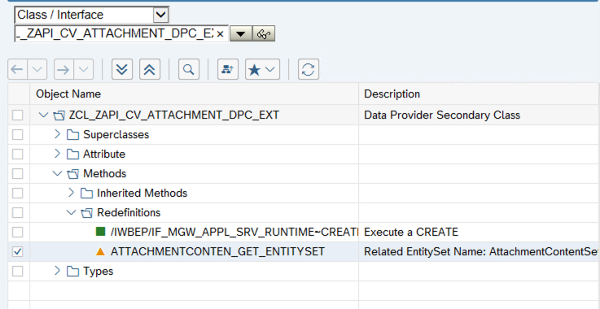  

    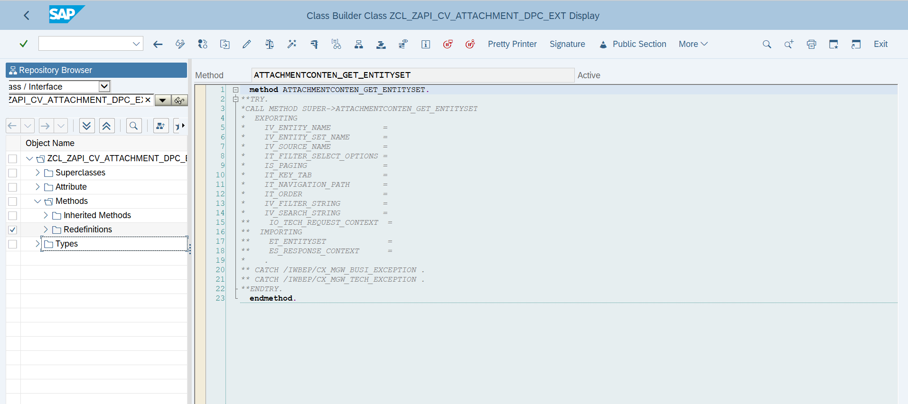  

14. Save all the object by clicking **SAVE** Icon (RED Circle) and then **Activate** the object (Green circle). Please don't do force activation. If error persist during activation, then there might be some issue in steps.

    

15. Navigate to Transaction **/n/iwfnd/maint_service** and click on **Add Service** to register the service.

    

16. Follow the below steps to register newly created Business Partner in Gateway.
    * Set **System-Alias** = *LOCAL*
    * Search for *ATTACHMENT*
    * Add selected Service
    * Click on **ZAPI_BUSINESS_PARTNER_SRV**

     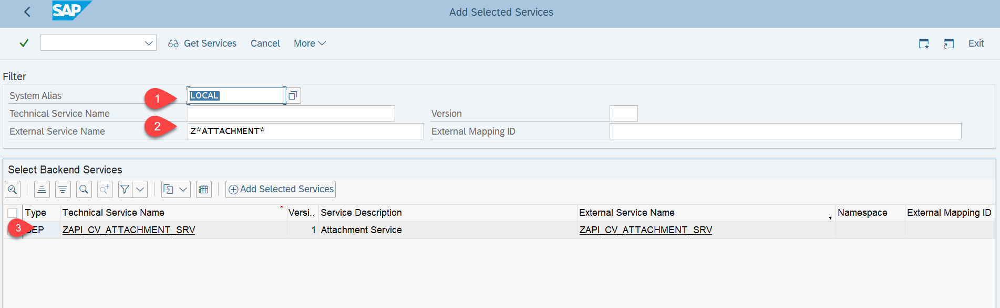

     * Set **Package Assignment** = *$TMP*
     * Click on the green check mark (**OK**).

     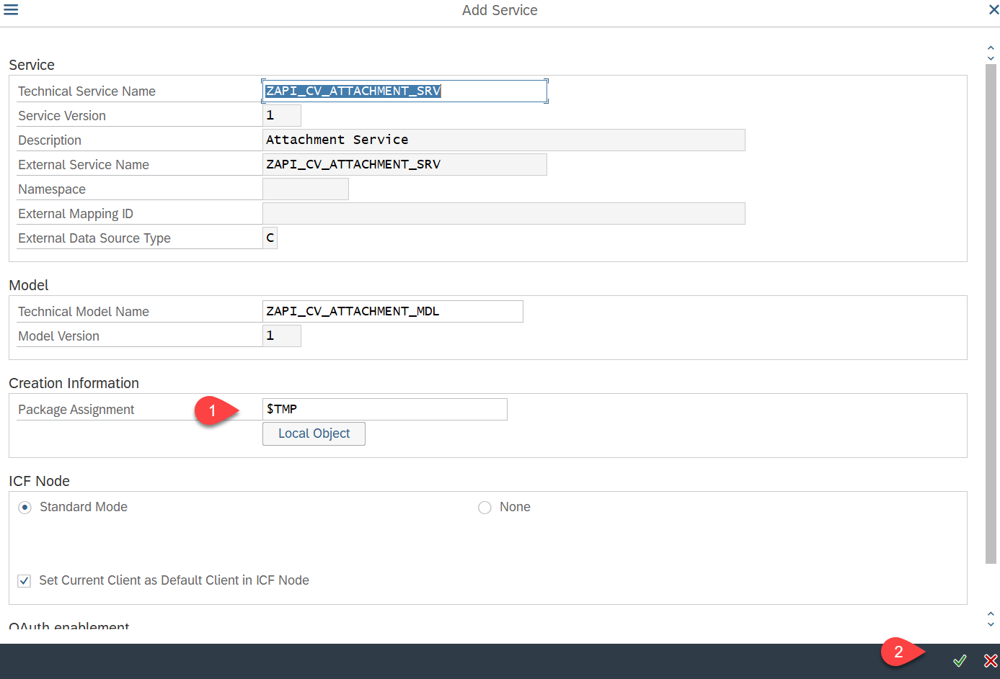

## Test Your Service

1.  Double click on **registered service** and click on **SAP Gateway Client**.

    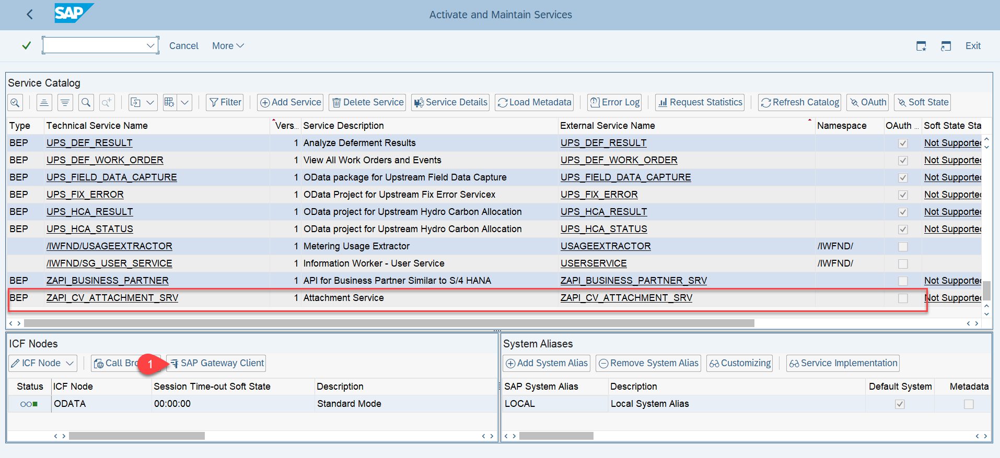

18. Click on **Execute** and you will see *status code 200* in your response body.

    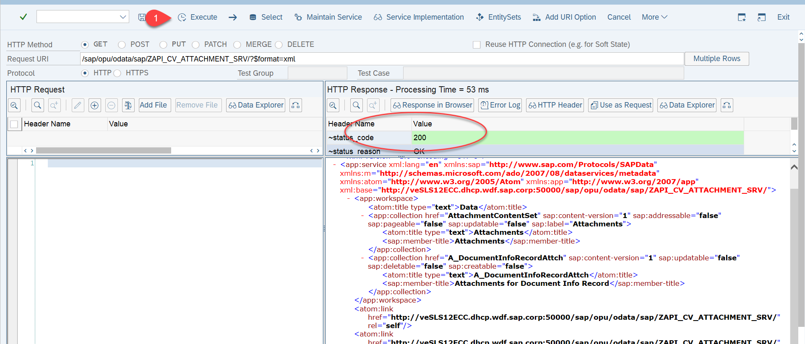

19. To see the metadata, add *$metadata* at the end of the URL. You will see **API_ATTACHMENT_SRV** namespace in EDMX.

    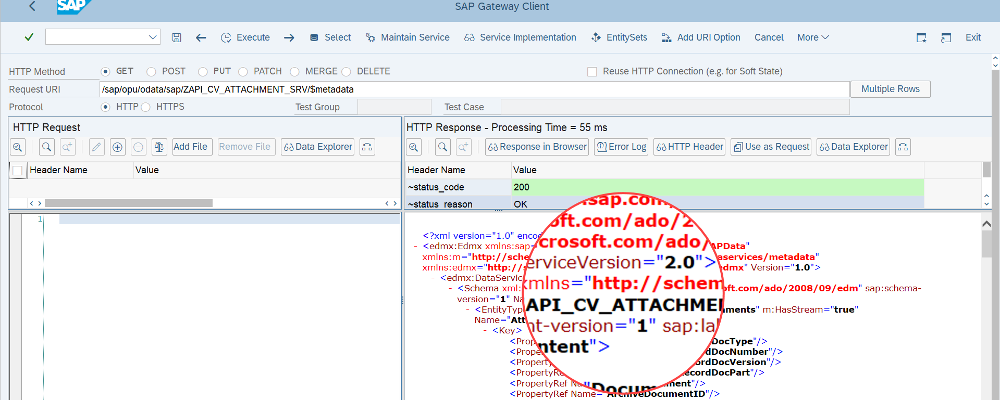
