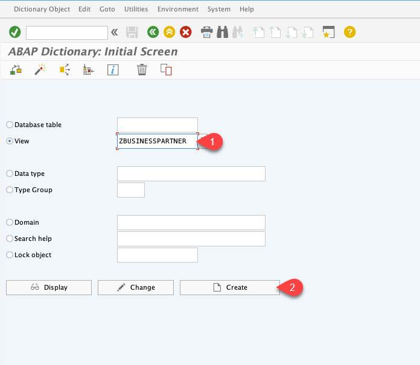
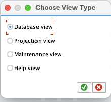
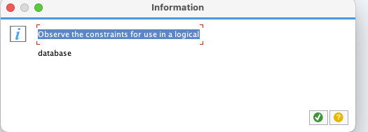
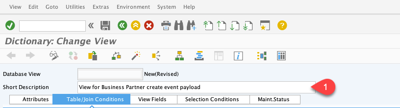
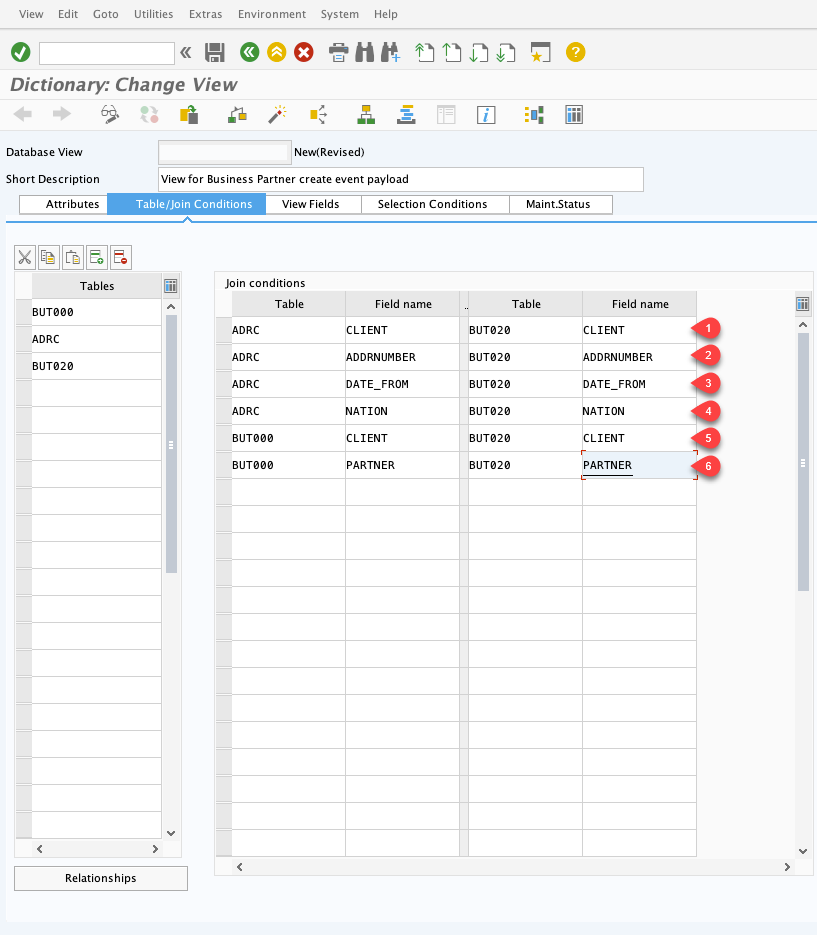
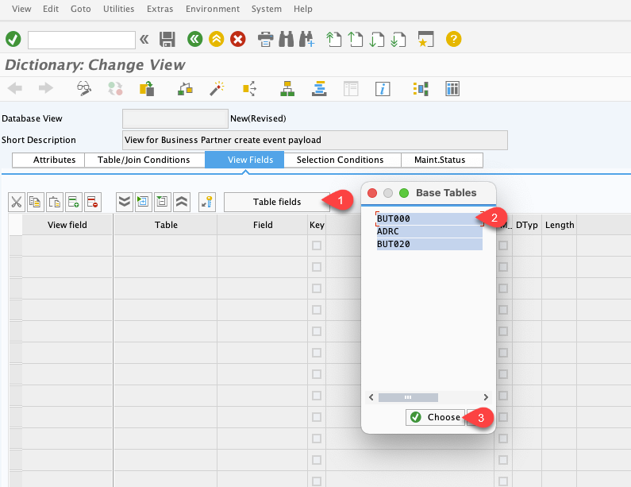
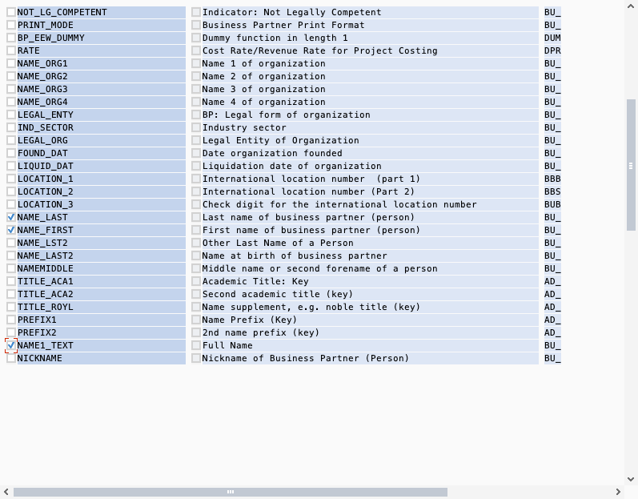
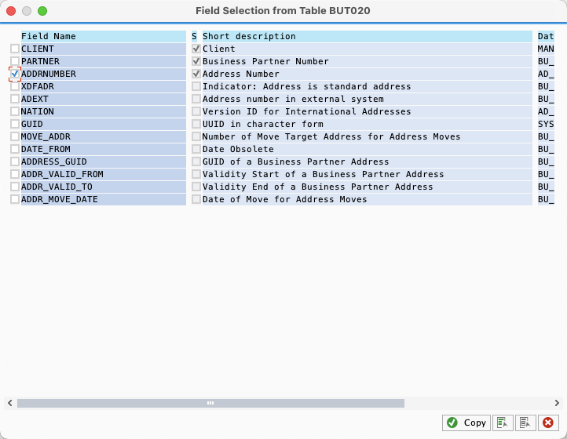
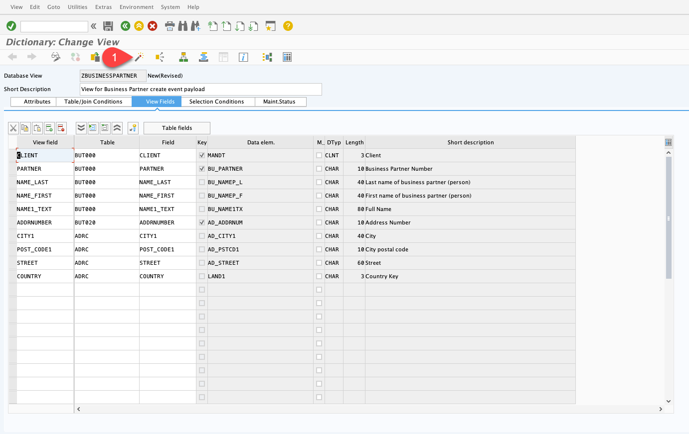
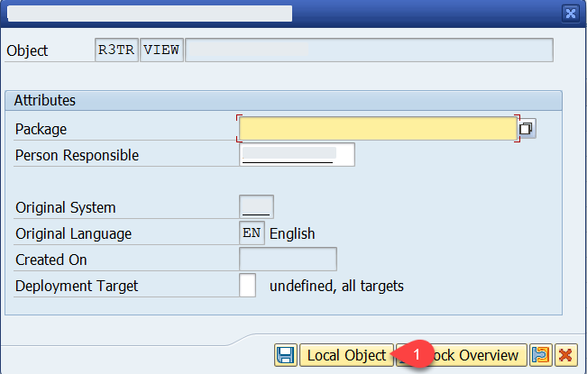

#   Create View for Data Event

In this section you will create a database view for a data event and do the additional setup to enable the data event feature. More details on data events are available in the [Emit Data Events from SAP S/4HANA or SAP ECC through SAP NetWeaver Add-On for Event Enablement](https://blogs.sap.com/2021/08/13/emit-data-events-from-sap-s-4hana-or-sap-ecc-through-sap-netweaver-add-on-for-event-enablement/) blog post.

## Create Database View

1. Log in to your SAP S/4 HANA system with the development user using SAP GUI. Go to transaction **SE11**.
2. Set **View** = *ZBUSINESSPARTNER* and choose **Create**.

   

3. Choose **Database view** in the next popup window.

   

   *Note:* skip the following popup window if it appears:

   

4. Set **Short Description** = *View for Business Partner create event payload*.

   

5. In the tab **Table/Join Conditions**, enter the following table names on the left side:
   * *BUT000*
   * *ADRC*
   * *BUT020*

   

6. Enter join conditions on the right side of the same screen:
   - In the first column, **Table**, enter *ADRC*
   - In the second column, **Field name**, enter *CLIENT*
   - In the third column, **Table**, enter *BUT020*
   - In the fourth column, **Field name**, enter *CLIENT*

   - In the first column, **Table**, enter *ADRC*
   - In the second column, **Field name**, enter *ADDRNUMBER*
   - In the third column, **Table**, enter *BUT020*
   - In the fourth column, **Field name**, enter *ADDRNUMBER*

   - In the first column, **Table**, enter *ADRC*
   - In the second column, **Field name**, enter *DATE_FROM*
   - In the third column, **Table**, enter *BUT020*
   - In the fourth column, **Field name**, enter *DATE_FROM*

   - In the first column, **Table**, enter *ADRC*
   - In the second column, **Field name**, enter *NATION*
   - In the third column, **Table**, enter *BUT020*
   - In the fourth column, **Field name**, enter *NATION*

   - In the first column, **Table**, enter *BUT000*
   - In the second column, **Field name**, enter *CLIENT*
   - In the third column, **Table**, enter *BUT020*
   - In the fourth column, **Field name**, enter *CLIENT*

   - In the first column, **Table**, enter *BUT000*
   - In the second column, **Field name**, enter *PARTNER*
   - In the third column, **Table**, enter *BUT020*
   - In the fourth column, **Field name**, enter *PARTNER*

   

7. Switch to the tab **View Fields**.
8. Choose **Table fields**, then select the line with *BUT000* table and confirm the selection by choosing **Choose**.

   

9.  Find and mark the following fields in the popup screen:
   - *CLIENT*
   - *PARTNER*
   - *NAME_LAST*
   - *NAME_FIRST*
   - *NAME1_TEXT*

   

10. Choose **OK**.
11. Repeat the steps *7 to 9* for the table *BUT020* and field *ADDRNUMBER*.

   

12. Repeat the steps *7 to 9* for the table *ADRC* and the following fields:
   - *CITY1*
   - *POST_CODE1*
   - *STREET*
   - *COUNTRY*

13. Choose **Activate**.

   

14. Choose **Local Object** when you are asked about package assignment.

   
