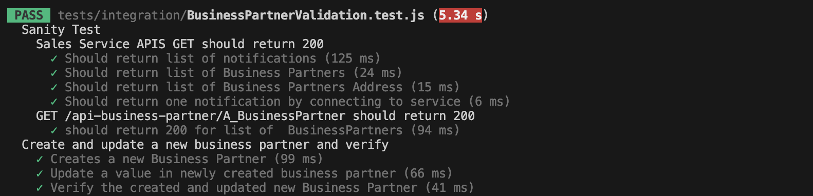

# Run an Integration Test

## Introduction

 - Running Integration tests is to ensure that all the components of a system are working together as expected. 
 - Integration tests are used to test the integration of components such as databases, web services, APIs, and user interfaces.

**Persona:** BTP Developer


### Understand the Test Case

In this exercise there is already a pre prepared integration test created in [GitHub](https://github.com/SAP-samples/cloud-extension-ecc-business-process/blob/main/tests/integration/BusinessPartnerValidation.test.js). In case you have not cloned the repository in an earlier step, copy the files to your created repository.

1. The test is using the function [_cds.test_](https://cap.cloud.sap/docs/node.js/cds-test), which launches a CAP server in a test environment. 

    

2. For accessing and testing all the service APIs, authentication needs to be added. Axios provides default, which can be set globally, that will be applied to every request.

    ```
    const { default: axios } = require('axios');
    axios.defaults.auth = { username: "admin", password: "admin" };
    ```

    


3. Start with sanity checks on APIs. 

   A sanity check is a basic level of testing that ensures that the fundamental features of the software application are working as expected before proceeding with more extensive testing.

4. As a first step, it is tested if the application can access the APIs for returning notifications, Business Partner and Business Partner Address.

    
    

5. After the basic functionality is tested the test script is executing more detailed test. A new Business Partner is created and then it is checked if the send notification is returning the correct Business Partner Data

    
    

### Run Integration Tests in Your Application

1. Go back to your IDE

2. Open the terminal and run the following test script
    ```
    npm run test:integration
    ```

    
    
    
