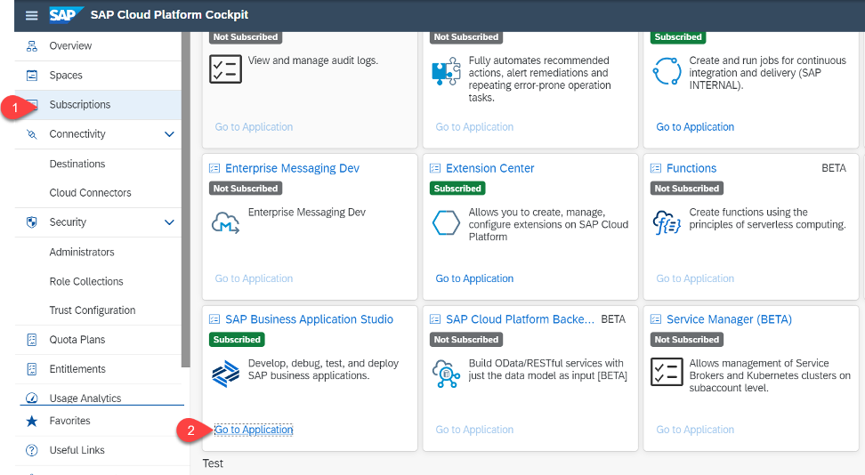
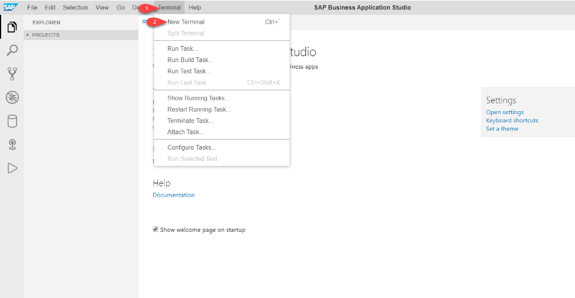
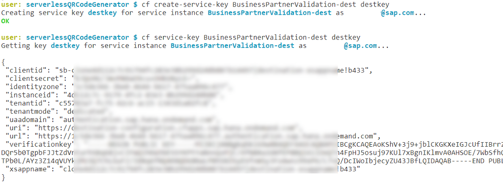
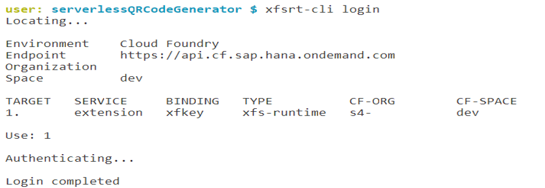
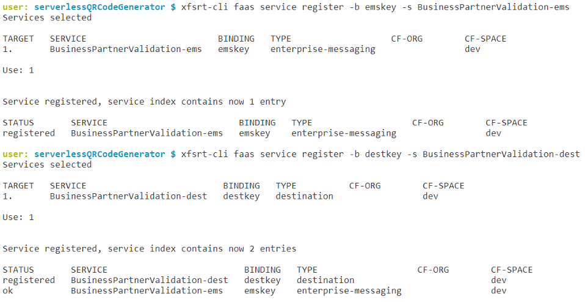
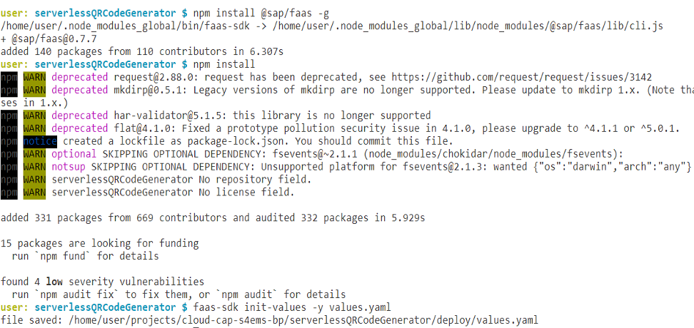

# Develop Serverless Function-as-a-Service - Part 1

This serverless function is used to generate a qrcode for the updated Business Partner address and it uploads the same to the S/4HANA on premise system along with the business partner details.

The implementation showcases the following features of the SAP Cloud Platform Serverless Runtime:

  - AMQP trigger for invoking the serverless function
  - OData Provisioning for registering the S/4HANA OData Services
  - Consumption of the registered S/4HANA OData services from a Serverless function

**Persona:** Cloud Application Devloper

## Requirements

* A working instance of Enterprise Messaging.
* A working instance of a Destination Service.
* A queue has been set up for receiving messages sent by the cf application
* Subscription for Extension Center
* Subscription for Enterprise Messaging App
* Subscription for Business Application Studio
* Entitlement to create a new Serverless instance (*Extension Factory, serverless runtime*).

## Deployment - Business Application Studio

1. Login to Business Application Studio



>Hint: you should have enabled "SAP Cloud Platform Serverless Runtime Development" while creating a dev space in the Business Application Studio in one of the earlier steps. 

2. In the menue select File - Open Workspace and select the cloud-cap-ecc-bp project 
3. Login to your SAP Cloud Platform account

   * Check if you are logged in to your Cloud Platform Account from *SAP Business Application Studio*.
     
   * To login to Cloud Foundry, In the tabs, click on View-> Select “Find Command”.
    
   * Search for “CF Login”.
    
   * Select for “CF: Login on to Cloud Foundry”.
     
      
    
   * Enter CF API endpoint or take the default suggested API endpoint. You can find the API endpoint of your region by switching into your SAP Cloud Platform account browser window and copy the API Endpoint. Also write down the 'Org Name' into a text editor of your choice which is needed for the next step.  

     
    
   * Choose 'Spaces' and write down the space name to a text editor of your choice. 

     
     
   * Enter “Email” and “Password” when prompted.
   * Select your Cloud Foundry "Org" which you have noted down in step before 
   * Select the space name which you have noted down. Once you have selected the Org and Space, you would login to your Cloud Foundry account from SAP Business Application Studio.
 
4. Open a terminal and change to the serverlessQRCodeGenerator directory



```bash
cd  serverlessQRCodeGenerator
```
 
5. Create the Serverless Runtime service instance

```bash
cf create-service xfs-runtime default extension -c '{"extensions": true, "odp": true}'
```

6. Create the required keys for the Serverless Runtime, the destination service and Enterprise Messaging


- Create the Serverless Runtime service key

```bash
cf create-service-key extension xfkey
```
 
- Create destination service service - key
 
```bash
cf create-service-key <DESTINATION_SERVICE_INSTANCE_NAME> <DESTINATION_SERVICE_KEY_NAME>
```
e.g. cf create-service-key BusinessPartnerValidation-dest destkey

- Create the Enterprise Messaging service key

```bash
cf create-service-key <ENTERPRISE_MESSAGING_SERVICE_INSTANCE_NAME> <ENTERPRISE_MESSAGING_SERVICE_KEY_NAME>
```
e.g cf create-service-key BusinessPartnerValidation-ems emskey



7. Login to the Serverless Runtime instance

```bash
xfsrt-cli login -k <serverless_instance_key_name> -n <service_instance_name>
```

or alternatively log in and then select from the options

```bash
xfsrt-cli login
```



8. Register Enterprise Messaging Service instance

     ```bash
      xfsrt-cli faas service register -b <Enterprise_Messaging_service_key_name> -s <Enterprise_Message_instance_name>
     ```
    e.g.  xfsrt-cli faas service register -b emskey -s BusinessPartnerValidation-ems

    Select Target - most likely 1 for you.

9. Register Destination Service instance

    ```bash
    xfsrt-cli faas service register -b <Destination_service_key_name> -s <sDestination_instance_name>
    ```
    e.g. xfsrt-cli faas service register -b destkey -s BusinessPartnerValidation-dest

    Select Target - most likely 1 for you.

    

10. Confirm that the service instances are registered.

    ```bash
    xfsrt-cli faas service list  
    ```

11. Install faas-sdk

    ```bash
    npm install @sap/faas -g
    ```

12. Install all required node packages

    ```bash
    npm install
    ```

13. Create a deployment file to provide the credentials 

    Make sure you execute the command inside the project directory.

    ```bash
    faas-sdk init-values -y values.yaml
    ```

    


**Next [Setup and configure Messaging in Part 2](setup-serverless.md)**
