# # Develop Serverless Function-as-a-Service Part 2


## Set Up Messaging Queue required for Serverless

1. Create Queue in Enterprise Messaging for Serverless

- Go to SAP Cloud Platform Cockpit
- Click on Subscription
- Click on "Go to Application" for Enterprise Messaging

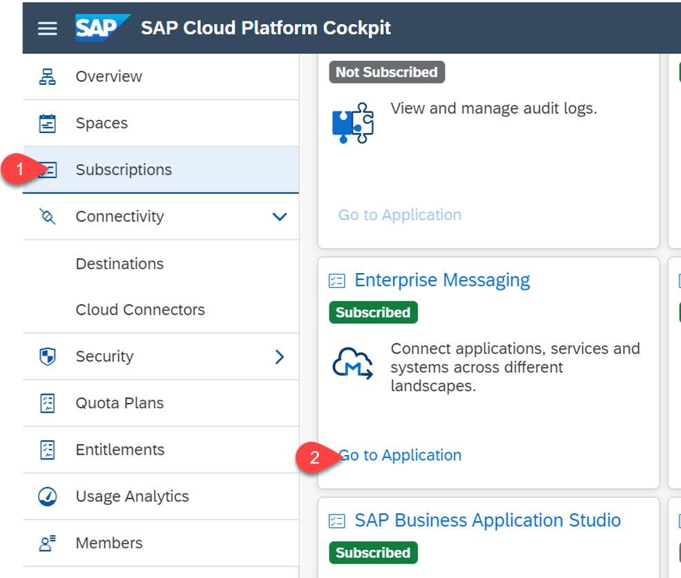

- Login using email and password


- Click on your message client

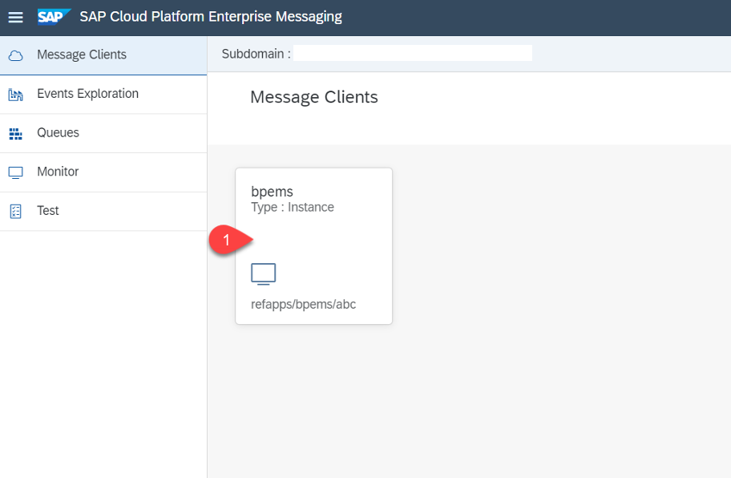

- Click on Queues.
- Click on Create Queue

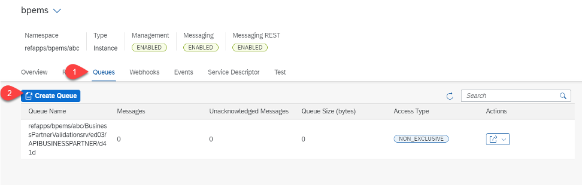

- Provide a name for the queue (recommended: serverlessQueue)
- Click on Create

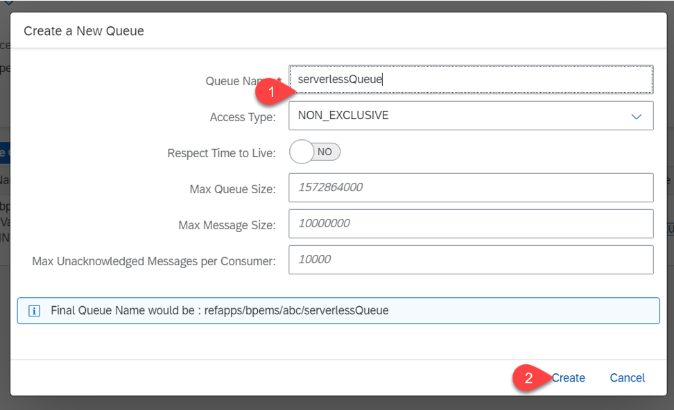

- Click on the  arrow icon (under Actions)
- Click on Queue subscriptions

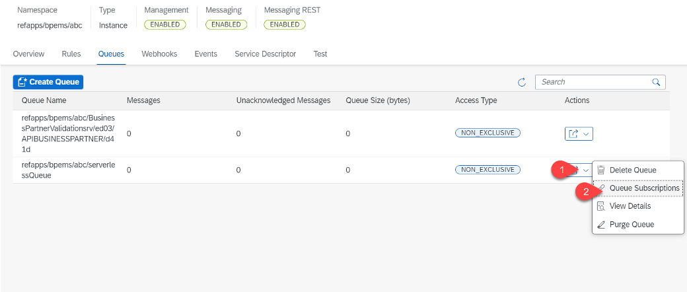

- Provide a topic name

Provide below topic name for our scenario:

```bash
refapps/bpems/abc/SalesService/d41d/BusinessPartnerVerified
```

- Click on *Add*
- Click on *Close*

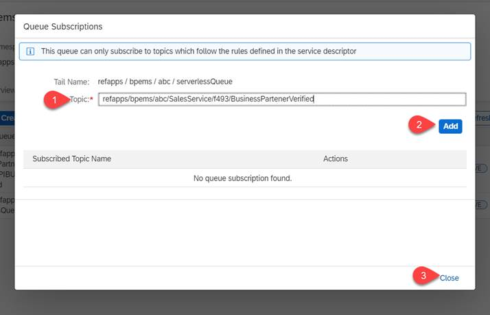

## Configuration in Extension Center

1. Login to Extension Center by going to *Subscriptions* in your Cloud Platform Cockpit and clicking on *Go to Application* in the Extension Center tile (Roles)

 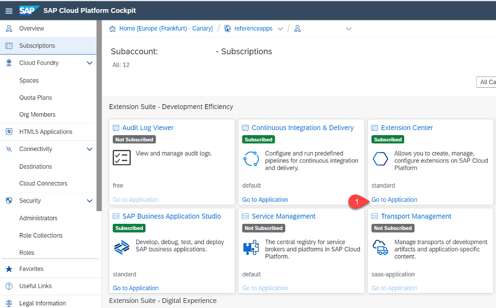

2. Once in the Extension Center, click on Services on the left hand side, then click the *Register* button 

 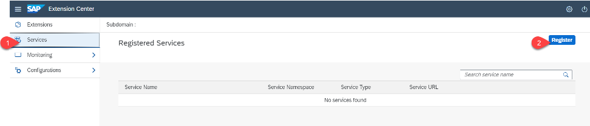

Now we will register the ZAPI_BUSINESS_PARTNER  and ZAPI_CV_ATTACHMENT_SRV services 

3. Select the destination (odataprov) that you had created before. 
4. Search for ZAPI_BUSINESS_PARTNER in the Service Name field
5. Select ZAPI_BUSINESS_PARTNER
6. Click on Register

 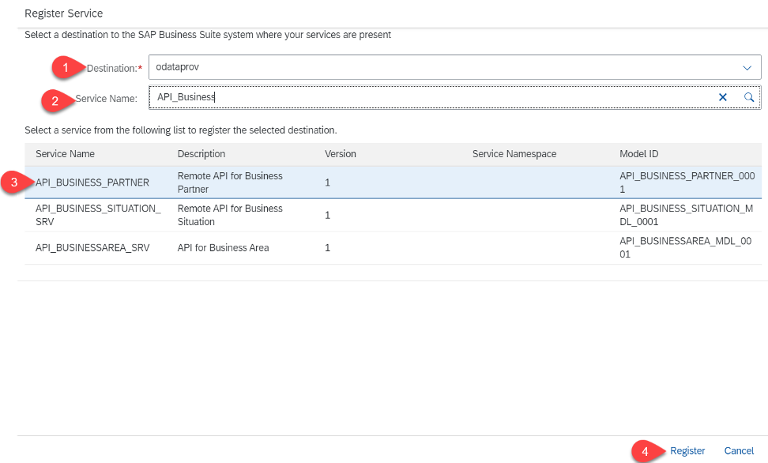

7. Repeat the steps above for ZAPI_CV_ATTACHMENT_SRV
8. Select ZAPI_CV_ATTACHMENT_SRV by clicking on the service name

9. Copy the front part of the service url ending with SAP/ , i.e. https://xxx.xxxx.services.xfs.cloud.sap/odata/SAP/

 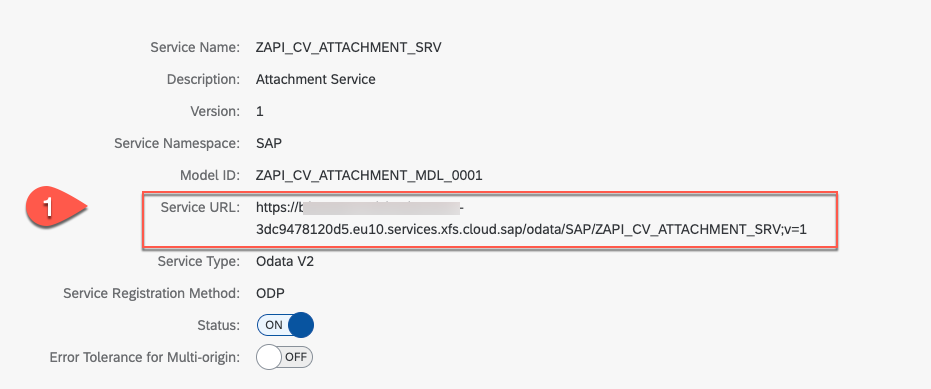

## Destinations in Cloud Platform Cockpit

1. Go to the SAP Cloud Platform Cockpit 
2. Go to Destinations
3. Click on *New Destination*

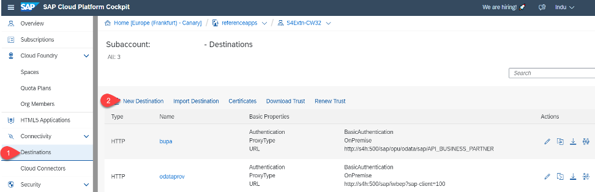

4. Perform the destination configuration

Enter the following data for the destination configuration:

- Enter a name for the destination: RegisteredODataService
- Set Type = HTTP
- Paste the URL of the ZAPI_CV_ATTACHMENT_SRV copied in previous step
- Proxy type: Internet
- Authentication: oAuth2ClientCredentials
- Provide client ID of XFSRT instance
- Provide Client secret of XFSRT instance
- Provide Token Service URL of XFSRT instance


You get the client ID, secret and Token Service URL from the xfkey of the Serverless Runtime instance

   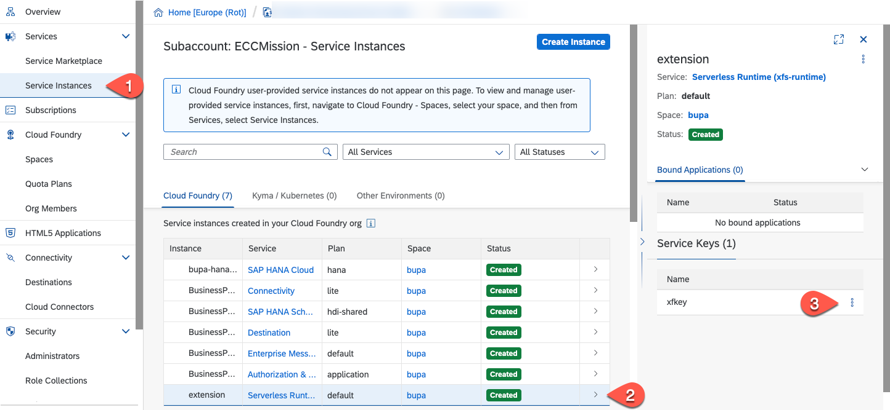

   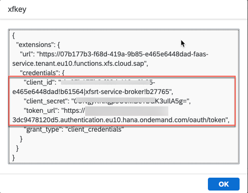

   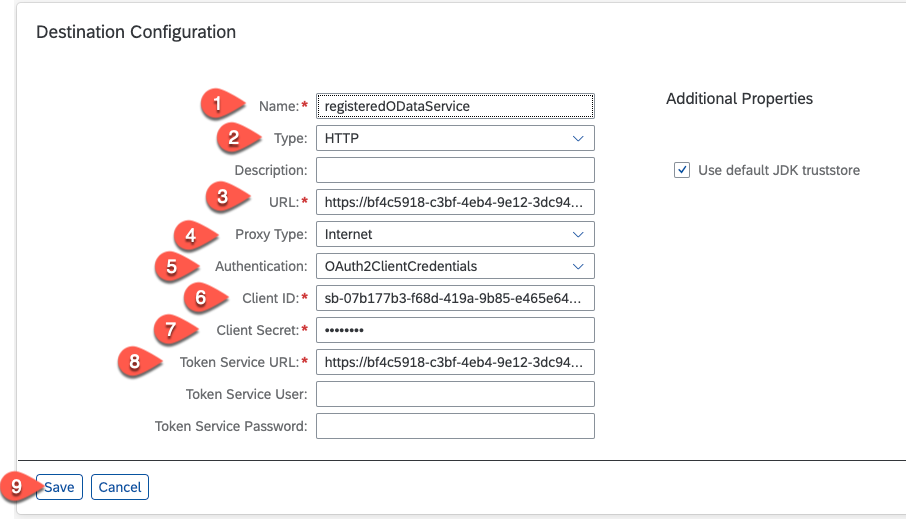

5. Click on save
6. Check the connection for the destination by clicking *Check Connection*. Hint: In case that you get a green light and a 401 error, this is ok. 

## Update Values for Serverless Function


1. Go to the Business Application Studio
2. Update values.yaml file with the below values

- Open deploy folder in serverlessQRCodeGenerator 

- Open values.yaml file

- Update *type*, *instance id* and *key name* from the details of registered Enterprise Messaging Service under em-srv. Execute the below commands to get the details. The first command will provide you the list of services. Then, in a next step, you get the service-key for these services.

  ```bash
  xfsrt-cli faas service list
  
  cf service-key <Enterprise_Messaging_instance_name> <Enterprise_Messaging_service_key_name>
  ```
   eg: cf service-key BusinessPartnerValidation-ems emskey
   
  ```bash
  cf service-key <Destination_instance_name> <Destination_service_key_name>
  
  ```
  eg: cf service-key BusinessPartnerValidation-dest destkey
  
  

- Provide the destination created in a previous step under secret-values -> destination-name -> name -> name

- Fill the values for the fields attachmentSrvApi, businessPartnerSrvApi and businessObjectTypeName

- Update the Enterprise messaging queue name under config-values-section -> amqp-service-config -> amqp -> incoming -> inp1 -> sourceAddress appended with "queue:<your queue name>"

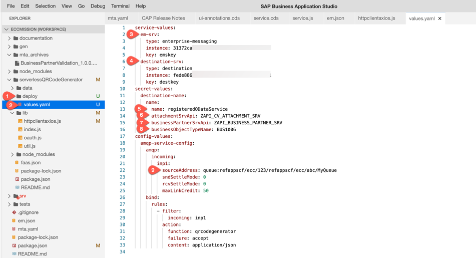

3. Deploy the Serverless app
  
```bash
xfsrt-cli faas project deploy -p "<path to serverless project directory>" -y ./deploy/values.yaml
```

## Test

1. Go to the Extension Center
2. Select *Extensions*
3. Click on the tile for the application you have just created
4. Click on *logs*
5. View the logs of the function in Extension Center.
6. Choose your application check whether everything looks good

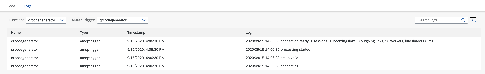