#   Configure ERP 6.0 Backend

Before starting the development of the OData services we have to do some preconfigurations.

## Add Development User

1. Call transaction /nSU01
2. Enter a user name and select create.
   
   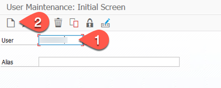

3. In the Address section enter User name and email address
   
   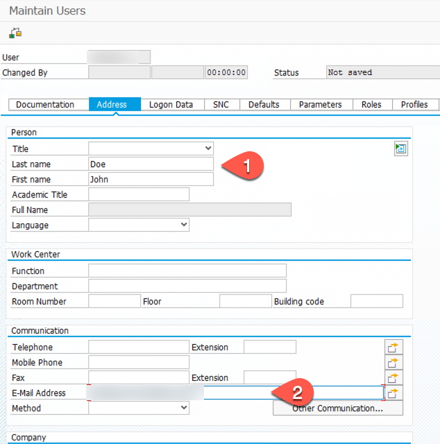

4. In the "Logon Data" section enter the initial password

   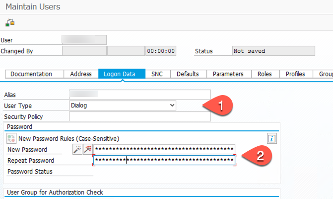

5. In the Roles section add the SAP_BC_DWB_ABAPDEVELOPER role.

   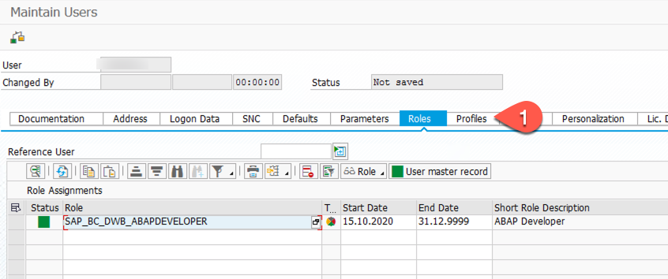

6. In the Profiles section add the SAP_ALL profile and press save

   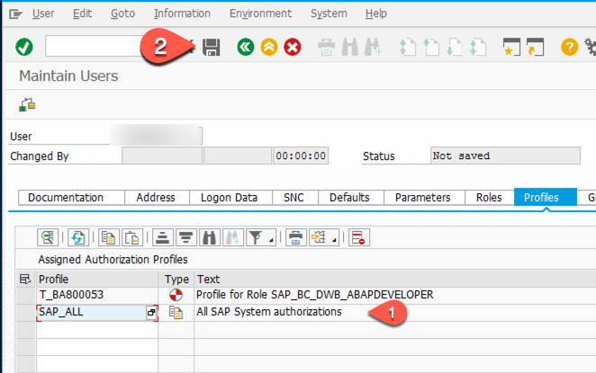

This user can than also be used as technical user for the connection between the ERP system and your SAP Cloud Platform account - just for testing not for production usage. We will do this in a later section.

## Activate HTTP ports and TLS v1.2

1. Call Transaction RZ10 - Select the DEFAULT Profile and Extended Maintanance - click on Change

   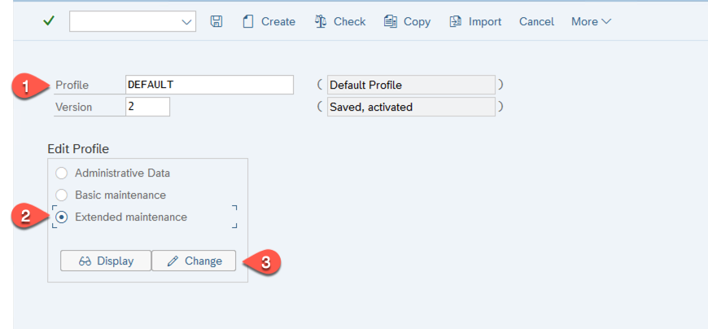

2. Check if the icm/server ports and the ssl/ciphersuites are enabled - if not set the values for HTTP, HTTPS and TLS v1.2 (ssl/ciphersuites, ssl/client_ciphersuites)

   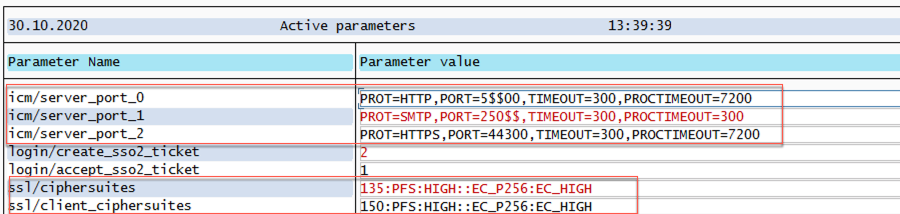

    * [Blog: Activate HTTP, HTTPS and SMPT ](https://blogs.sap.com/2014/02/05/how-to-activate-and-define-http-https-smtp-ports-in-any-sap-r3-system/)
    * [Blog: How to Enable TLS v1.2 in SAP Netweaver ABAP](https://blogs.sap.com/2019/11/11/how-to-enable-tls-v1.2-in-sap-netweaver-abap/)

3. If you have done changes save the Default profile and call transaction /nSMICM - make a global shutdown and restart your System
   
   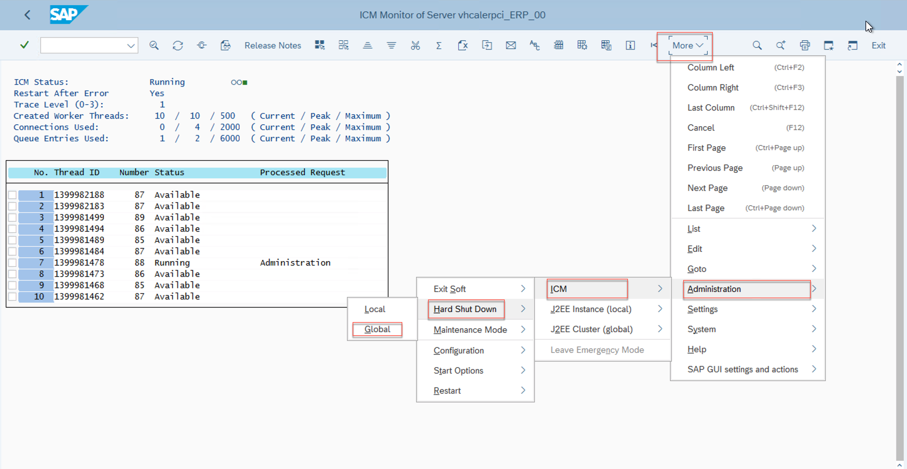

## Make Your Client Modifiable
>This step is necessary for client 000 when using the SAP CAL instance.

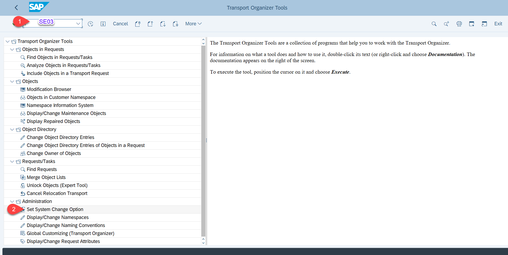

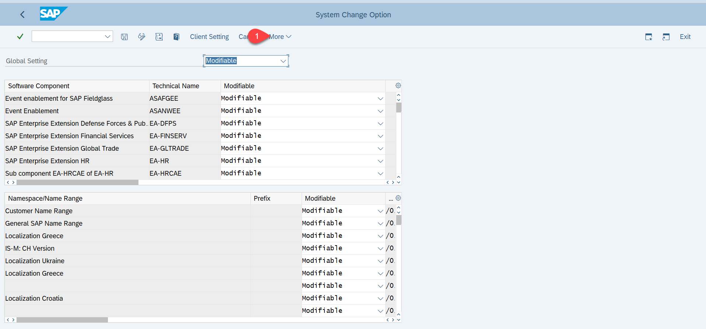

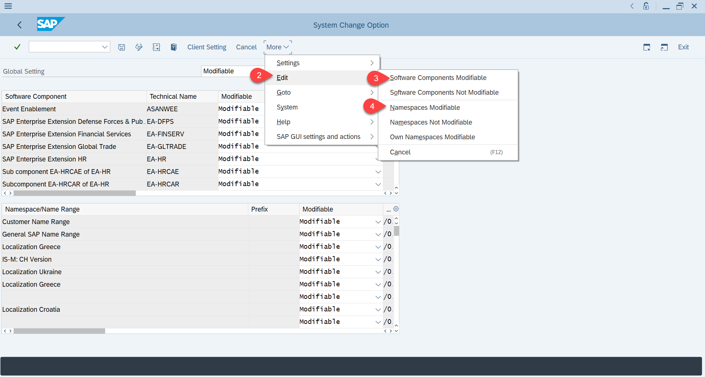

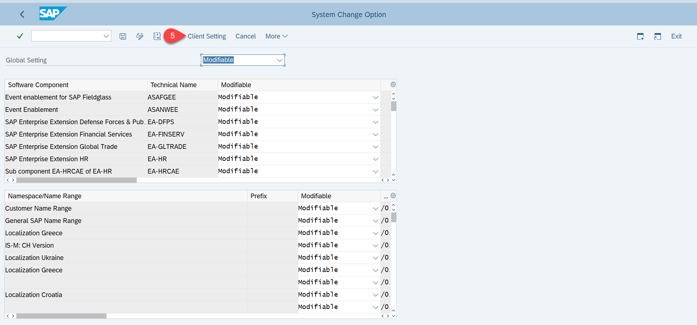

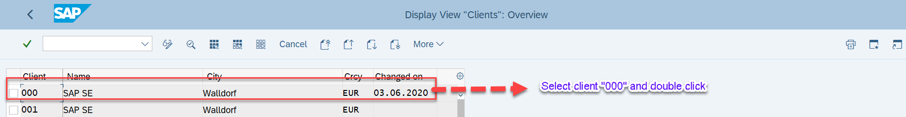

Navogate to Change mode --> Select "Automatic Recording of changes" --> Save it.

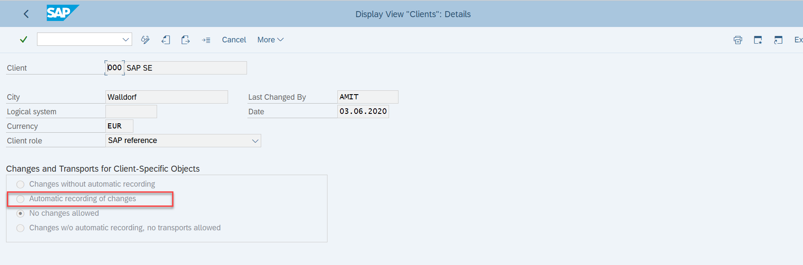

## Switch off your Virus Scannner for smooth inflow of update Data from Cloud Application Programming into ECC Business Partner oData API 

> Necessary when using the SAP CAL instance. Please note that this way is just for scenario validation and is not recommended in real productive scenario as this can make system vulnerable.

Naviage to Transaction /N/IWFND/VIRUS_SCAN
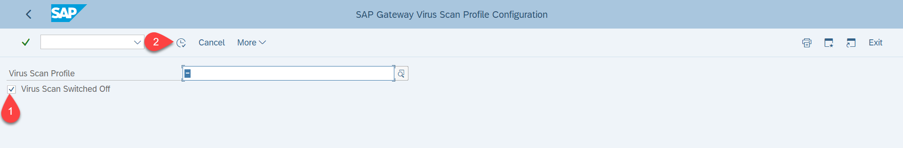
  