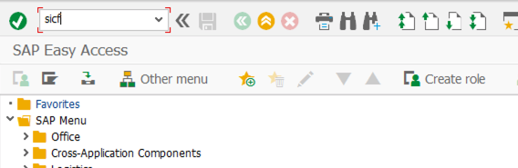
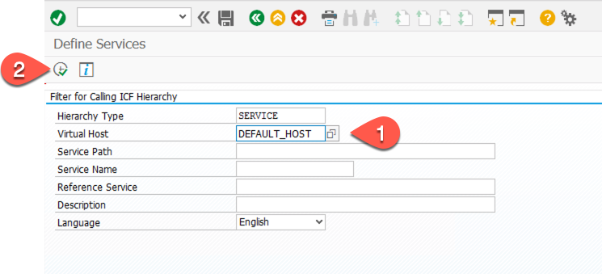
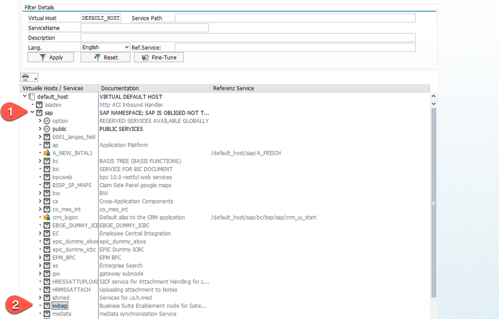
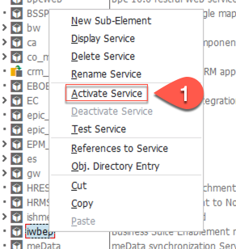
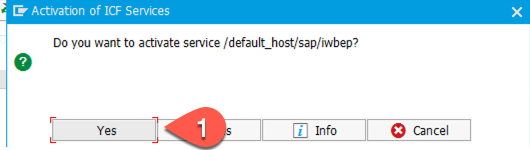

#   Configure ERP 6.0 Backend

Before starting the development of the OData services we have to do some preconfigurations.

## Activate IWBEP Service
1. Call transaction /nSICF
   
   

2. Select the DEFAULT_HOST and click OK
   
   

3. In the service list select SAP -- iwbep
   
   
   
4. Right-click on iwbep and activate the service
   
    
    

## Add Development User

1. Call transaction /nSU01
2. Enter a user name and select create.
   
   

3. In the Address section enter User name and email address
   
   

4. In the "Logon Data" section enter the initial password

   

5. In the Roles section add the SAP_BC_DWB_APPDEVELOPER role.

   

6. In the Profiles section add the SAP_ALL profile and press save

   

This user can than also be used as technical user for the connection between the ERP system and your SAP Cloud Platform account. We will do this in later section.

## Activate HTTP ports and TLS v1.2

1. Call Transaction RZ10 - Select the DEFAULT Profile and Extended Maintanance - click on Change

   

2. Check if the icm/server ports and the ssl/ciphersuites are enabled - if not set the values for HTTP, HTTPS and TLS v1.2 (ssl/ciphersuites, ssl/client_ciphersuites)

   

    * [Blog: Activate HTTP, HTTPS and SMPT ](https://blogs.sap.com/2014/02/05/how-to-activate-and-define-http-https-smtp-ports-in-any-sap-r3-system/)
    * [Blog: How to Enable TLS v1.2 in SAP Netweaver ABAP](https://blogs.sap.com/2019/11/11/how-to-enable-tls-v1.2-in-sap-netweaver-abap/)

3. If you have done changes save the Default profile and call transaction /nSMICM - make a global shutdown and restart your System
   
   

  