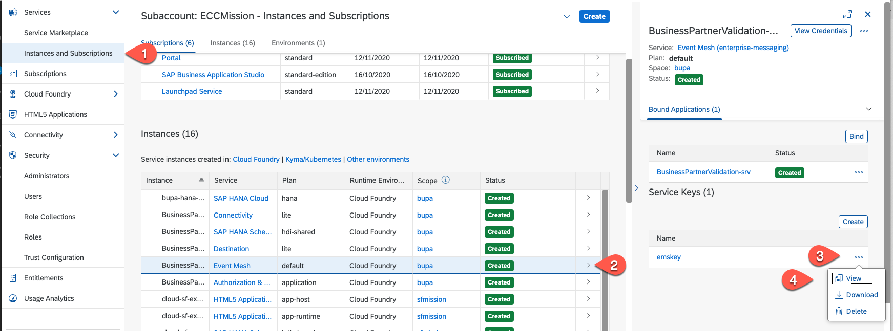
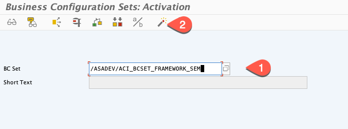
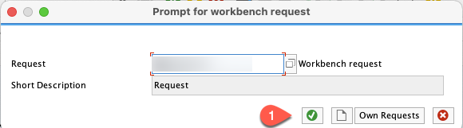
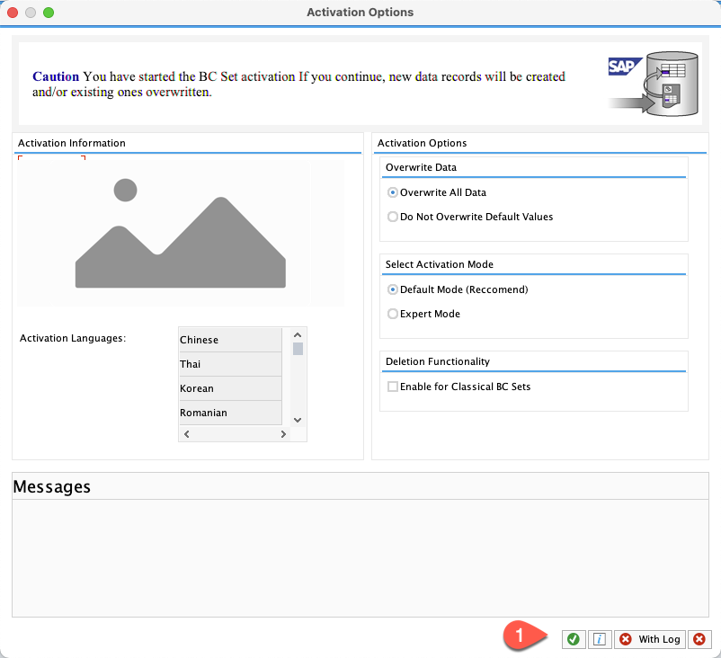
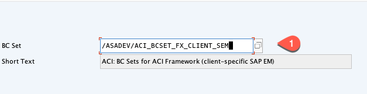
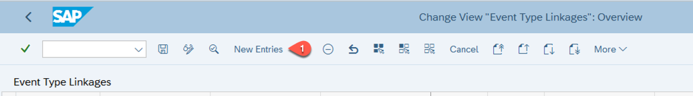
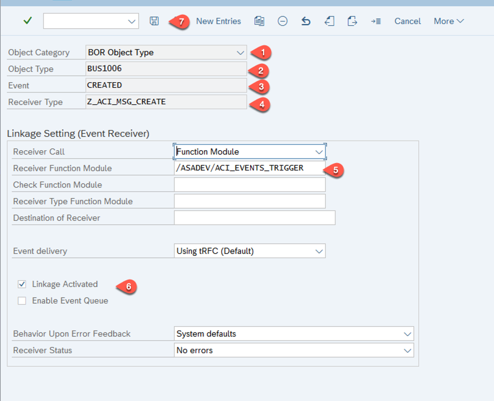
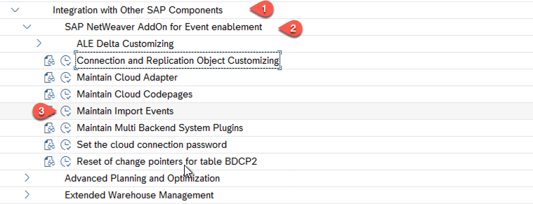

# Configuration of Eventing in On-Premise Backend and SAP Event Mesh

## Introduction

In this section, you will learn how to configure your on-premise backend system to use the SAP NetWeaver Add-On for Event Enablement Service Pack SP03. If you have installed only Service Pack SP01 or SP02, please use the [SP01 Setup Guide](./SETUP_SP01.md). In SP03, the setup has been simplified and the events are now compatible to standard SAP S/4HANA events.

**Audience:** Basis ABAP Administrator 

## Step-by-Step

### Prerequisites

- A working instance of SAP Event Mesh.

### Download SAP Event Mesh Certificate 

1. Log in to the SAP BTP cockpit.
2. Navigate to your subaccount, and then choose **Services** > **Service Instances**.
3. Select your already created SAP Event Mesh service instance and view the Service Key. Copy this Service Key to a text editor of your choice.
   
   
   
4. Copy the SAP Event Mesh Token Endpoint URL and open this URL in a browser of your choice. Here, the following screenshots are done with Internet Explorer and might differ for other browsers.
   
   
   
5. Once you open the Token Endpoint URL, choose **Cancel** in the popup and select on view site information button (lock symbol on top left corner), then choose **Certificate**.

   
   
6. Select **Details** and choose **Copy to files**.

   
   
7. When the **Certificate Export Wizard** opens, choose **Next**.

   
   
8. Select the format as **DER encoded binary X.509 (.CER)** and choose **Next**.

    
    
9. Select a folder to export the certificate and choose **Next**.
   
   
   
10. Select **Finish** to export the certificate. You have exported the SAP Event Mesh certificate.

    
    
	
### Create a Node for Standard SSL Client
1. Open your SAP backend system and go to transcaction - **/nSTRUST**. 
2. Select **Display/Change icon** and right-click on **SSL client SSL Client (Standard) Node** and choose **Create**.

   

3. A popup **Create PSE** appears. Choose **Continue(Enter)**.

   
 
 
 
### Import SAP Event Mesh Certificate in Your On-Premise System

1. Still in transaction - **/nSTRUST**. 	
2. Select **Display/Change icon** and right-click on **SSL client SSL Client (Anonymous)  Node**, then select **Create**.

   
   
3. A Popup **Create PSE** appears. Choose **Continue(Enter)**.

   
   
4. Choose **Import Certificate** (under **Certificate**).

    

5. Enter file path to certificate file which you have stored in your local system.
   
   
   
6. Choose **Continue** and then **Allow** for the **SAP GUI Security** popup asking to allow access to the file. 
7. Once you can see the certificate as imported, choose **Add to Certificate List** and choose the **Save** icon.
   
   >Hint: Note the valid-to date of the certificate and update it in advance.	
   
   

### Configure RFC Destinations

1. Enter transaction **/nsm59**.	
2. Choose **Create**.

   
   
3. Enter a destination name **ACI_SAP_EM** and select the connection type **G Http connection to External Server** from the popup which appears once you enter **G** in that field, choose the **Save** icon.
   
    

4. Choose **Continue** for the popup that says information **HTTP Connections may not be secure**.
5. Switch to the text editor where you have copied the Service Key of the SAP Event Mesh service instance in the first section above. Copy the value of **uri** for the protocol **httprest**.
6. Switch back to the **RFC Destination** tab and in the field **Target Host**, enter the URI which you copied excluding **https://**, for example: enterprise-messaging-pubsub.cfapps.eu10.hana.ondemand.com. Choose the **Save** icon and then choose **Connection Test**.

   
   
7. The connection test has to give a response of **Status HTTP Response** as **200** and **Status Text** as **Ok**. If not, check if the target host field is entered properly.

   
   
8. Choose back icon to create a second RFC Destination.
9. Choose **Create** like in step 2.
10. Enter a destination name **ACI_SAP_EM_TOKEN**, choose connection type **G Http connection** from the drop down, and then choose the **Save** icon.
   
    
   
11. Choose **Continue** for the popup that says information **HTTP Connections may not be secure**.
12. Switch to the text editor where you have copied the Service Key of the SAP Event Mesh service instance in the first section above. Copy the value of **tokenendpoint** excluding **https://** and **oauth/token** from the URL.	
13. Switch back to the **RFC Destination** tab and for field **Target Host**, enter the copied URL for example: **xxxxxx.authentication.eu10.hana.ondemand.com**. In the **Path Prefix** field, enter the value **/oauth/token**.

    

14. Choose tabulator **Logon & Security** and scroll-down to Security options and select the radio button **active** for field **SSL** and for field **SSL Certificate**, select **Anonym SSL Certificate (Anonymous)** from the dropdown menu and choose **Save**.

    
    
15.Then choose **Connection Test**. The connection test should give a response of **Status HTTP Response** as **401** and **Status Text** as **Unauthorized**. Choose  **Cancel** as this is expected here.

   

### Configure Logical Message Types

WE81 (Logical message types) is a standard SAP parameter transaction code that is used to maintain the contents of VEDI_EDMSG database table. It does this by executing the table maintenance t-code SM30 in edit mode, assuming you have the appropriate authorisations.

1. Choose the back icon to go to the home screen and enter transaction **/nWE81** and then choose **Display/Change**. For the warning that the change is cross-client, choose **Ok**.

    
    
2. Choose field **New Entries**.
3. Add the following two Message types:
   - Enter Message Type: **Z_ACI_MSG_CREATE**
   - Enter any meaningful text in the field: **Short Text**
   - Add another Message Type: **Z_ACI_MSG_CHANGED**
   - Enter a meaningful short text.	
   - Choose **Save**.

   	

4. When you try to save, it prompts you to create a Transport Request for any Cross Object. Choose the **Create** icon to create a new Workbench request.

   

5. Enter a meaningful text in the **Short Description** field and then choose **Save**.

   

6. Choose the **Green tick mark** icon in the screen to save the Object in Transport. Once Transport is created, for any further cross object changes, you can capture the change in the same transport number/Request which you have created. You will be prompted with similar "Transport Request"/ "Customizing Request" in the next steps, you can reuse the same Transport request which you created now.

   
   
### Activate Business Configuration Sets
> You have to do this once per SAP system.

1. Enter Transaction **/nSCPR20** to add a new BC Set.
2. As BC Set enter  **/ASADEV/ACI_BCSET_FRAMEWORK_SEM**, then select the **activation** icon.
   

3. Confirm the next two popup screens.
   

   
    
4. As BC Set add **/ASADEV/ACI_BCSET_FX_CLIENT_SEM**, select the **activation** icon and again confirm the next two popups.
   

### Activate Change Pointers for Message Types		
1. Enter Transaction **/nBD50**.
2. Choose **New Entries**.

   

3. Add the following 2 change pointers for message types:
   - Add Message Type **Z_ACI_MSG_CREATE**
   - Select the **Active** checkbox next to the message type
   - Add a second Message Type **Z_ACI_MSG_CHANGED**
   - Select the **Active** checkbox next to also this message type
   - Choose **Save**.
   
   
   
4. For the screen with **Prompt with Customization Request**, you have to create a new transport request and then choose **Ok** to save.
 
   

### Maintain Event Type Linkage 

1. Enter the Transaction **/nSWE2** and select **New Entries**.
   
     
  
   We now map the BusinessObjects events:
   
2. In the opened screen, enter the following values:
   - In the field **Object Category**, select **BOR Object Type**
   - In the field **Object Type**, select **BUS1006**
   - In the field **Event**, select **CREATED**
   - In the field **Receiver type**, select **Z_ACI_MSG_CREATE**
   - In the field **Receiver Function Module**, select **/ASADEV/ACI_EVENTS_TRIGGER**
   - Select the **Linkage Activated** checkbox
   - Choose **Save**
        
     
     
3. Select **New Entries**
4. In the opened screen, enter the following values:
   - In the field **Object Category**, select **BOR Object Type**
   - In the field **Object Type**, select **BUS1006**
   - In the field **Event**, select **CHANGED**
   - In the field **Receiver type**, select **Z_ACI_MSG_CHANGED**
   - In the field **Receiver Function Module**, select **/ASADEV/ACI_EVENTS_TRIGGER**
   - Select the **Linkage Activated** checkbox
   - Choose **Save** and then the **OK** (green-tick) icon for Transport Request.
        
     

### Set ISO standard with UTF-8

1. Enter Transaction **/nSPRO** and choose the **SAP Reference IMG** icon.

   
   
2. Expand **SAP Customization Implementation Guide** > **Integration with Other SAP components** > **SAP NetWeaver AddOn for Event enablement** and choose the clock icon with tooltip **IMG:Activity** next to **Maintain Cloud Codepages**.	
   
   
3. Choose **Display/Change** icon and then choose **New Entries**.

   
   
4. Enter in the field **ISO** value as **UTF-8** and for the field **Code Page**, enter **4110**. Choose the **Save** icon and then the **OK** (green-tick) icon for Transport Request.

   
   
5. Enter **Back** button to go to previous screen.

### Load Events into Cloud

1. Expand **SAP Customization Implementation Guide** > **Integration with Other SAP components** > **SAP NetWeaver AddOn for Event enablement** > and choose the clock icon with tooltip **IMG:Activity** next to **Maintain Import Events**. 

   
   
2. Choose **Display/Change** icon and choose **New Entries**.

   
   
4. In the field **Import Event**, enter the value **API**, choose **Save** and then the **OK** (green-tick) icon for Transport Request.

   
   
5. Choose the **Back** button to go to previous screen.

### Summary
You have established the trust to SAP Event Mesh service, set up the connection and defined the message linkage objects. In the next steps, you will define the Add-on event instance and the content for it.

[SAP Help - SAP NetWeaver Add-On for Event enablement](https://help.sap.com/viewer/e966e6c0e61443ebaa0270a4bae4b363/1.0/en-US/3eba827c531344eb879d8e35022d90ba.html)
