# Configuration of Eventing in on-premise backend and Event Mesh

## Introduction

In this section, we describe steps how to configure events in the on-premise backend system

**Persona:** Basis ABAP Administrator 

## Step-by-Step

### Requirements

- A working instance of Event Mesh.

### Download Event Mesh Certificate 

1. Login to your SAP Business Technology Platform (BTP) account.
2. Navigate to your Subaccount -> Services and click **Service Instances**.
3. Select your already created Event Mesh instance and view the Service key. Also copy this Service Key to a text editor of your choice.
   
   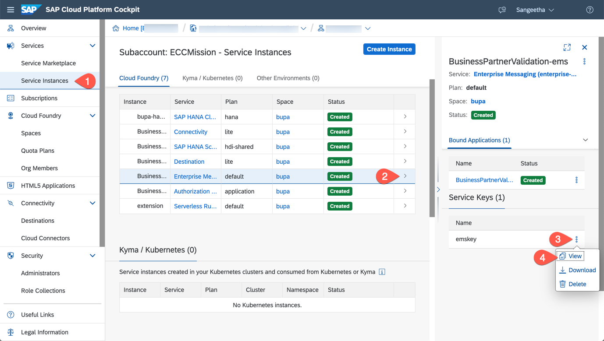
   
4. Copy the Event Mesh Token Endpoint URL and open this URL in a browser of your choice. Here the following screenshots are shown with Internet Explorer and might differ for other browsers.
   
   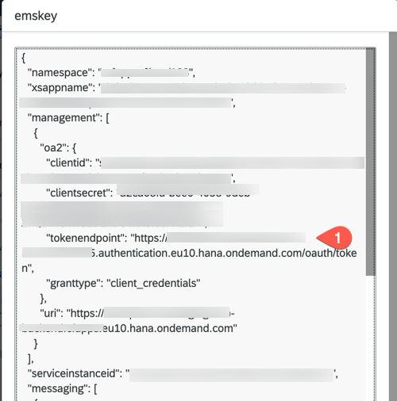
   
5. Once you open the Token Endpoint URL, Click on Cancel in the popup and Click on view site information button (lock symbol on top left corner) and click on **Certificate**.

   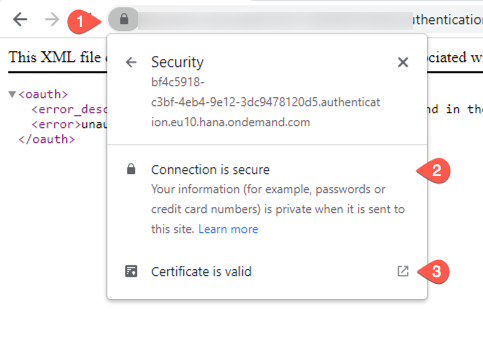
   
6. Click on **Details** and click **Copy to files**.

   
   
7. Now **Certificate Export Wizard** opens, click on **Next**.

   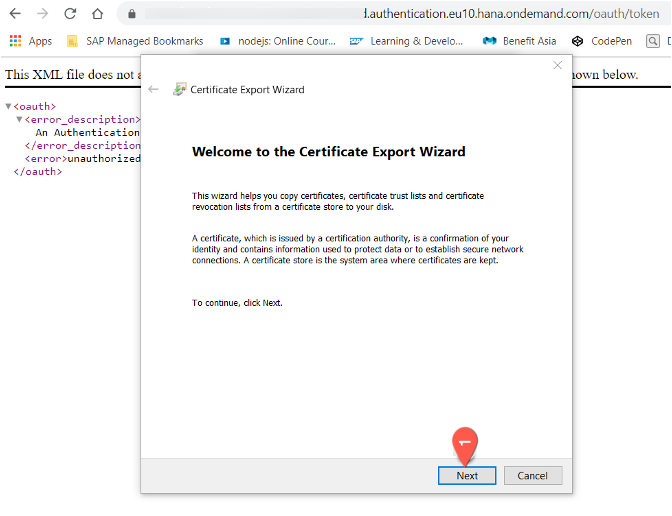
   
8. Select the format as **DER encoded binary X.509 (.CER)** and click **Next**.

    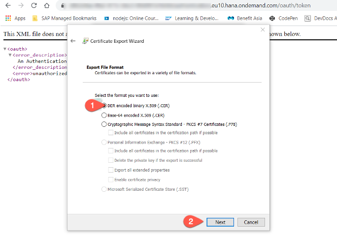
    
9. Select a folder to export the certificate and click **Next**.
   
   
   
10. Click **Finish** to export the certificate. Now we have exported the Event Mesh certificate.

    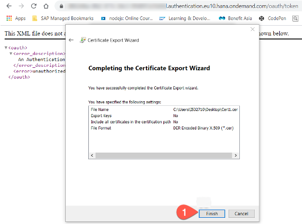
    
	
### Create a Node for standard SSL Client
1. Open your SAP Backend system and Go to transcaction - **/nSTRUST**. 
2. Click on **Display/Change icon** and right Click on **SSL client SSL Client (Standard) Node** and Select **Create**.

   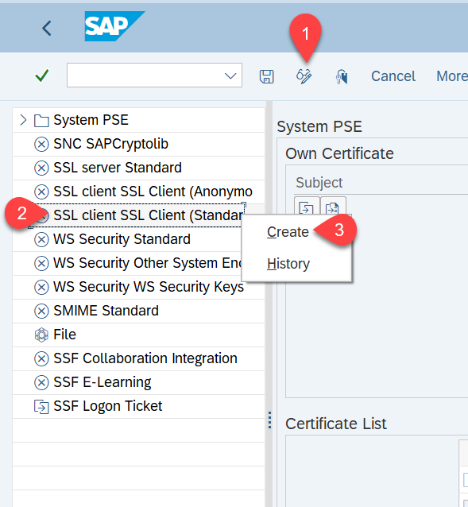
3. A Popup “Create PSE” will comes. Click on Continue(Enter).

   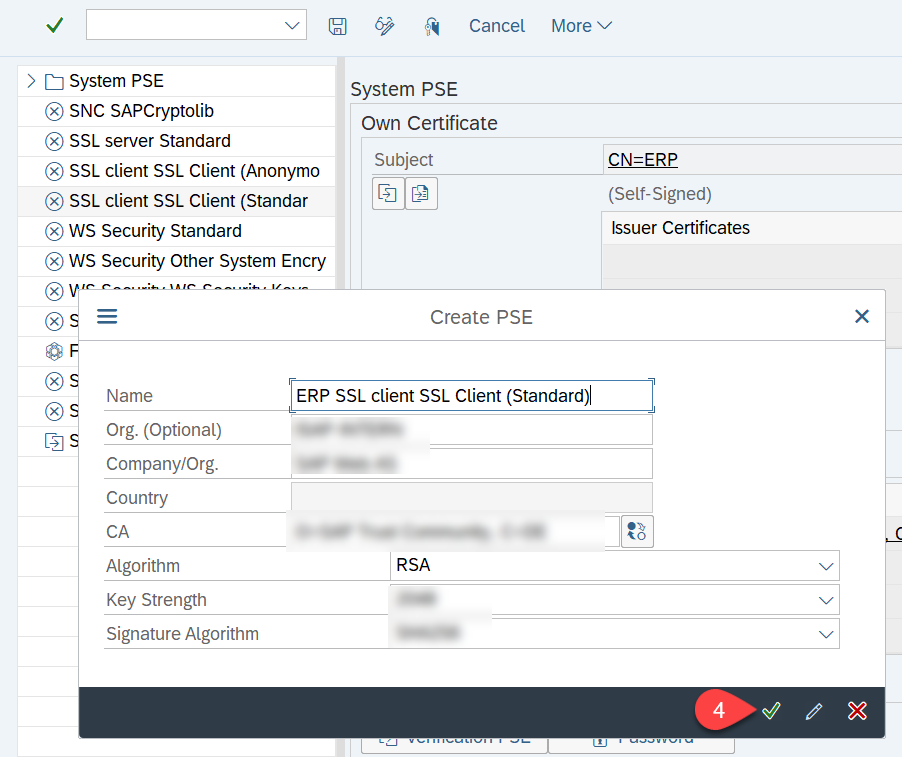
 
 
 
### Import Certificate in on-premise system

1. Open your SAP Backend system and Go to transcaction - **/nSTRUST**. 	
2. Click on **Display/Change icon** and right Click on **SSL client SSL Client (Anonymous)  Node** and Select **Create**.

   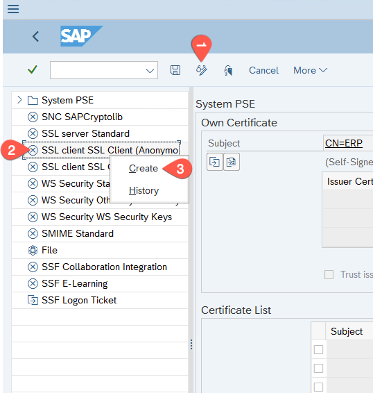
   
3. A Popup “Create PSE” will comes. Click on Continue(Enter).

   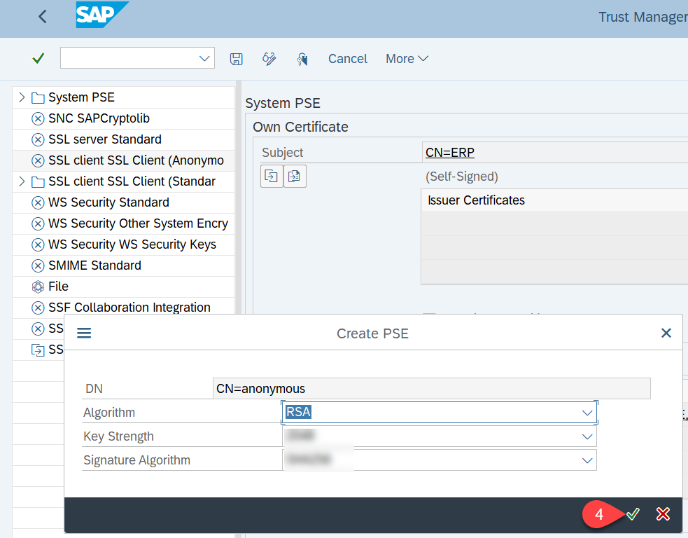
   
4. Click on **Import Certificate** (under **Certificate**).

    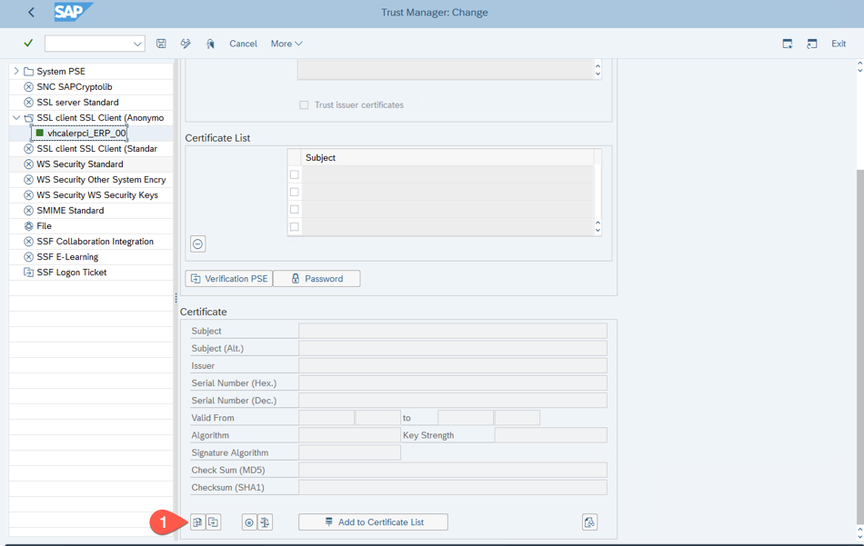

5. Enter file path to certificate file which is stored in local system.
   
   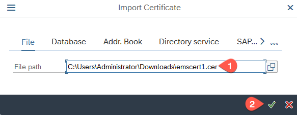
   
6. Click on **Continue** and Click on **Allow** for the **SAP GUI Security** popup asking to allow access to the file. 
7. Now you can see the Certificate imported, Click on **Add to Certificate List** and Click on the **Save** icon.
	
   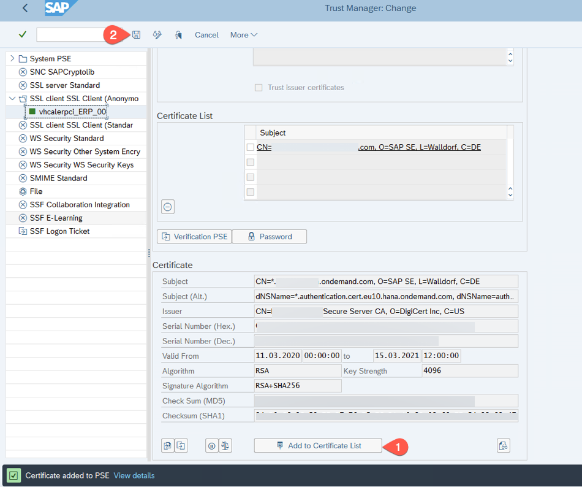

### Configure RFC Destinations

1. Enter Transaction **/nsm59**.	
2. Click on **Create** icon.

   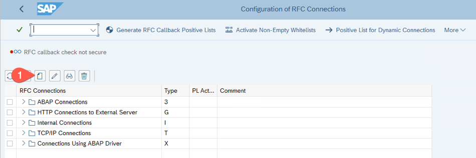
   
3. Enter a destination name **ACI_SAP_EM** and Select connection type **G Http connection to External Server** from the popup which appears once you enter **G** in that field, Click on **Save** icon
   
    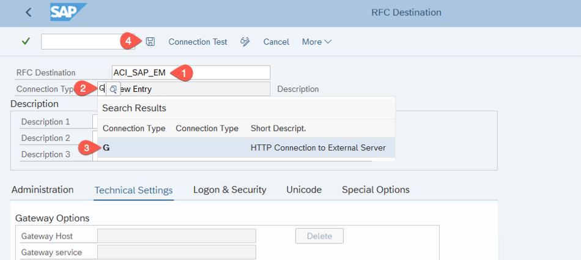

4. Click on **Continue** for the popup that says information **HTTP Connections may not be secure**.
5. Switch to the text editor where you have copied the Service Key of Event Mesh in the first section above. Copy the value of **uri** for the protocol **httprest**
6. Switch back to the RFC Destination tab and for field **Target Host**, enter the uri which you copied excluding **https://** for example: enterprise-messaging-pubsub.cfapps.eu10.hana.ondemand.com. Click on **Save** icon and click on **Connection Test**.

   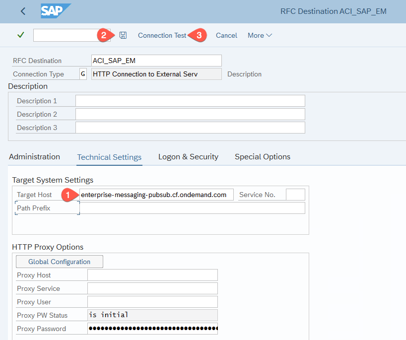
   
7. Connection Test has to give a response of **Status HTTP Response** as **200** and **Status Text** as **Ok**. If not, check if the target host field is entered properly.

   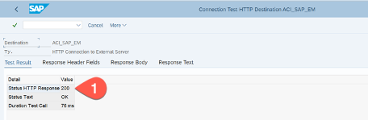
   
8. Click on back icon to create a second RFC Destionation.
9. Click on **Create** button like in step 2.
10. Enter a destination name **ACI_SAP_EM_TOKEN** and Select connection type **G Http connection** from the drop down, Click on **Save** icon
   
    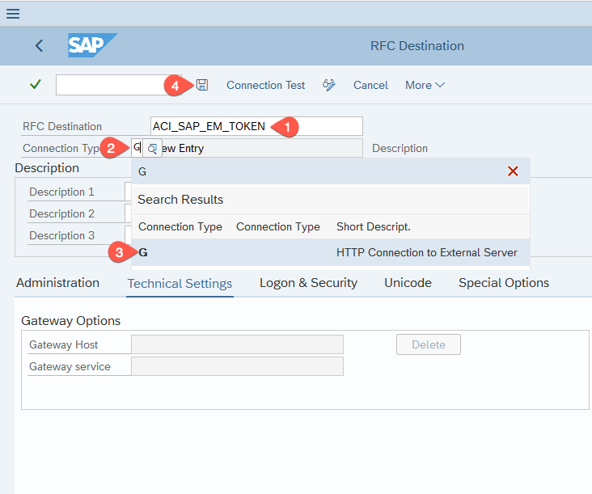
   
11. Click on **Continue** for the popup that says information **HTTP Connections may not be secure**.
12. Switch to the text editor where you have copied the Service Key of Event Mesh in the first section above. Copy the value of **tokenendpoint** excluding **https://** and **oauth/token** from the URL.	
13. Switch back to the RFC Destination tab and for field **Target Host**, enter the copied URL for example: **xxxxxx.authentication.eu10.hana.ondemand.com**. Enter for field **Path Prefix** value as **oauth/token**.

    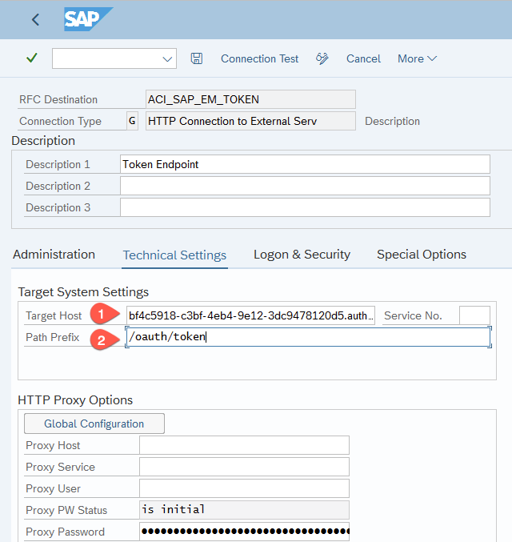

14. Click on tab **Logon & Security** and scroll-down to Security options and Click on radio button **active** for field **SSL** and for field **SSL Certificate**, select **Anonym SSL Certificate (Anonymous)** from dropdown and click on **Save**.

    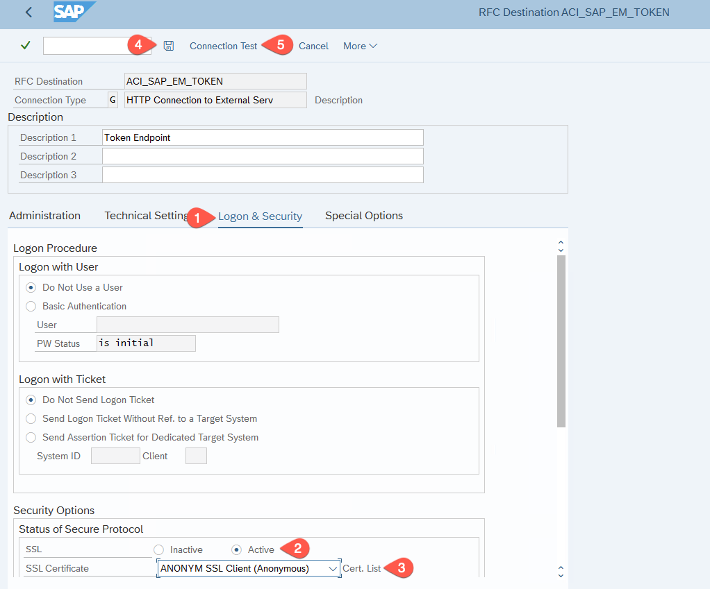
    
15. Click on **Connection Test** and Connection Test gives a response of **Status HTTP Response** as **401** and **Status Text** as **Unauthorized** which is fine. Click on **Cancel** as this is expected here.

    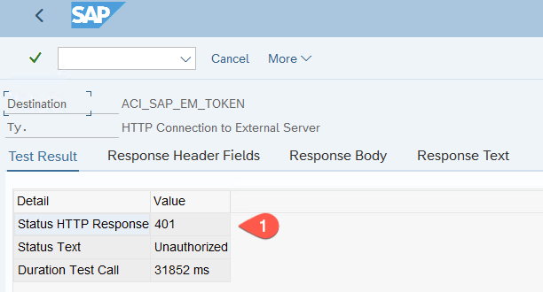

### Configure Logical Message Types

WE81 (Logical message types) is a standard SAP parameter transaction code that is used to maintain the contents of VEDI_EDMSG database table. It does this by executing the table maintenance t-code SM30 in edit mode, assuming you have the appropriate authorisations.

1. Click on back icon to goto the home screen and enter transaction **/nWE81** and click on **Display/Change**. For the warning that change is cross-client, click **Ok**.

    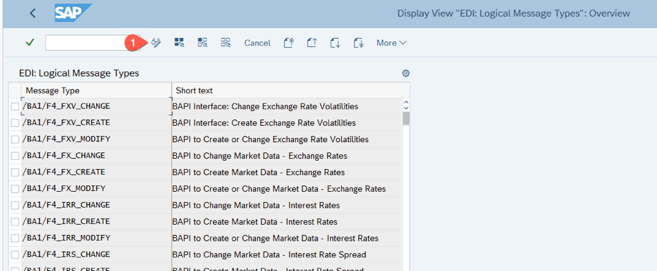
    
2. Click on field **New Entries**.
3. Add the following two Message types,
   - Enter Message Type: **Z_ACI_MSG_CREATE**
   - Enter Any Meanigful for field **Short Text**
   - Add another Message Type: **Z_ACI_MSG_CHANGED**
   - Enter Any Meanigful **Short Text**	
   - Click on **Save**

   	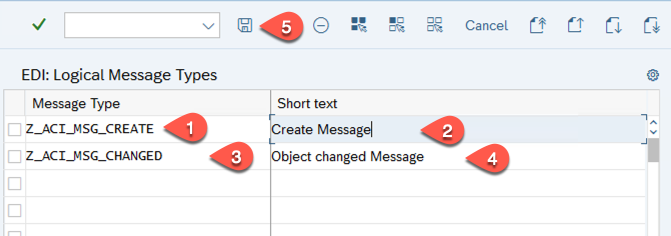

4. When you try to Save, it prompts to create a Transport Request for any Cross Object. Click **Create** icon to create a new Workbench request.

   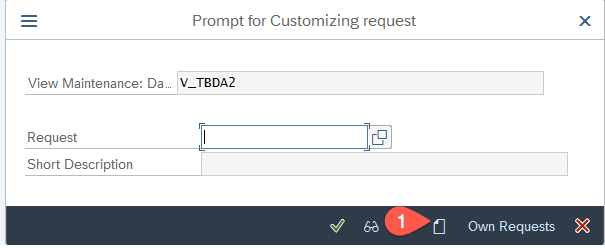

5. Enter some meaningful text for the field **Short Description** and click on **Save**.

   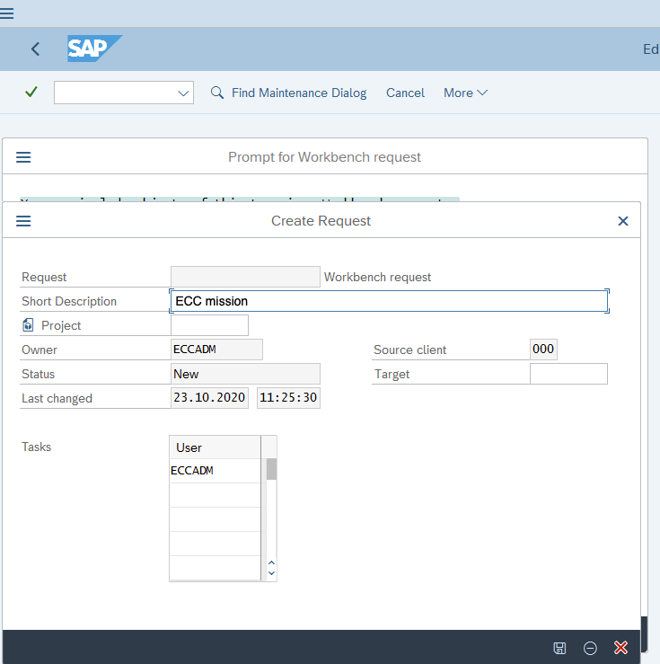

5. Click the **Green tick mark** icon in the screen to save the Object in Transport. Once Transport is created, for any further cross object changes, you can capture the change in the same transport number/Request which you have created now. You will be prompted with similar "Transport Request"/ "Customizing Request" in the next steps, you can reuse the same Transport request which you created now.

   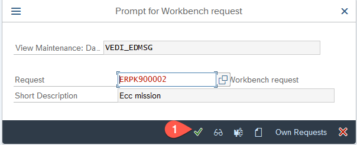
   

### Activate Change Pointers for Message Types		
1. Enter Transaction **/nBD50**.
2. Click on **New Entries**.

   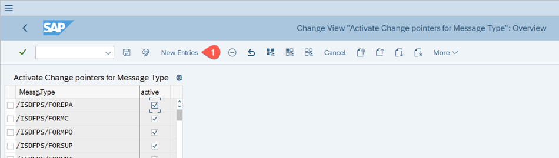

3. Add the following 2 change pointers for message types:
   - Add Message Type **Z_ACI_MSG_CREATE**
   - Click the checkbox as **Active** next to the message type
   - Add second Message Type **Z_ACI_MSG_CHANGED**
   - Click the checkbox as **Active** next to also this message type
   - Click **Save** icon.
   
   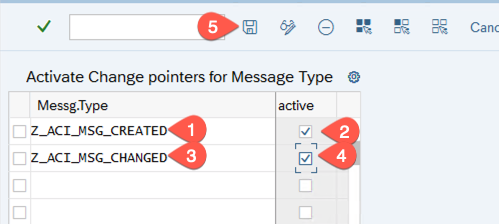
   
4. For the screen with **Prompt with Customization Request**, you have to create a new transport request and then choose **Ok** to save.
 
   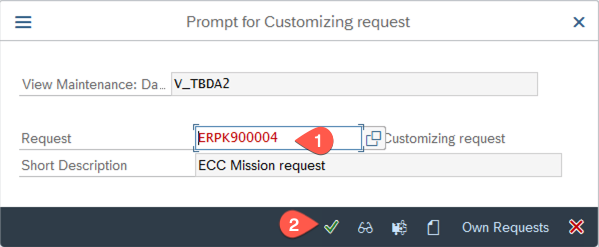
   
### Set ISO standard with UTF-8

1. Enter Transaction /nSPRO and click on **SAP Reference IMG** icon.

   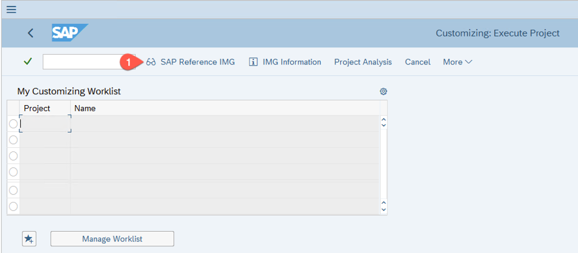
   
2. Expand **SAP Customization Implementation Guide** --> **Integration with Other SAP components** --> **SAP NetWeaver AddOn for Event enablement** --> **ALE Delta Customizing** and click the clock icon with tooltip **IMG:Activity** next to **ACI: Cloud Codepages**.	
   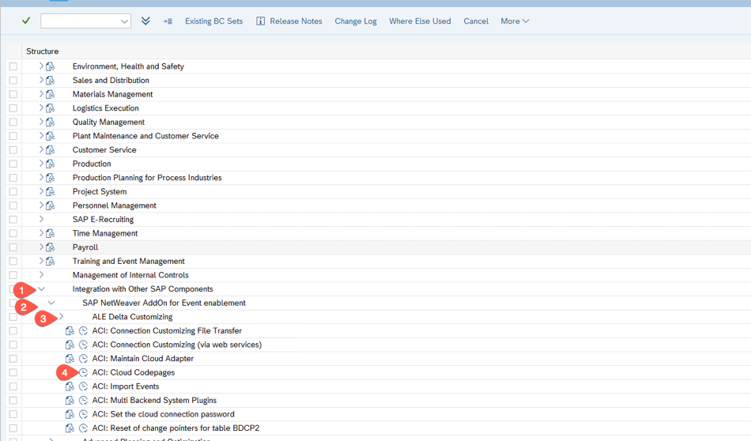
   
3. Click on **Display/Change** icon and click **New Entries**.

   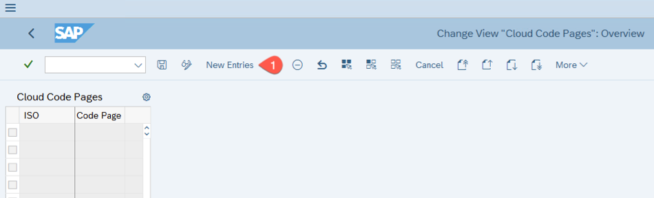
   
4. Enter in the field **ISO** value as **UTF-8** and for the field **Code Page**, enter **4110** and click **Save** icon and then the  **OK** (green-tick) icon for Transport Request.

   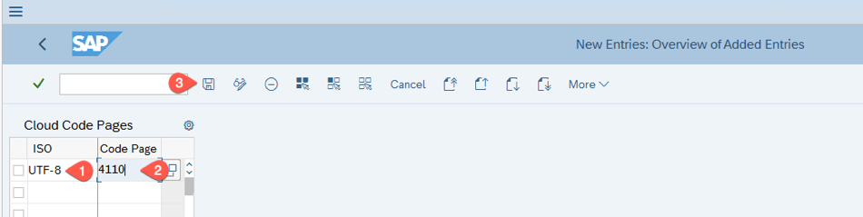
   
5. Click on **Back** Button to go to previous screen.

### Load Events into Cloud

1. Expand **SAP Customization Implementation Guide** --> **Integration with Other SAP components** --> **SAP NetWeaver AddOn for Event enablement** --> ALE Delta Customizing and click on the clock icon with tooltip **IMG:Activity** next to **ACI: Import Events**. 

   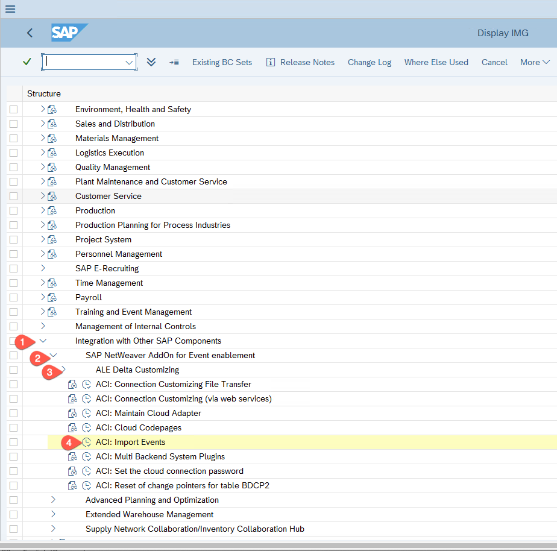
   
2. Click on **Display/Change** icon and click on **New Entries**.

   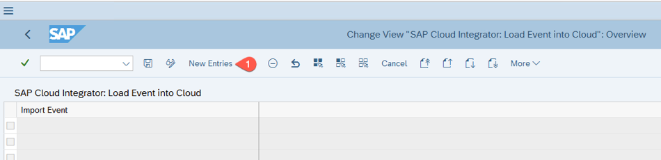
   
4. Enter in the field **Import Event** value as **API** and click **Save** icon and then the **OK** (green-tick) icon for Transport Request.

   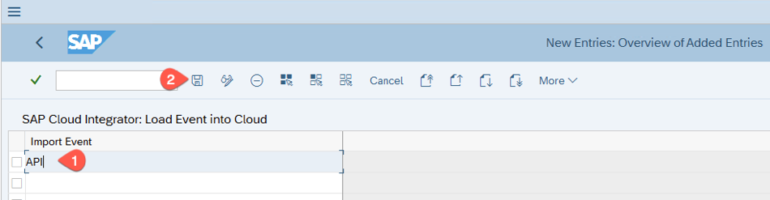
   
5. Click on **Back** Button to go to previous screen.

### Connection Customizing File Transfer		
1. Expand **SAP Customization Implementation Guide** --> **Integration with other SAP components** --> **SAP NetWeaver AddOn for Event enablement** --> **ALE Delta Customizing** and click on clock icon with tooltip **IMG:Activity** next to **ACI: Connection Customizing File Transfer**.
   
   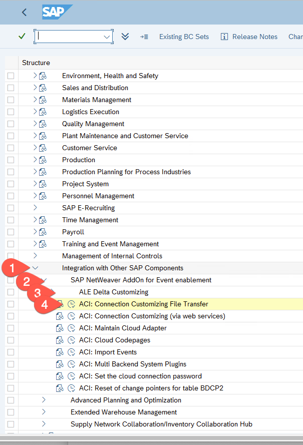
   
2. Click on New Entries.

   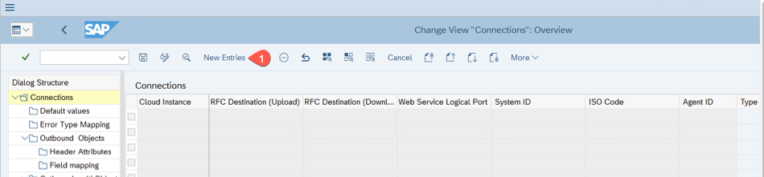
   
3. In the screen **New Entries: Details of added entries** enter the following values: 
   - Enter instance name as **ACI_SAP_EM_CAL**
   - Enter/select RFC Destination(upload) **ACI_SAP_EM**
   - Enter/Select ISO code as **UTF-8**
   - Enter/Select Cloud Type **SAP_EM**
   - Click on **Save** icon
   - Click on **Default Values**.
   
     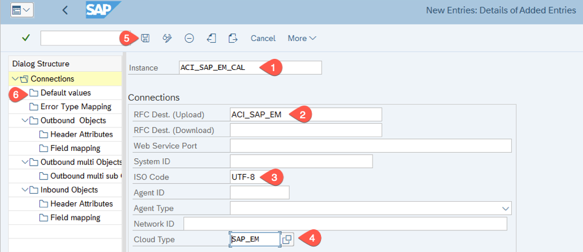
   
4. In **Default Values**, Click on **New Entries**

   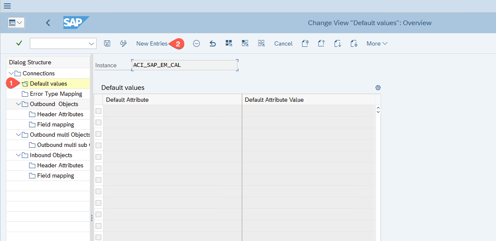
   

5. In the opened screen, **New Entries: Overview of Added Entries**, enter the following values: 
   - In the column **Default Attribute**, enter **SAP_EM_CLIENT_ID**
   - For the **Default Attribute value**, copy and paste the value of **clientid** from the Event Mesh Service Key which you copied in the beginning of this document.
   - In the colum **Default Attribute**, enter **SAP_EM_TOKEN_DESTINATION**  
   - For this **Default Attribute value**, enter  **ACI_SAP_EM_TOKEN**
   - Click on **Save** icon
   - Click on **Error Type Mapping	**

     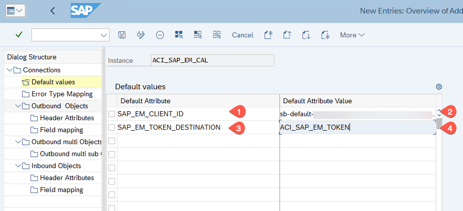
   
6. In the screen **Change View Error Type Mapping: Overview**, Click on **New Entries**.
   
7. 	In the opened screen, **Change View Error Type Mapping: Overview**, enter the following values: 
   - In the column **Resp Code**, enter **200**.
   - In the column **Message Type**, select Success**
   - In the column **Resp Code**, enter **201**
   - In the column **Message Type**, select **Success**
   - In the column **Resp Code**, enter **204**
   - In the column **Message Type**, select **Success**
   - Click on **Save** icon.

     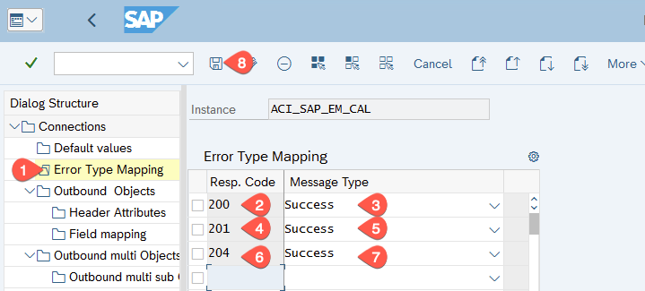

8. Click **Outbound Objects** and Click **New Entries**

   
   
9. In the opened screen, **Change View Outbound Objects: Details**, enter the following values:
   - Enter Object as **BUSINESSPARTNER_CREATED**
   - Enter Extraction Function Module Name **/ASADEV/ACI_SIMPLE_NOTIFY**
   - Enter Message Type as **Z_ACI_MSG_CREATE**
   - Select Load Type as **Incremental Load**
   - Enter Event **API**
   - Check the **Trace** Checkbox	
   - Enter **Formatting Function**, value as **/ASADEV/ACI_SAP_EM_CLOUDEV_FM** 
   - Click **Save** icon.
   	
     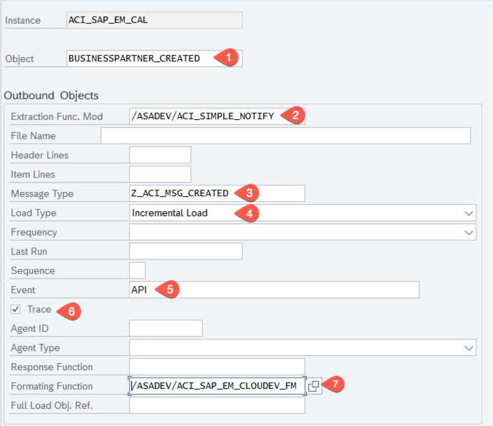

10. Click **Header Attributes**, choose **New Entries**.
    
    
	
11. In the opened screen, enter the following values:
    - In the column, **Header Attributes**, enter **SAP_EM_CALL_METHOD**
    - In the column, **Header Attributes Value**, enter **POST**
    - In the column, **Header Attributes**, enter **SAP_EM_CONT_TYPE**
    - In the column, **Header Attributes Value**, enter **application/json**
    - In the column, **Header Attributes**, enter **SAP_EM_QOS**
    - In the column, **Header Attributes Value**, enter **0**
    - In the column, **Header Attributes**, enter **SAP_EM_TOPIC**
    - In the column, **Header Attributes Value**, enter **refappscf/ecc/123/BO/BusinessPartner/Created** (enter the topic name created in Event Mesh Dashboard through CAP Application)
    - Click **Save** icon
    
      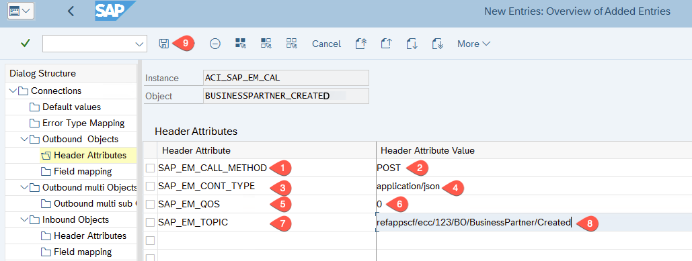

12. Now, double click on **Outbound Object** and click **New Entries**.
13. In the opened screen, **Change View Outbound Objects: Details**, enter the following values:
   - Enter Object as **BUSINESSPARTNER_CHANGED**
   - Enter Extraction Function Module Name as**/ASADEV/ACI_SIMPLE_NOTIFY**
   - Enter Message Type as **Z_ACI_MSG_CHANGED**
   - Select Load Type as **Incremental Load**
   - Enter Event **API**
   - Check the **Trace** Checkbox	
   - Enter **Formatting Function**, value as **/ASADEV/ACI_SAP_EM_CLOUDEV_FM** 
   - Click **Save** icon.
   	
     

14. Click **Header Attributes**, Click **New Entries**.
15. In the opened screen, enter the following values:
    - In the column, **Header Attributes**, enter **SAP_EM_CALL_METHOD**
    - In the column, **Header Attributes Value**, enter **POST**
    - In the column, **Header Attributes**, enter **SAP_EM_CONT_TYPE**
    - In the column, **Header Attributes Value** enter **application/json**
    - In the column, **Header Attributes**, enter **SAP_EM_QOS**
    - In the column, **Header Attributes Value**, enter **0**
    - In the column, **Header Attributes**, enter **SAP_EM_TOPIC**
    - In the column, **Header Attributes Value**, enter **refappscf/ecc/123/BO/BusinessPartner/Changed** (enter the topic name created in Event Mesh Dashboard through CAP Application)
    - Click **Save** icon
    
      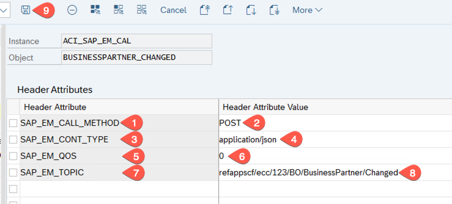

### Enter Cloud Connection Secret

1. Click on **Back** Button to go to previous screen of **Display IMG**.
2. Expand the following path: **SAP Customization Implementation Guide** --> **Integration with Other SAP components** --> **SAP NetWeaver AddOn for Event Enablement** --> **ALE Delta Customizing** and click on clock icon with tooltip **IMG:Activity** next to **ACI: Set the Cloud Connection Password**.
3. In the screen, **Maintain the Cloud Shared Secret**:
   - Select Cloud Instance **ACI_SAP_EM_CAL**.
   - For the field **Cloud Shared Secret**, copy and paste the value of **clientsecret** from the Event Mesh Service Key which you copied in the beginning of this document.

     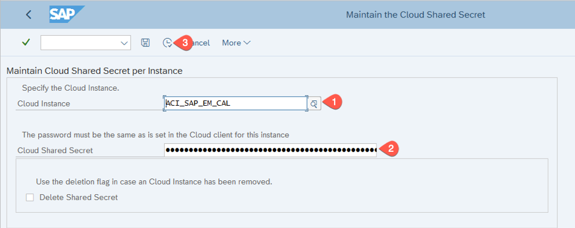

   - Click on Execute ( Will see suucess Message---> Shared Secret for ** was created successfully**)
   	
     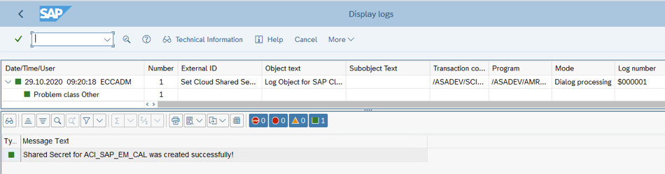
     
### Maintain Event Type Linkage 

1. Enter the Transaction **/nSWE2** and Click **New Entries**.
   
   
   
2. In the opened screen, enter the following values:
   - For field **Object Category**, select **BOR Object Type**
   - For field **Object Type**, select **BUS1006**
   - For field **Event**, select **CREATED**
   - For field **Receiver type**, select **Z_ACI_MSG_CREATE**
   - For field **Receiver Function Module**, select **/ASADEV/ACI_EVENTS_SYNCH**
   - Check the checkbox **Linkage Activated**
   - Click **Save** icon
        
     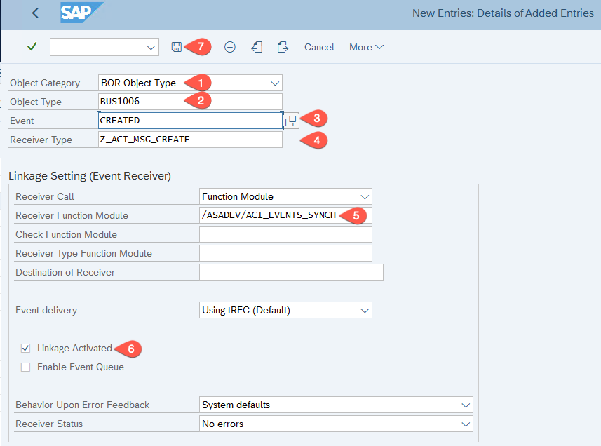
     
3. Click **New Entries**
4. In the opened screen, enter the following values:
   - For field **Object Category**, select **BOR Object Type**
   - For field **Object Type**, select **BUS1006**
   - For field **Event**, select **CHANGED**
   - For field **Receiver type**, select **Z_ACI_MSG_CHANGED**
   - For field **Receiver Function Module**, select **/ASADEV/ACI_EVENTS_SYNCH**
   - Check the checkbox **Linkage Activated**
   - Click **Save** icon and then the **OK** (green-tick) icon for Transport Request.
        
     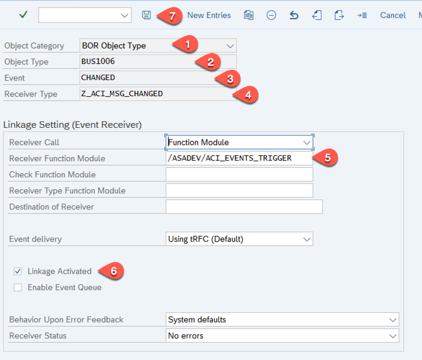  	

## Summary

We have estabilished a trust between our SAP ERP backend and the Event Mesh service and set up the eventing. Now we are ready to run the reference application.

**Additional Resources:**

* [SAP Enterprise Messaging for SAP ERP: HowTo-Guide (Part 1 – Connectivity)](https://blogs.sap.com/2020/10/02/sap-enterprise-messaging-for-sap-erp-howto-guide-part-1-connectivity/)

* [SAP Enterprise Messaging for SAP ERP: HowTo-Guide (Part 2 – First use case)](https://blogs.sap.com/2020/10/08/sap-enterprise-messaging-for-sap-erp-howto-guide-part-2-first-use-case/)
