# SAP NetWeaver® Event Enablement Add-on 1.0 installation at SAP ERP 6.0 with Netweaver 7.5 or SAP S/4HANA

This guide gives you a rough overview of the installations steps for the SAP NetWeaver® Event Enablement Add-on 1.0 for a Netweaver 7.5 system. 

For the installation you will need the installation package SAPK-100COINASANWEE and the service packs 1-3 from [SAP Support Portal]( https://launchpad.support.sap.com/#/softwarecenter):

* **SAPK-100COINASANWEE**  Add-On Installation
* **SAPK-10001INASANWEE**  SP01
* **SAPK-10002INASANWEE**  SP02
* **SAPK-10003INASANWEE**  SP03

> For **SAP S/4HANA**: When you face errors during the installation like missing Netweaver 7.31 packages you have also to install the *Attribute Change Package 13 for ASANWEE 100* **ASANWEE===100**

In addtion see [overview in SAP Help](https://help.sap.com/viewer/e966e6c0e61443ebaa0270a4bae4b363/1.0/en-US/4bd8777d7a674f1ba93e1da405e4b9df.html). 

It could also be necessary to update the SPAM transaction to the latest version

Check also [SAP Note](https://launchpad.support.sap.com/#/notes/2927040) for more details and other SAP Netweaver versions.

**Persona:** ERP Administrator or SAP S/4 HANA Administrator 

## Step-by-step 

1. Navigate to Transaction SPAM and check the version. If SPAM version is not '0074' then upgrade to it. Download the latest file from SAP Support. See also this [blog](https://blogs.sap.com/2016/03/02/spam-saint-update-2/).
Then run the installation:

   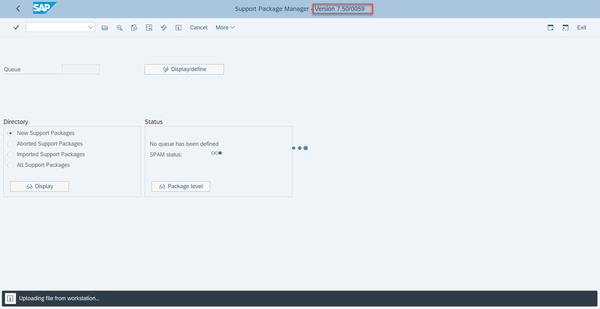
   
   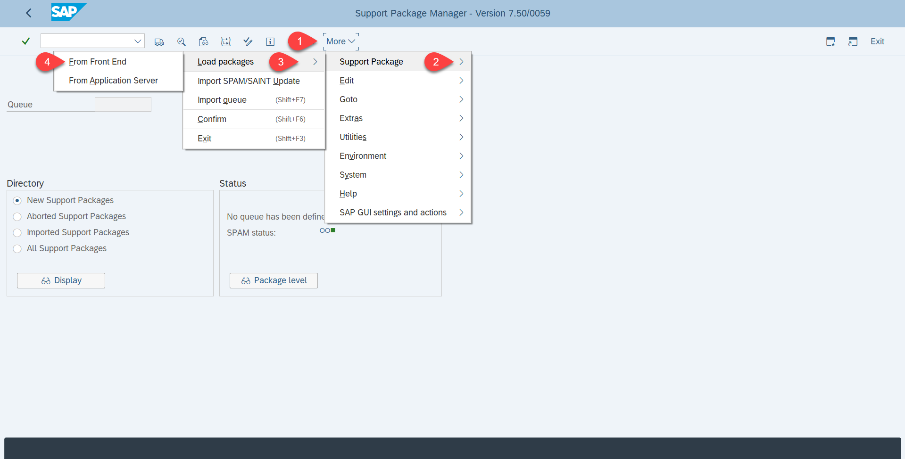
   
   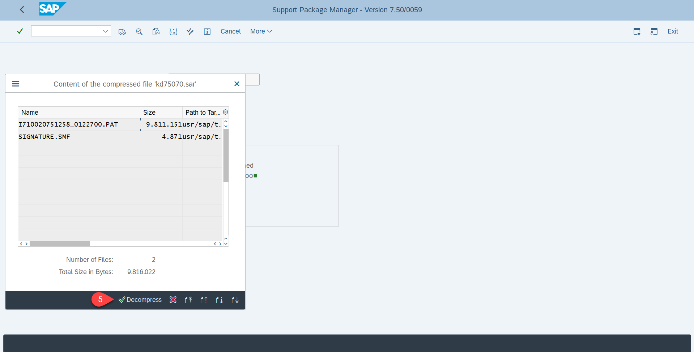
   
   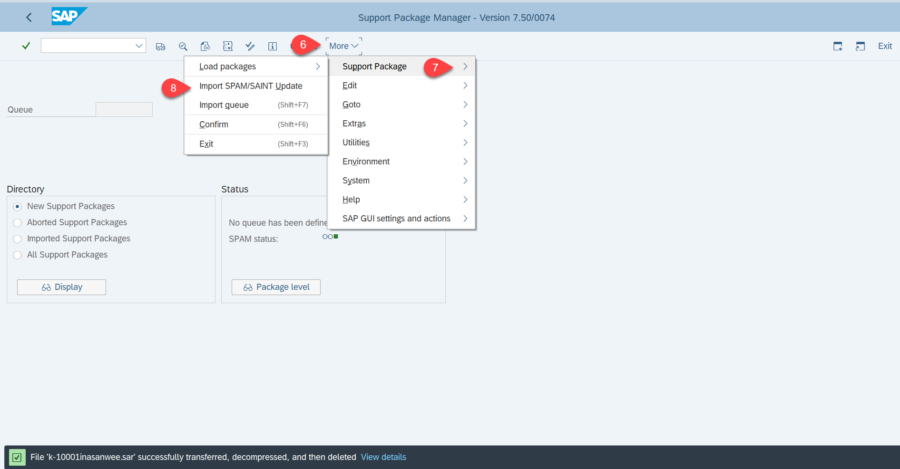
   
   Please note that it will take some time up to 30 min to upgrade the Support Package Manager. Once SPAM get upgraded you can see the upgraded version in header.
     
2. Now you can Navigate to Transaction SAINT from the home screen. File name will be be "K-100COINASANWEE.SAR". Click on Continue 2-3 times and then a popup will appear to give a Password. Enter password "76755BF26A".

   
   
   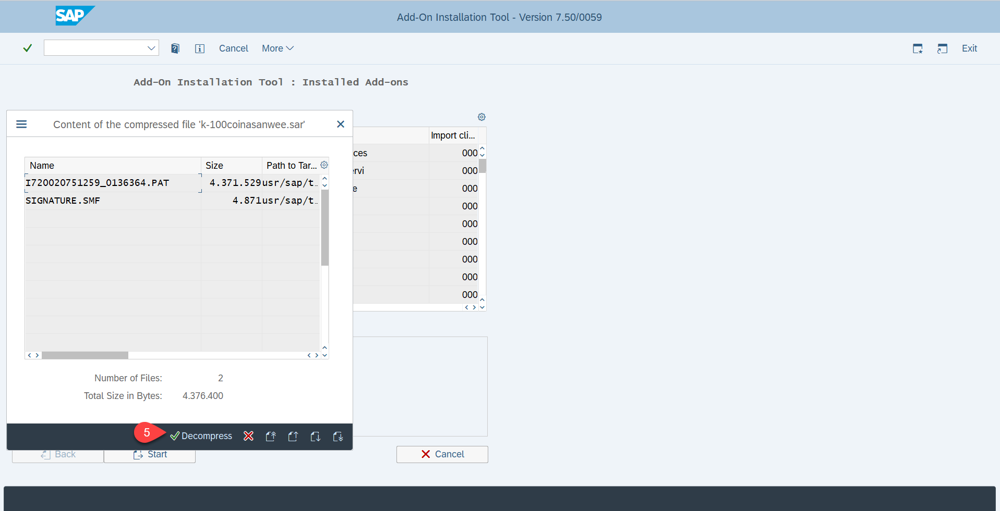
   
   
   
   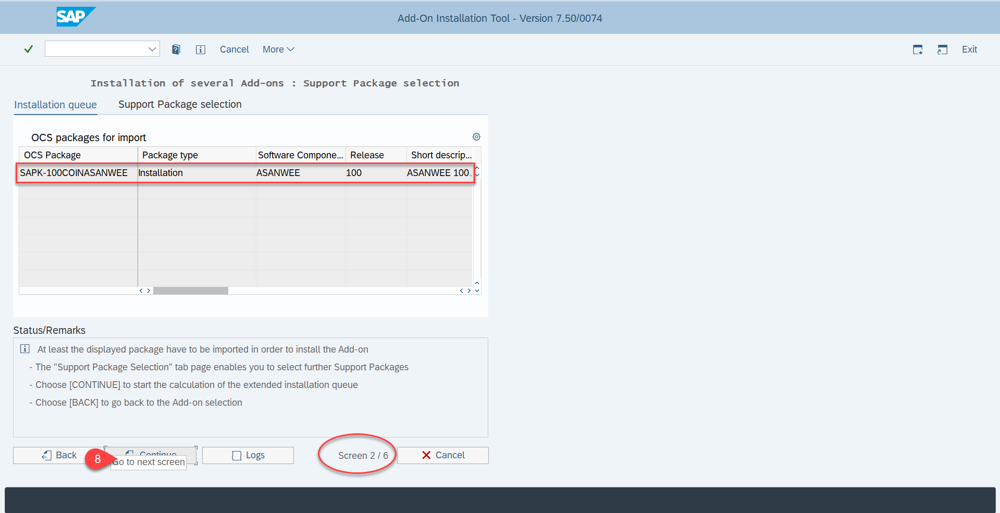
   
   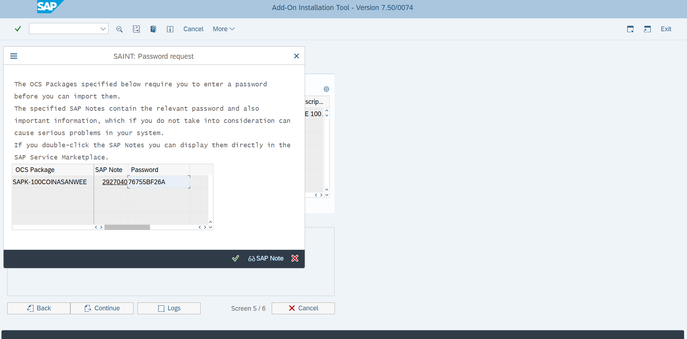

    Please note that it will take some time up to 15-20 min to install the Add-ons. Once it's installed and you got the message for successful installation , you can assure from seeing the Add-on detail by going again to transaction /nSAINT.
 
   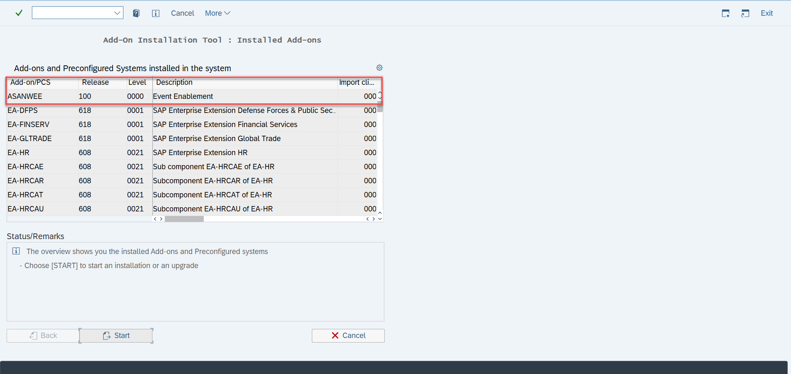

   Congratulation!! you have downloaded the installation SP0 version.
 

3. Now you have to upgrade to SP1 Pack. For this Navigate to Transaction SPAM. File name will be "K-10001INASANWEE.SAR".

   
   
   
   
   
   
   
   
   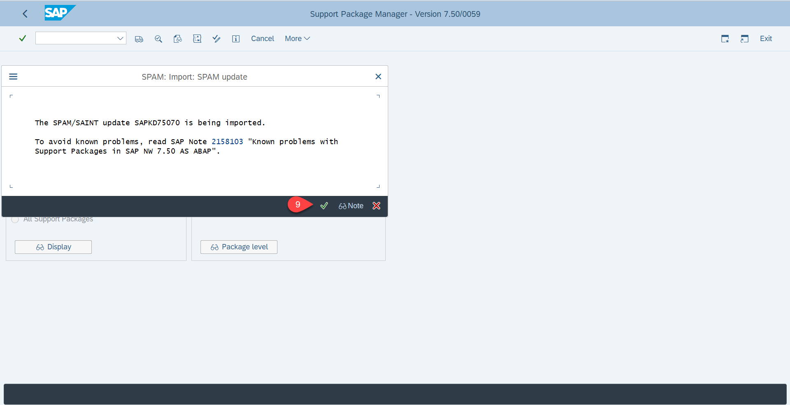
   
   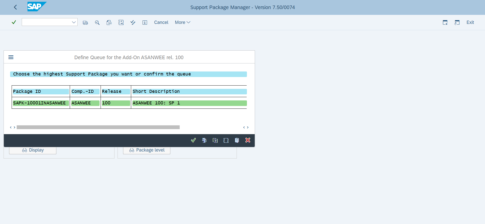
   
   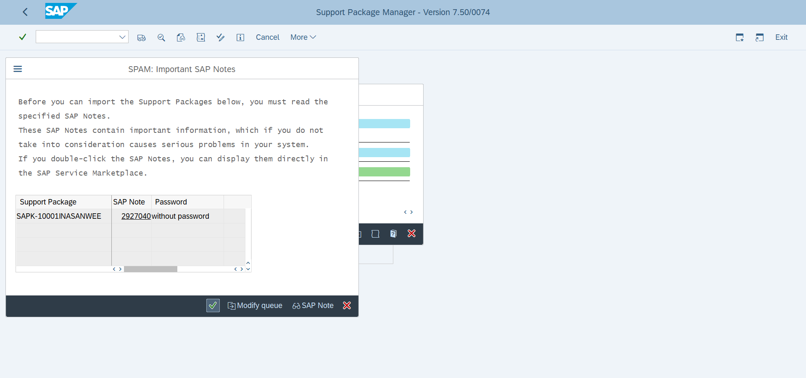
   
   Once it's installed and you got the message for successful installation , you can assure from seeing the Add-on detail by going again to transaction /nSAINT.
   
   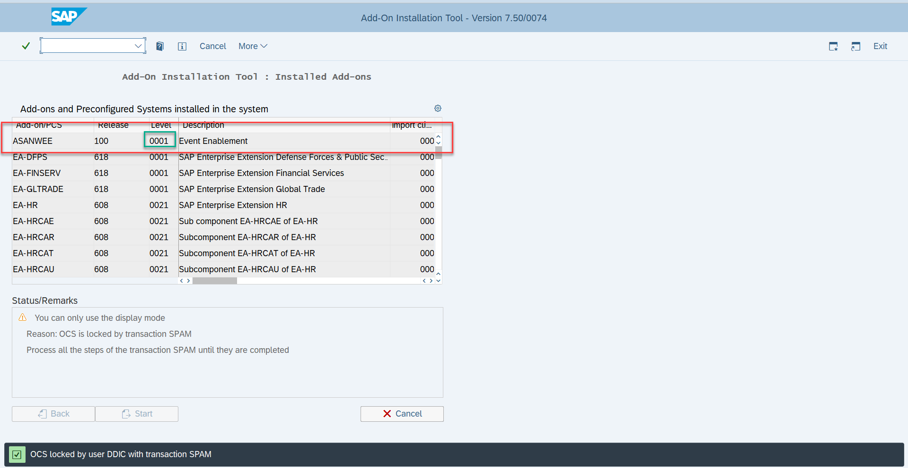
   
   Repeat the steps from section 3 also for the SP2 K-10002INASANWEE.SAR and SP3 K-10003INASANWEE.SAR. 

   Now your SAP System is ready for messaging.

   

   
   
   
   
   
 

   
   
   
 

