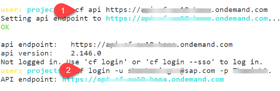
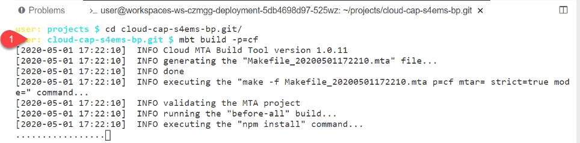
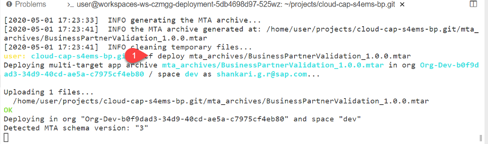

# Develop SAP Cloud Application Programming Model Application

## Introduction

Now we will setup the SAP Business Application Studio and use it to develop our SAP Cloud Application Programming Model (CAP) application:

**Persona:** BTP Developer

### Create a New Application in SAP Business Application Studio

1.	Make sure you have opened your *SAP BTP Account* and navigate to your *Subaccount* 
   
2.	Open the menu *Services* and navigate to *Instances and Subscriptions*
   
3.	Choose "SAP Business Application Studio" under the *Subscriptions* tab and click on the icon to open the application
     
     
 
4.	 After opening the home sceen of SAP Business Application Studio, click the button *Create Dev Space*

     
 
5.	On the next screen, you will create the new Dev Space. For this enter a Dev space name e.g 'BusinessProcess', select the type *Full Stack Cloud Application*.
    Don´t forget to click on the button *Create Dev Space*

      
      
 
6.	Your Dev Space is now being created. As soon as the Dev Space is running, you can click on your Dev Spaces name to access

7.	Choose *Terminal -> New Terminal* in the menu on the top of your screen.

    
 
8. In the opened terminal go to projects folder with executing
   
   ``` 
   cd projects
   ``` 
 
9. Then clone the project from your personal GitHub and enter username and token to execute the command: 
   ``` 
   git clone https://github.com/SAP-samples/cloud-extension-ecc-business-process
   ``` 
 
10.	Click on *File* in the menu on the top and choose *Open Workspace* in the drop-down.

    
 
11.	 Open the project by selecting projects -> cloud-extension-ecc-business-process and click on *Open*
 
12. For the next steps, you need the terminal again. Go to *Terminal* -> *New Terminal*
     
13. First you need to [login] into your subaccount(https://help.sap.com/docs/BTP/65de2977205c403bbc107264b8eccf4b/7a37d66c2e7d401db4980db0cd74aa6b.html):
> Hint: You can find the API Endpoint of your Subaccount in the BTP Cockpit-Overview section

  ```
    cf api <API-ENDPOINT>
    cf login -u <USER-ID> -p <PASSWORD>
    cf target -o <ORG> -s <SPACE>
  ```
         
  

14. In a next step you will create SAP HANA Cloud instance. You can either follow the steps below or follow the more detailed tutorial for creating a SAP HANA Cloud instance [at SAP Help Portal](https://help.sap.com/docs/HANA_CLOUD/db19c7071e5f4101837e23f06e576495/03982b3b93664f089b084713285e3c81.html?locale=en-US&state=DRAFT&version=2020_04_QRC).

    ```
      cf create-service hana-cloud hana my_hana_db -c '{"data":{"edition":"cloud","memory":30,"systempassword":"<PASSWORD>"}}'
    ```
 > Hint: Make sure you save this password for later

 > Hint: The creation of HANA Cloud will take some time use command "cf services" to monitor the current creation status

15. After your SAP HANA Cloud instance is created you can use the following command to get the globally unique identifier (GUID)
    ``` 
    cf service <HANA-INSTANCE-NAME> --guid
    ``` 

16. In a next step, using the guid of your HANA instance you will create a service called BusinessPartnerValidation-db

    ```  
    cf create-service hana hdi-shared BusinessPartnerValidation-db -c '{"database_id" :"<HANA-CLOUD-GUID>"}'
    ``` 
  
17. Use ["cds build"](https://cap.cloud.sap/docs/guides/deployment/custom-builds) to build tasks on your project folders to prepare them for deployment.

    ```
    cds build --production
    ```

### MTA Based Deployment
1. Create mta.yaml 
   ```
   cds add mta
   ``` 

###  Manifest-Based Deployment
1. Create manifest.yaml and services-manifest.yaml file

   ```
   cds add cf-manifest
   ```
  
2. Install a [cf CLI plugin](https://github.com/dawu415/CF-CLI-Create-Service-Push-Plugin) which creates services specified from a services manifest.yml file 

    ```	
    cf install-plugin Create-Service-Push
    ```   
    
3.  Now you will use manifest file to build services in your application. You want to create 5 different services for Business Partner Validation. To build the services modify manifest.yml as below:

    ```
    ---
    applications:
    # -----------------------------------------------------------------------------------
    # Backend Service
    # -----------------------------------------------------------------------------------
    - name: BusinessPartnerValidation-srv
      random-route: true  # for development only
      path: gen/srv
      memory: 256M
      buildpack: nodejs_buildpack
      services:
      - BusinessPartnerValidation-db
      - BusinessPartnerValidation-xsuaa
      - BusinessPartnerValidation-ems
      - BusinessPartnerValidation-dest
      - BusinessPartnerValidation-cs

    # -----------------------------------------------------------------------------------
    # HANA Database Content Deployer App
    # -----------------------------------------------------------------------------------
    - name: BusinessPartnerValidation-db-deployer
      path: gen/db
      no-route: true
      health-check-type: process
      memory: 256M
      instances: 1
      buildpack: nodejs_buildpack
      services:
      - BusinessPartnerValidation-db

    ```

4. Also, modify services-manifest.yml as below:

    ```
    ---
    create-services:
    # ------------------------------------------------------------
      - name:   BusinessPartnerValidation-db
        broker: hana  # 'hanatrial' on trial landscapes
        plan: "hdi-shared"
    # ------------------------------------------------------------
      - name:   BusinessPartnerValidation-xsuaa
        broker: xsuaa
        plan: application
        parameters: "./xs-security.json"
    # ------------------------------------------------------------
      - name:   BusinessPartnerValidation-ems
        broker: enterprise-messaging
        plan: default
        parameters: "./em.json"
    # ------------------------------------------------------------
      - name:   BusinessPartnerValidation-dest
        broker: destination
        plan: lite
    # ------------------------------------------------------------
      - name:   BusinessPartnerValidation-cs
        broker: connectivity
        plan: lite
    ```

5. Now use the installed plugin to create services: DB, XSUAA, Event Mesh, Destination and Connectivity
 
    ```
    cf create-service-push
    ```

### Build and Deploy to cf

1. Build using following command:
    ```
    mbt build -p=cf 
    ```
     

2. Navigate to mta_archives folder and run the below command from CLI
 
    ```
    cf deploy mta_archives/BusinessPartnerValidation_1.0.0.mtar
    ``` 

     
               
3. (Optional) After successful deployment, use terminal to create service key
  
    ```
    cf create-service-key BusinessPartnerValidation-ems emkey
    ``` 
