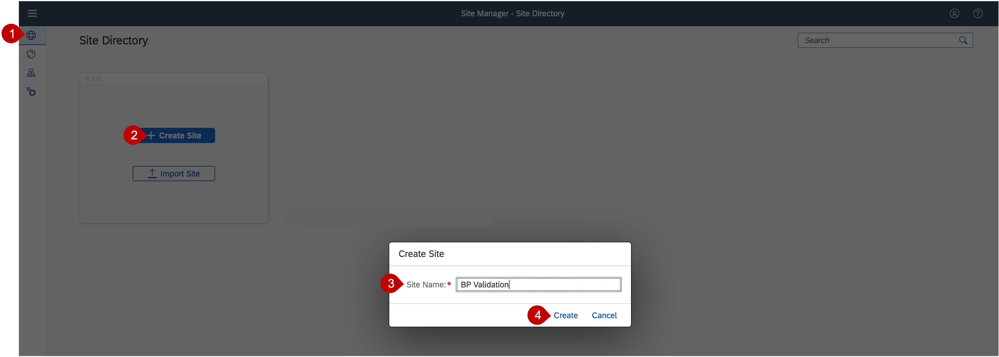
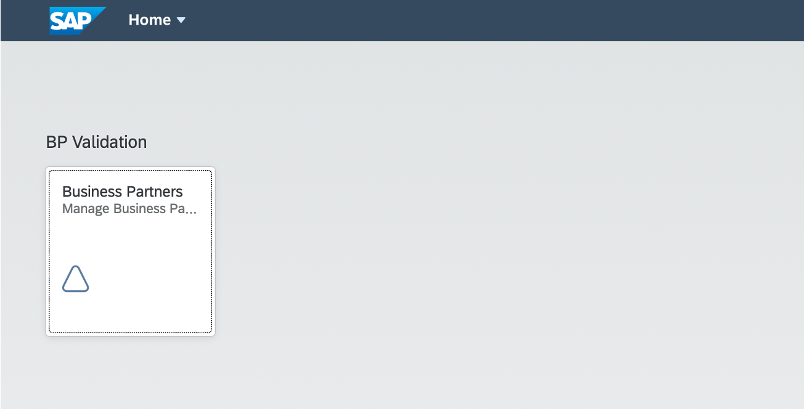

# Integrate the Application to SAP Build Work Zone, standard edition

## Introduction

In this section, the application will be connected to SAP Build Work Zone, standard edition to display the application from the launchpad

**Persona:** BTP Developer

###  Integrate with SAP Build Work Zone, standard edition

1.  Open your Subaccount and search for *Instances and Subscriptions*
2.  Search for the application *SAP Build Work Zone, standard edition* and click on icon to open
3.  Now are on the home page of SAP Build Work Zone, standard edition. In the menu on the left side click on the icon for *Provider Manager*
4.  Click on the refresh icon to fetch the updated content

     
    
5.  Click on *Content Manager* in the menu on the left and open tab *Content Explorer*
6.  Select the tile "HTML5 Apps" with your respective subdomain name
  
     
    
7.  In the items table, click checkmark for your app. Click on the button *Add to My Content*  
     

8. Navigate back to *My Content* and click on role *Everyone* in table "Items"

     

9. On the right section of your screen search for your apps in the *Display Assigned Items* field
10. Click on *Edit* button for Role Everyone, then click on the '+' in the assigned items section on the right site of your screen
 
     
 
11. Click on *Save*
12.  Go to the *My Content* tab, click on *New* button and select *Group* from dropdown

	  
	  
13.   Add title 'BP Validation'
14.   Assign items on the right section of your screen. Search for your app and click on the '+' icon to assign the apps like described in step 10
15.   Click on *Save*
16. Go Back to the *Site Directory* and click on button to *Create Site*
17. Enter the site name as 'BP Validation' and click on *Create*

     
    
20. Navigate to Site Directory
21. Find your created site and open it by clicking on the icon *Go to site*
 
     
    
21. Congratulations! You now can use your created application 
     
