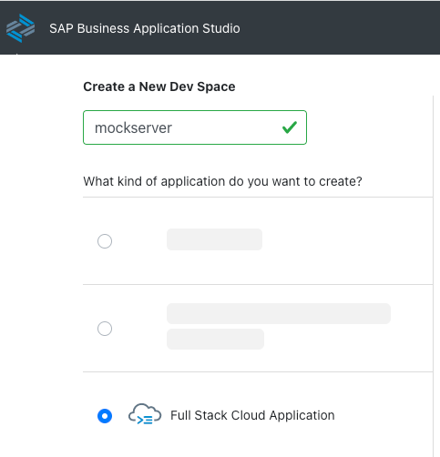
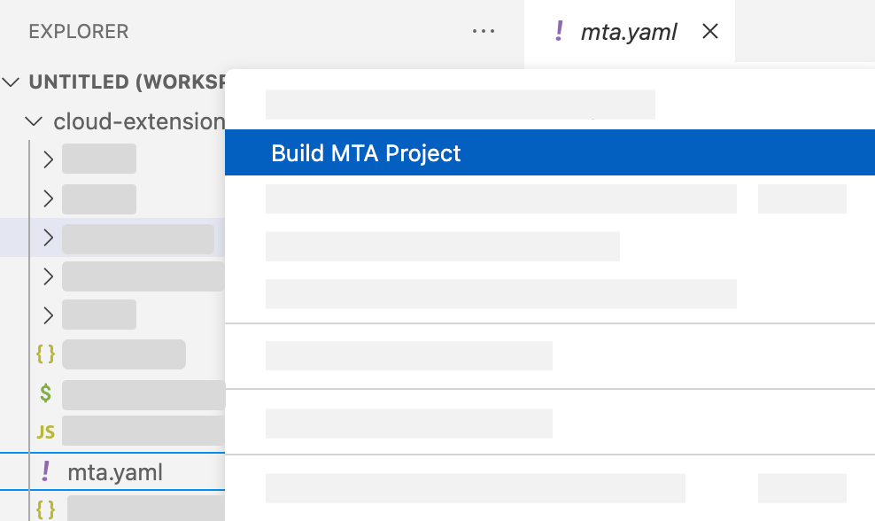
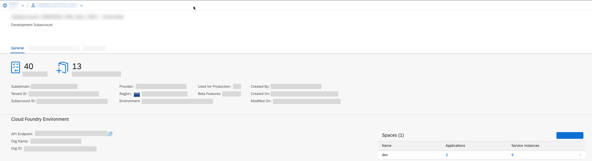
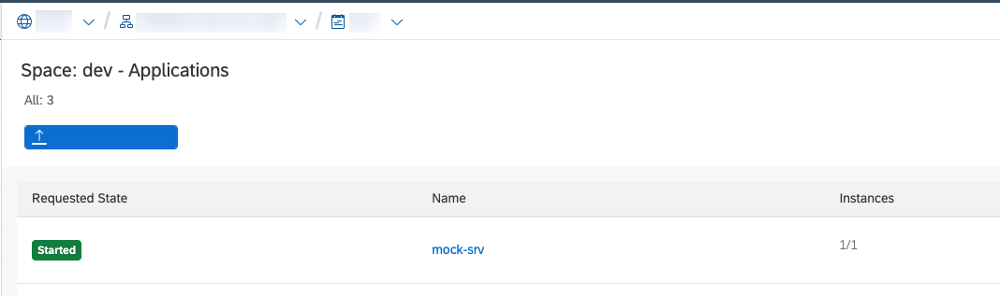
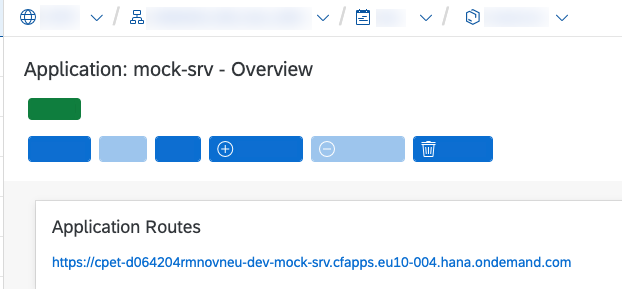
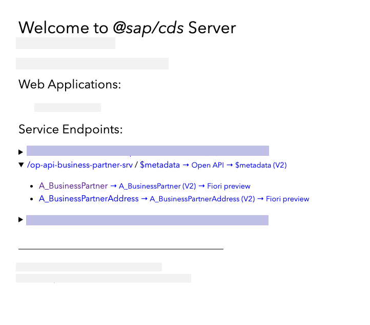

# Set Up Mock Server

If you don't have access to a SAP S/4HANA system but still want to create an application consuming an OData service with SAP Business Application Studio, you can make use of this [mock server application](../README.md). It contains some entities of the SAP S/4HANA API_Business_Partner OData service (A_BusinessPartner & A_BusinessPartnerAddress) with sample data.

To install the mock server, you need an SAP BTP subaccount with Cloud Foundry Environment and 256 MB of Cloud Foundry runtime.

Also you have to create a destination to the mock service in the same subaccount as your SAP Business Application Studio subscription.

## Create Workspace in SAP Business Application Studio

1. Open the SAP Business Application Studio and create a new **Dev Space** using the **Full Stack Cloud Application** type

   

2. Switch to the tab where you have opened **SAP Business Application Studio**. In the tabs, choose **View** and select **Find Command**.

3. Search for **CF Login** and select **CF: Login on to Cloud Foundry**.

   

4. Enter CF API endpoint

> Hint: You can find your API Endpoint in the overview section of your SAP BTP account  &rarr; Cloud Foundry Environment

5. Enter your SAP BTP account **Email** and **Password** when prompted.

6. Select your Cloud Foundry **Org**

> Hint: You can find your Org Name in the overview section of your SAP BTP account &rarr; Cloud Foundry Environment

7. Select the space name. Once you have selected the Org and Space, you would log in to Cloud Foundry in SAP Business Application Studio.

> Hint: You can find your space name in your SAP BTP account  &rarr; Cloud Foundry  &rarr; Spaces

8. Now, you have successfully created a workspace and pointed to our desired SAP BTP **Org** and **Space**.


### Build and Deploy

1. In the menu select Terminal  &rarr;  New Terminal. In the terminal go to the projects folder
   
   ```bash
      cd projects
   ```

2. Clone the mock server GitHub repository:

   ```bash
      git clone -b mock https://github.com/SAP-samples/cloud-extension-ecc-business-process.git
   ``` 
3. Choose File in the menu on the top and then select Open Workspace from the dropdown menu.

4. Open the project by choosing projects > cloud-extension-ecc-business-process and choose Open.

3. In the project folder right-click on the `mta.yaml` file and select **Build MTA Project**.

   

4. When the build was successful, you will see a new folder **mta_archives** in your project with the **Mockserver_1.0.0.mtar** file. Right-click on that file and select **Deploy MTA Archive**.

   
   
5. The next step is to create a destination to the mock server


### Set Up Destination in SAP BTP

1. Open your SAP BTP account and navigate to your **Subaccount**.

2. Choose **Connectivity** in the menu on the left then choose **Destinations** &rarr; **New Destination**.

3. Again, choose **Destinations** &rarr; **New Destination** and enter the following information destination:

    - Name: `bupa`
    - URL: `https://<mock_srv_url>/v2/op-api-business-partner-srv`
    - Authentication: `No Authentication`

   

### Test the Mock Server

1. Open your **SAP BTP Account** and navigate to your **space**
    
   

2. Find the mockserver application in the table and choose **mock-srv** to open

   

3. Click on the link for application routes to open mock server

   

4. Now you can open the service endpoints for */op-api-business-partner-srv* and have a look on the provided data

   
