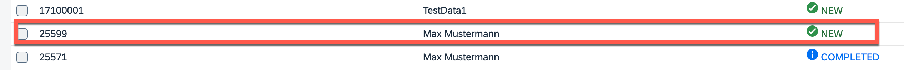

### Demo Script

1. Start your Business Partner Validation Application:

- Go to **Instances and Subscriptions**.
- Find **SAP Build Work Zone** and click to open the application.
- In the Website Manager find your created Website and click on tile to open it.
- Click on **Business Partner Validation** tile.
- The list of Business Partners along with their verification status gets displayed.

 

2. Create a new Business Partner in the mock server using business partner API:

- After the successful deployment you will get the following message:

  `Application "mock-srv" started and available at "..."`

- Follow the given URL to get the CAP App Index Page. You can find `/op-api-business-partner-srv` link there.

- On the index page there is a link to SwaggerUI: Open API Preview. Open it.

- Go to the POST section of /A_BusinessPartner. Click the button Try it out. Use the following JSON as a payload (replace the proposed one):

	```
	{  
		"BusinessPartner": "25599",  
		"BusinessPartnerName": "Max Mustermann",  
		"BusinessPartnerFullName": "Max Mustermann",  
		"FirstName": "Max",  
		"LastName": "Mustermann",  
		"BusinessPartnerIsBlocked": true,  
		"to_BusinessPartnerAddress": [{  
			"BusinessPartner": "25599",  
			"AddressID": "99",  
			"StreetName": "Platz der Republik",  
			"HouseNumber": "1",  
			"PostalCode": "10557",  
			"CityName": "Berlin",  
			"Country": "DE"  
		}]  
	}
	```

- Click Execute. 
You should get a response with the code 201. This means that the entry was created in the database and the corresponding event was triggered (if the Event Mesh instance is binded).

3. Now, go back to the BusinessPartnerValidation application to see if the new Business Partner has appeared as a new entry in the UI.

	

4. Go to the details page for the new Business Partner.

5. Choose **Edit** and set the Status to **Verified**.

 	

6. (Optional) You can configure SAP Event Mesh in a way so that you can see the created event. For that, you could create an additional queue that subscribes to the topic as well.

 	

7. Now, go back to the Business Partner application to see if the new Business Partner has been updated in the UI.

8. Play around with the app.
