# Configure Systems in the Cloud Connector

In this section you will configure the Cloud Connector for connecting the on-premise backend system to the SAP Business Technology Platform (SAP BTP).

**Audience:** Backend Administrator (ERP Admin or SAP S/4HANA Admin) and Cloud Administrator (SAP BTP)
## Prerequisites

### Cloud Connector
For the installation of the Cloud Connector, see  [Cloud Connector Installation](https://help.sap.com/viewer/cca91383641e40ffbe03bdc78f00f681/Cloud/en-US/57ae3d62f63440f7952e57bfcef948d3.html). For this mission, the Portable Scenario is sufficient.

**Hint:** You can skip the installation of Cloud connector, if you are using a SAP Cloud Appliance Library S/4HANA demo backend system which you set up following the steps in [Setup SAP S/4HANA system in SAP CAL](../cal-setup/CALS4H.md). There is a Cloud Connector pre-installed and ready to be used. Check the **Welcome page** in your CAL system for the links, it usually runs in http://\<IP of your SAP CAL backend\>:8443/.

### Subaccount Information

In the **Overview** page of your subaccount in the SAP BTP cockpit, you can find both, your **API Endpoint** and the subaccount **ID**, that you will need later.

  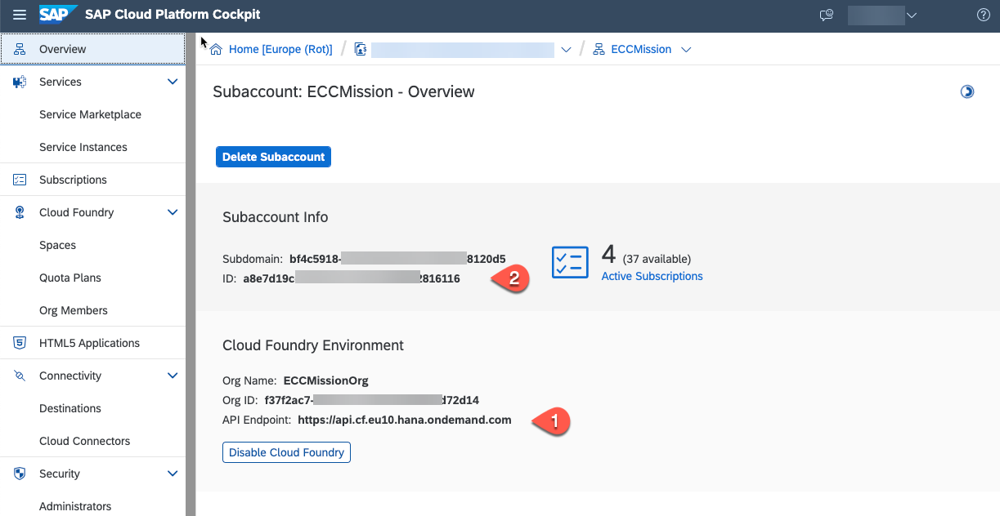

## Configure Systems in the Cloud Connector for an Access with a Technical User

1.	Open your Cloud Connector administration UI for the on premise backend system. If the Cloud Connector is running on the default port, open https://localhost:8443/.

    >Hint: adjust the port if you have specified another port for the Cloud Connector during the installation. Potentially you might have to use the external IP of your system.

2. Enter username and password and choose **Log In**.

3.	Choose **Add Subaccount** and then fill out the following fields:
4.	Enter the following data:
    - Region
    - Subaccount ID
    - Display Name (optional)
    - Subaccount User
    - Password
    - Description (optional)
    
    Choose **Save**.

    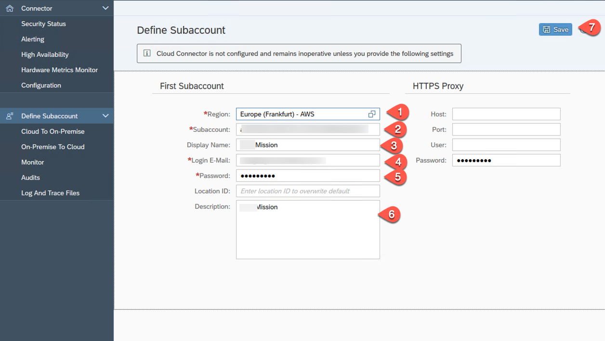

    You can look up the required data in the SAP BTP cockpit as described in the prerequisites.

5.	Choose **Cloud to On-Premise**.
6.	To add a new system mapping, choose the **'+'** on the right side of the screen.

   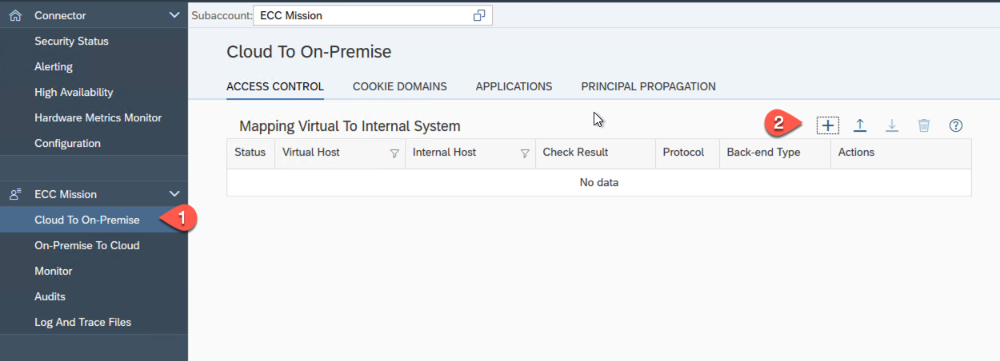

7. In the pop-up window select **ABAP System** in the **Backend Type** field and then choose **Next**.

   

8. Select **HTTP** in the **Protocol** field and then choose **Next**.

   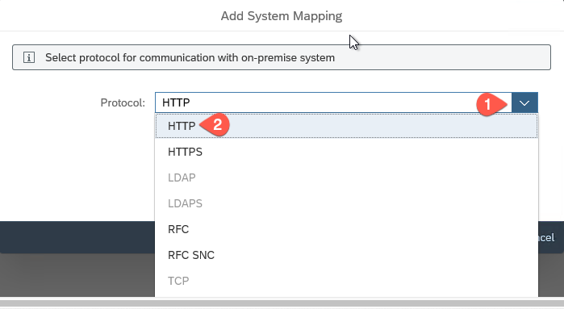

   >Hint: To find out the HTTP port number of your SAP ERP system, refer to the [Find your system's HTTP and HTTPS port](https://github.com/SAP-samples/cloud-extension-ecc-business-process/tree/mission/mission/ecc-setup#check-your-http-and-https-ports-in-smicm) page.
   
9. Enter values for the fields: **Internal Host** and **Internal Port**. Then, choose **Next**. 
   To learn more details about internal host, see [Configure Access Control (HTTP)](https://help.sap.com/viewer/cca91383641e40ffbe03bdc78f00f681/Cloud/en-US/e7d4927dbb571014af7ef6ebd6cc3511.html). You can also execute transaction **/nOS01** in your SAP backend system to find out the host name of your SAP ERP system.

   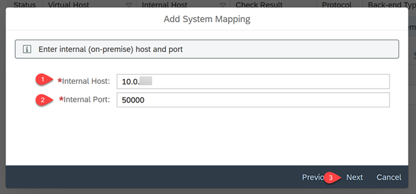

9.	Enter values for: **Virtual Host**, for example as: **sapsystem** and **Virtual Port**, for example as **5000**, and then choose **Next**

   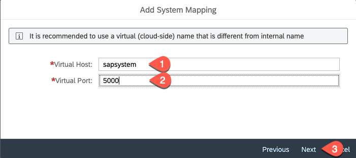

10.	Select **None** in the **Principal Type** field and choose **Next**.
11. Select **Use Virtual Host** in the **Host in header** field and choose **Next**.

   

12.	Add a **Description** for your system mapping.

   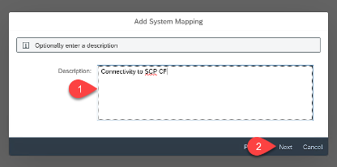

13.	Make sure all the values are correct in the summary and don´t forget to check the Internal Host checkmark.
14.	Select the **Check Internal Host** checkbox and choose **Finish**.

   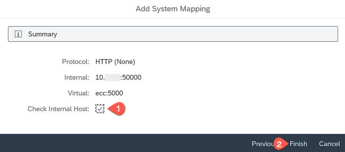

15.	Choose **'+'** to add a resource.

   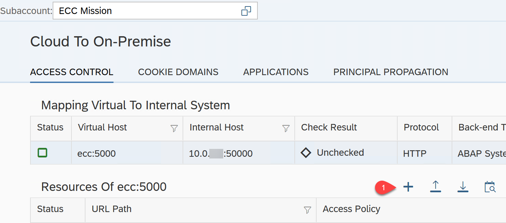

16. Enter the following data:
    - URL Path: **/sap/opu/odata/**
    - Select the **Active** checkbox
    - Select **Path and all sub-paths**
    - Optional: Description
    Choose **Save**.

   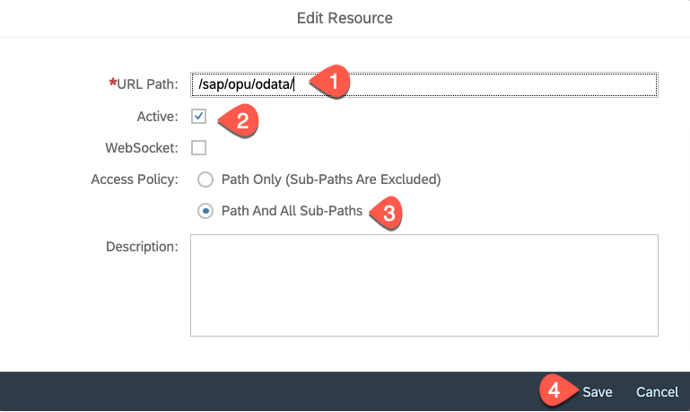
## Create a Destination

1.	Open SAP BTP cockpit and navigate to your **Subaccount**.
2.	Choose **Connectivity** and then choose **Cloud Connectors** to check the host details.

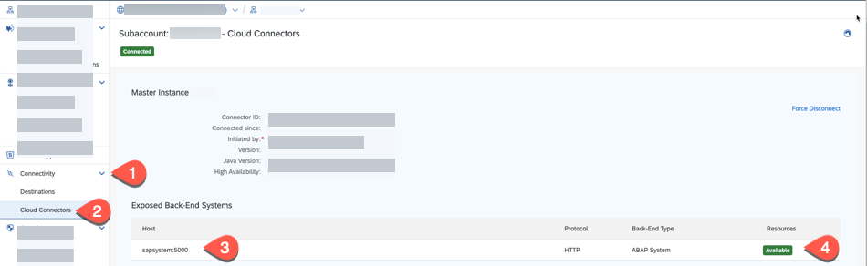

3.	Go back to **Connectivity** and then choose **Destinations** > **New Destination**.

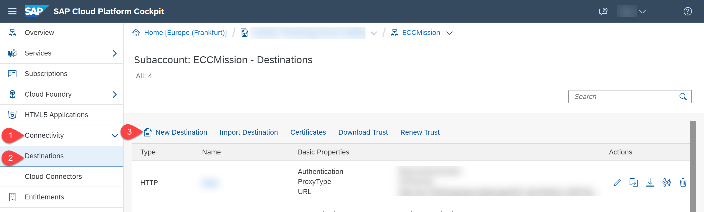

4.	Enter the following information to the **Destination Configuration**:
    - **Name:**: bupa
    - **Type:** HTTP
    - **URL:** Enter the URL of the on-premise system depending on type of your backend.
      * Pattern for the URL is in format: `http://<virtual host name>:<virtual port name>/<OData service name>`, note down the configured virtual host and virtual port in previous step 10 of configuring cloud connector.
      * For an SAP ECC system as backend: the name of the OData service for Business Partners is **ZAPI\_BUSINESS\_PARTNER\_SRV**, then the URL would be for example `http://sapsystem:5000/sap/opu/odata/sap/ZAPI_BUSINESS_PARTNER_SRV`. Adjust the URL according to your configured virtual host name and port.
      * For an SAP S/4HANA system, the name of the OData service is **API\_BUSINESS\_PARTNER**, so the URL would be for example `http://sapsystem:5000/sap/opu/odata/sap/API_BUSINESS_PARTNER`. Adjust the URL according to your configured virtual host name and port.
    - Select **OnPremise** in the **Proxy Type** dropdown menu
    - Select **Basic Authentication** in the **Authentication:** dropdown menu
    - Set values for the **User** and **Password** fields
    - Choose **New Property** and add the **sap-client = 100** of your on-premise backend. Adjust the **sap-client** parameter according to your backend system.
5.	Click on **Save** (optionally you can also **check the connection**) and close the window

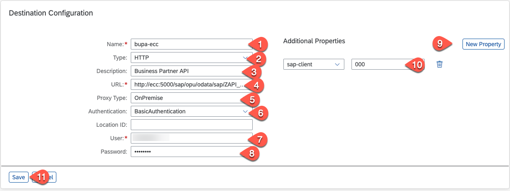

6.	Choose **Connection**.

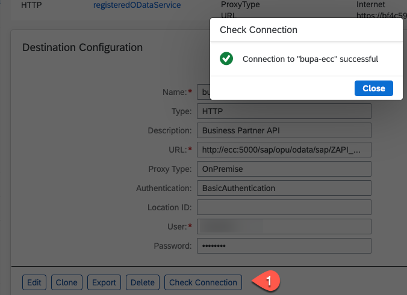

**Troubleshooting links:**

* [Blog Post: SAP Cloud Connector Troubleshooting](https://blogs.sap.com/2019/01/26/cloud-connector-guided-answers-and-troubleshooting/)
* [SAP Cloud Connector: Guided Answers](https://ga.support.sap.com/dtp/viewer/index.html#/tree/2183/actions/27936)

## Summary

You have established a connection between the SAP on-premise system and your subaccount in SAP BTP.
