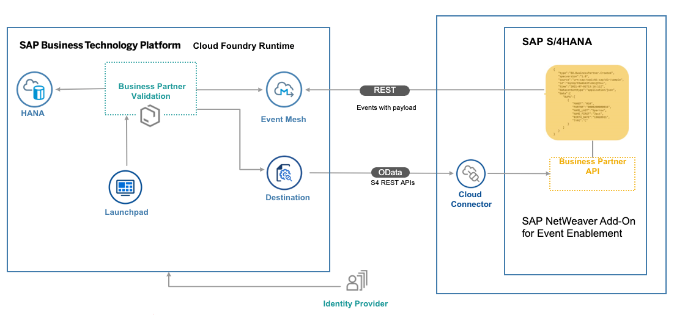
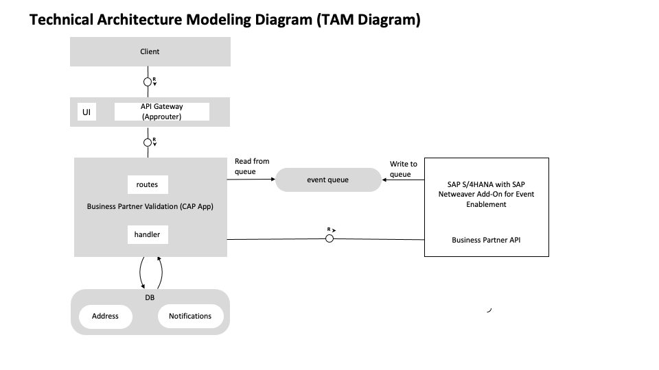

# SAP S/4HANA Extend Business Process Using the NetWeaver Eventing Enablement Add-on

## Description
The main intent of this scenario is to complement an existing business process in an SAP solution – currently, SAP ERP 6.0, SAP S/4HANA, SAP SuccessFactors or selected SAP cloud solutions - with additional business process steps. This involves adding major logic and/or additional data and goes beyond simple UI changes.

This application showcases:

- Building application on SAP BTP using the SAP Cloud Application Programming Model
- Consuming data-driven events from an SAP S/4HANA system by using the NetWeaver Add-on for Event Enablement 
- Consuming standard OData API's from SAP S/4HANA using the SAP BTP Connectivity service

## Business Scenario

This is the business scenario that is used to showcase how to build an SAP S/4HANA extension application.

As an employee of iCredible, a business partner validation company, which is a third party vendor of ACME Corporation, John would like to get notifications whenever new business partners are added to the SAP backend system of ACME Corporation. John would then be able to review the business partner details in his extension application. He would visit the business partner’s registered office and do some background verification. Then, John would update/validate the verification details into the extension application. Once the details are verified, the business partner gets activated in the SAP S/4HANA system of ACME Corporation.

The technical details include:
- Custom extension application that works independently from SAP S/4HANA
- Changes in the SAP S/4HANA system are communicated via events in real time to the extension application.
- Vendor employees need access only to the custom application

## Audience
For the complete installation, configuration and implementation of this scenario at least the following experts are involved:

* **SAP S/4HANA and Backend Administrator**
* **ABAP Developer**
* **SAP BTP Administrator**
* **Cloud Application Developer**

## Architecture

### Solution Diagram

The Business Partner Validation application is developed using [SAP Cloud Application programming Model (CAP)](https://cap.cloud.sap/docs/) and runs in the SAP BTP, Cloud Foundry environment. It consist of 3 modules: database, service and UI. It consumes platform services like SAP Event Mesh, SAP HANA and SAP Connectivity service. The events generated in the SAP S/4HANA system are inserted into the Event Mesh queue. The application running in SAP BTP, Cloud Foundry environment polls the queue for these messages and inserts them into the SAP HANA database. The Business Partner Validation application uses the data from the Business Partner API.

## Requirements

### Systems
* SAP S/4HANA 2020
* SAP BTP account with [SAP Event Mesh](https://help.sap.com/viewer/product/SAP_ENTERPRISE_MESSAGING/Cloud/en-US) service. The 'default' plan for the SAP Event Mesh service is required.

### Local Development (not part of this mission):
* [Node js](https://nodejs.org/en/download/)
* [Cloud Foundry Command Line Interface (CLI)](https://github.com/cloudfoundry/cli#downloads)
* [Visual Studio Code](https://cap.cloud.sap/docs/get-started/in-vscode)
* [cds-dk](https://cap.cloud.sap/docs/get-started/)
* [SQLite ](https://sqlite.org/download.html)
* To build the multitarget application, you need the [Cloud MTA Build tool](https://sap.github.io/cloud-mta-build-tool/), download the tool from [Cloud MTA Build Tool download page](https://sap.github.io/cloud-mta-build-tool/download/)
* For Windows system, install 'MAKE' from https://sap.github.io/cloud-mta-build-tool/makefile/   
* [multiapps plugin](https://github.com/cloudfoundry-incubator/multiapps-cli-plugin) - `cf install-plugin multiapps`  
*  mbt -  `npm install -g mbt`

## Configuration

### Entitlements

The application requires a set of SAP BTP entitlements/quota

| Service                              | Plan       | Number of Instances |
|--------------------------------------|------------|:-------------------:|
| SAP Event Mesh                       | default    |          1          |
| SAP Build Work Zone, standard Edtion | standard   |          1          |
| SAP HАNА Cloud                       | hana       |          1          |
| SAP HANA Schemas & HDI Containers    | hdi-shared |          1          |
| SAP BTP, Cloud Foundry runtime       | MEMORY     |          3          |
| SAP Destination                      | lite       |          1          |
| SAP Continuous Integration and Delivery (Optional)| default     |          1          |

For the development, we recommend **SAP Business Application Studio**.

### Demo Project Structure

The project contains the following folders and files:

File / Folder | Purpose
---------|----------
`app/` | contains content for UI frontends
`db/` | contains your domain models and data
`srv/` | contains your service models and code
`srv/service.js` | contains the implementation of the service model
`package.json` | contains project metadata and configuration

