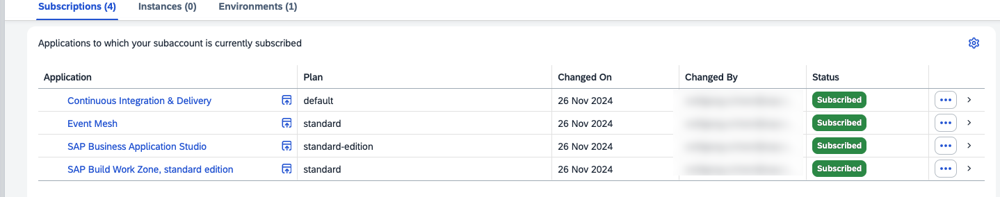

# Setup of a SAP Business Technology Platform Account using Boosters
## Introduction

For running the ECC extension mission you will need the following services in your SAP Business Technology Platform (BTP) account.

* SAP Business Application Studio
* Event Mesh
* Cloud Foundry Runtime
* SAP HANA service for SAP BTP
* SAP Continuous Integration & Delivery Service (optional)

The entitlement differs for the pricing option of your account:

**Consumption-based SAP BTP Account:** 
No entitlement necessary. Be sure that you have enough credits to run the services.

**Subscription-based SAP BTP Account:** 
You have to create entitlements for the services above - [see also Entitlements and Quotas](https://help.sap.com/viewer/df50977d8bfa4c9a8a063ddb37113c43/Cloud/en-US/38ecf59cdda64150a102cfaa62d5faab.html#loio363f0f68f9704830ac65c87a2562559b).

[Check the costs with the SAP BTP Estimator Tool](https://www.sap.com/products/cloud-platform/pricing/estimator-tool.html?blueprintId=a0ad3bc5-4fcb-4008-b109-bd8f70634d6c)

**Booster:**

The setup could be done for each service individually. To simplify the setup process, SAP has introduced Boosters. Boosters are a collection of wizards that provides functionalities for specific scenarios to automate and speed-up the installation and configuration process of a SAP BTP sub-account. This also includes the user management with the mapping of the respective administrator and developer roles.

Before running the booster please check for which regions and infrastructures the services are available - [see SAP BTP Regions and Service Portfolio ](https://help.sap.com/doc/aa1ccd10da6c4337aa737df2ead1855b/Cloud/en-US/3b642f68227b4b1398d2ce1a5351389a.html) - unfortunately the booster is not able to check this in advance, so it will fail when you select a region where a service is not available.

**Persona:** Cloud Administrator (SAP BTP)

**Abbreviation:** SAP Business Technology Platform = SAP BTP

## Step-by-step

### A: Run the Booster

1. Start the Booster
   Login to your global SAP BTP account.
   1. Select Boosters in the SAP BTP Account menu.
   2. Select **Extension Suite - Development Efficiency** from the drop-down list
   3. Select the Booster "Prepare an account for Developing Extension Applications"
   
   

2. Booster Overview

   
 
3. Select Components to get an overview of them. Press Start

   

4. Check Prerequisites. If Ok press Next - otherwise check 
   

   > Hint: If you get a warning check which services are affected. If they are not relevant for this mission (see the next step) you can just ignore it.
            

5. Setup Subaccount
   
   You find the list of the services that will acctivated by the Booster. For this mission the **Countinuous Integration & Delivery** service is optional. Remove it if you don't want to use it.**Alert Notification**, **Application Logging**, the **Extension Center**, the **Extension Factory serveless runtime**, the **Launchpad** and the **SAP Cloud Transport Management Service** are not used in this  mission - therefore you can remove them. We will install the  **SAP HANA Cloud** DB in a separate step - so remove it also. 
   
   

   >By using a subscription-based SAP BTP account you have to set the quota of the **Cloud Foundry Runtime** to 3
   
 

    1. In the sub section enter a meaningful Subaccount name - in general it reflects the organisation of your team etc.
    2. Select your Provider
    3. Select the Region
    4. Enter a meaningful Org Name
    5. Enter a space name - this should reflect the name of your project
    6. Press Next   
  
   

6. Add User
   1. Enter the User ID (mail address) of all administration users
   2. Enter the User ID (mail address) of all development users
   3. Press Next
   
   

7. Review your settings and press Finish
   
   

8.  Check the Progess - all sections should get green
   
    

9. If you succeed navigate to the new Subaccount.

    

10. Check your subaccount: 
    Select Security - Role Collection
    You will find the Extension_App_Administrator and the Extension_App_Developer role collection. If you want to add additional users to the mission you have to assign one of those role collections.

    

    Go to **Instances and Subscriptions** and select the **Subscription** tab - check if the following subscriptions are enabled:
    * SAP Business Application Studio
    * Event Mesh
    * Continuous Integration & Delivery (only when selected in the booster)   
    
    

### B: Create a SAP HANA Service Instance

For this mission a SAP HANA service for SAP BTP is necessary. Use the following steps for activating it:

1. Select Services - Service Marketplace and click on the tile 'SAP HANA Cloud'. If you do not see the 'SAP HANA Cloud' Tile, click 'Entitlements' and click on 'Configure Entitlements and then click 'Add Service Plans' and assign the 'SAP HANA Cloud' service with 'hana' service plan.

    

2. Select **Create**.
   
    

3. In the "New Instance" screen select 
    * Service = SAP HANA Cloud
    * Service Plan = Hana
    * Runtime Environment = Cloud Foundry
    * Space = the space you have created with the Booster
   
    click on the link **here** to create a Database first before creating an instance.
   

    

4. Click the button 'Create Database'.

    

5.  Enter an 'Instance Name','Description' and 'Password'. if everything is correct then the "Step 2" button appear - click on it.

    

6.  Here you can setup the size of the SAP HANA Cloud instance - for the mission you can keep the minimum settings - click on "Step 3"

    

7.  Keep the Advanced Settings and click on "Create Instance"

    

8.  After some minutes the HANA instace is created and you should see a similar card.

    

With that the setup of your SAP BTP account is done.

