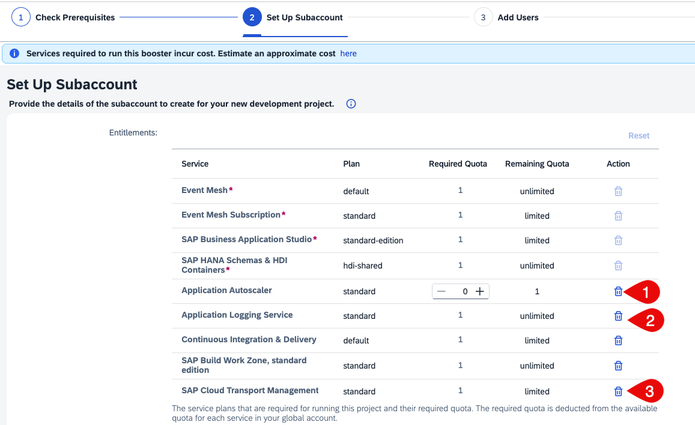

# Set Up an Account in SAP Business Technology Platform Using a Booster

## Introduction

For running the Extend SAP S/4HANA on SAP BTP Using SAP Netweaver Event Enablement Add-on mission, you will need the following services in your account in SAP Business Technology Platform (SAP BTP).

* SAP Business Application Studio
* SAP Event Mesh
* SAP BTP, Cloud Foundry runtime
* SAP Build Work Zone, standard Edition
* SAP HANA service for SAP BTP
* SAP Continuous Integration & Delivery service (optional)

The entitlement differs for the pricing option of your account:

**Consumption-based account in SAP BTP:** 
No entitlement is necessary. Be sure that you have enough credits to run the services.

**Subscription-based account in SAP BTP:** 
You have to create entitlements for the services above. See [Entitlements and Quotas](https://help.sap.com/viewer/df50977d8bfa4c9a8a063ddb37113c43/Cloud/en-US/38ecf59cdda64150a102cfaa62d5faab.html#loio363f0f68f9704830ac65c87a2562559b).

**SAP BTP Enterprise Aggreement**: :exclamation: This mission does not support the BTPEA pricing model.

[Check the costs with the SAP BTP Estimator Tool](https://www.sap.com/products/cloud-platform/pricing/estimator-tool.html?blueprintId=a0ad3bc5-4fcb-4008-b109-bd8f70634d6c)

**Booster:**

The setup of these services could be done for each service individually. To simplify the setup process, you can use the boosters in the SAP BTP cockpit. Boosters are a collection of wizards that provide functionalities for specific scenarios to automate and speed-up the installation and configuration process of a subaccount it SAP BTP. This includes the user management with the mapping of the respective Administrator and Developer roles.

For this mission, you can use the **Prepare an account for Developing Extension Applications** booster. Before running the booster, please check for which regions and infrastructures the services are available. See [SAP BTP Regions and Service Portfolio ](https://help.sap.com/doc/aa1ccd10da6c4337aa737df2ead1855b/Cloud/en-US/3b642f68227b4b1398d2ce1a5351389a.html).

Unfortunately, the booster is not able to check this in advance, so it will fail when you select a region where a service is not available.

**Audience:** Administrator (SAP BTP)

## Step-by-step

> The Booster **Prepare an account for Developing Extension Applications** is not available for trial accounts. If you're using a trial account in SAP BTP, go to [section C for the manual setup](#manualSetup).  

### A: Run the Booster

1. Start the booster.
   1. Log in to SAP BTP cockpit and navigate to your global account in SAP BTP.
   2. Choose **Boosters**.
   3. Select **Extension Suite - Development Efficiency** from the drop-down menu.
   4. Select the **Prepare an account for Developing Extension Applications** booster.
   
   

2. Read the overview of the **Prepare an account for Developing Extension Applications** booster.

   
 
3. Choose **Components** to check what components and services take part of the booster. You can also view the cost estimate for running this scenario in a productive account. Choose **Start**.

   

4. Check the prerequisites. If all the prerequisites are met, choose **Next**.
   

   > Hint: If you get a warning, check which services are affected. If they are not relevant for this mission, (see the next step) you can just ignore it.
   
   

5. Set up your subaccount.
   
You find the list of the services that will be activated by this booster. For this mission, the **SAP Continuous Integration & Delivery** service is optional. Remove it if you don't want to use it.
Services like **Application Autoscaler**, **Application Logging**, and the **SAP Cloud Transport Management Service** are not used in this  mission, you can remove them.     
   
   

   >By using a subscription-based account in SAP BTP, you have to set the quota of the **SAP BTP, Cloud Foundry runtime** to 3
   
   
   1. Enter a meaningful subaccount name. In general, it reflects the organization of your team.
   2. Select your provider. For example, Amazon Web Services (AWS).
   3. Select the region.
   4. Enter a meaningful Org name.
   5. Enter a space name. This should reflect the name of your project.
   6. Choose **Next**.  
  
   

6. Add users.
   1. Enter the User ID (mail address) of all Administrator users.
   2. Enter the User ID (mail address) of all Developer users.
   3. Choose **Next**.
   
   

7. Review your settings and choose **Finish**.
   
   

8.  Check the progess - all sections should become green.
   
    

9. If you succeed, navigate to the new subaccount.

    

10. To check your subaccount, choose **Security** > **Role Collection**.
    You will find the **Extension\_App\_Administrator** and the **Extension\_App\_Developer** role collections. If you want to add more users to the mission, you have to assign to their users one of these role collections.

    

    Go to **Instances and Subscriptions** and choose the **Subscription** tab. Check if the following subscriptions are enabled:
    * SAP Business Application Studio
    * SAP Event Mesh
    * SAP Build Work Zone, standard Edition
    * SAP Continuous Integration & Delivery (only when selected in the booster)   
    
    
    
### Configure Entitlements to SAP HANA service

1. In your SAP BTP Cockpit, choose **Entitlements** and choose **Entity Assignments**, select your sub-account and click **Configure Entitlements**.

   
   
2. Choose **Add Service Plans**.

   
   
3. Search for **hana** and select **SAP HANA Cloud** from the list and select the **hana** checkbox from the Available Plans. Choose **Add 1 Service Plan**.

   
   
4. Choose **Save** to save the changes.

   
   
   > For more information, see [Creating SAP HANA Cloud Instances](https://help.sap.com/viewer/9ae9104a46f74a6583ce5182e7fb20cb/hanacloud/en-US/784a1dbb421a4da29fb1e3bdf5f198ec.html).

   

### B: Create a SAP HANA Cloud Service Instance

For this mission, an SAP HANA service for SAP BTP is necessary. Use the following steps create a SAP HANA Cloud instance:

1. In your SAP BTP Cockpit, navigate to your sub-account and to the space which you have created. 
  
2. Choose **SAP HANA Cloud** in the left navigation pane and Choose **Create** and in the drop-down, select **SAP HANA Database**.

    

3. Choose the type of the SAP HANA Cloud Instance as **SAP HANA Cloud, SAP HANA Database** and select **Next Step**.

   
   
4. In the next tab, choose the SAP BTP **Organization** and **Space** from the drop-down box. Enter an **Instance name**, also enter a valid database **Administrator Password** and select **Next Step**.

   

5. Select the **Memory** and **Storage** capacity for your SAP HANA Cloud database instance. For this mission, you can choose the minimum capacity and select **Next Step**.

    
  
6. In the tab for Availability Zone and Replicas, you can leave the defaults and choose **Next Step**. 

       
   
7. In the tab for SAP HANA Advanced Settings, you can leave the default values to **Allow only SAP BTP IP Addresses** and choose **Review and Create**.

   

8. Choose **Create Instance** to create an instance of SAP HANA Cloud Database instance.

    

### C: Set Up Services and Authorization for Trial Account in SAP BTP Manually

For running this mission on a trial account in SAP BTP, you have to enable the services and manage your authorizations by several manual steps: 

[Setup of SAP BTP Environment](https://help.sap.com/viewer/368c481cd6954bdfa5d0435479fd4eaf/Cloud/en-US/302b47b11e1749c3aa9478f4123fc216.html) gives you a general overview of a SAP BTP Cloud Foundry account.

For this mission we have to activate the following services:
  
* [Set Up SAP Business Application Studio](https://help.sap.com/viewer/9d1db9835307451daa8c930fbd9ab264/Cloud/en-US/6331319fd9ea4f0ea5331e21df329539.html)
    * Subscribe to SAP Business Application Studio
    * Manage Authorization and Rules

* [Set Up SAP Event Mesh](https://help.sap.com/viewer/bf82e6b26456494cbdd197057c09979f/Cloud/en-US/7e504322652d4791ade0ca2bbc5a6443.html)
    * See the setup for the deprecated Lite Service Plan.

* [Set Up SAP Continuous Integration and Delivery](https://help.sap.com/viewer/99c72101f7ee40d0b2deb4df72ba1ad3/Cloud/en-US/719acaf61e4b4bf0a496483155c52570.html)
  
    * Enabling the service
    * Assigning Roles and Permissions

*  HANA Cloud Trial
  
    * For the setup, see [Section B](#b-create-a-sap-hana-cloud-service-instance)

